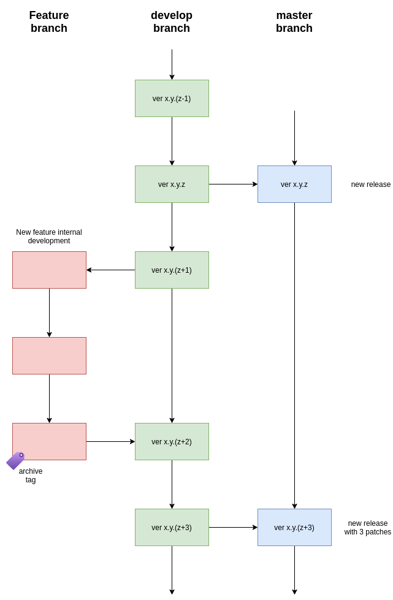
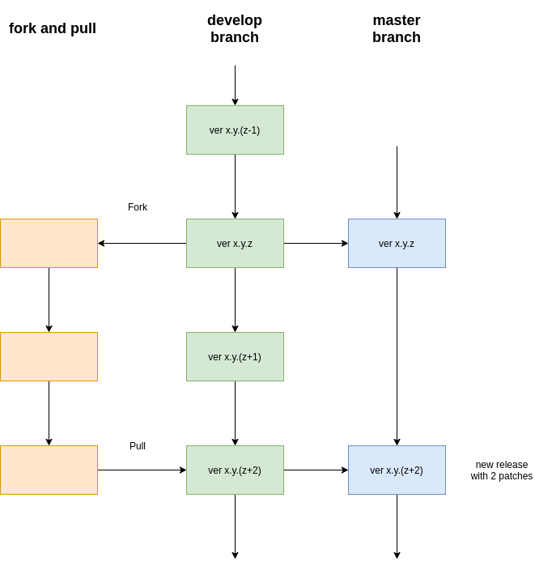
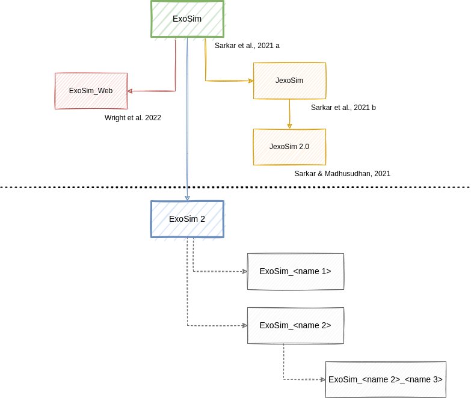

.. _guidelines:

===================================
Contributing guidelines
===================================

Code bugs and issues
------------------------
If you notice a bug or an issue, the best thing to do is to open an issue on the `GitHub repository <https://github.com/arielmission-space/ExoSim2-public/issues>`__.

Coding conventions
-----------------------

The code has been developed following the PeP8_ standard and the python Zen_.
If you have any doubts, try

.. code-block:: python

    import this

Documentation
-----------------------
Every function or class should be documented using docstrings which follow numpydoc_ structure.
This web page is written using the reStructuredText_ format, which is parsed by sphinx_.
If you want to contribute to this documentation, please refer to sphinx_ documentation first.
You can improve this pages by digging into the `docs` directory in the source.

To help the contributor in writing the documentation, we have created two `nox <https://nox.thea.codes/en/stable/>`__ sessions:

.. code-block:: bash

    $ nox -s docs
    $ nox -s docs-live

The first will build the documentation and the second will build the documentation and open a live server to see the changes in real time.
The live server can be accessed at http://127.0.0.1:8000/

.. note::
    To run a ``nox`` session, you need to install it first. You can do it by running:
    
    .. code-block:: bash
    
        $ pip install nox

Testing
-----------------------
Unit-testing is very important for a code as big as `ExoSim 2`.
At the moment `ExoSim` is tested using unittest_.
If you add functionalities, please add also a dedicated test into the `tests` directory.
All the tests can be run with

.. code-block:: console

    python -m unittest discover -s tests

.. _logging:

Logging
--------------
Logging is important when coding, hence we include a :class:`exosim.log.logger.Logger` class to inherit.

.. code-block:: python

    import exosim.log as log

    class MyClass(log.Logger):
        ...

Now the new class has the following methods from the main :class:`~exosim.log.logger.Logger` class.

.. code-block:: python

    self.info()
    self.debug()
    self.warning()
    self.error()
    self.error()

where the arguments shall be strings.
The logger output will be printed on the run or stored in the log file, if the log file option is enabled.
To enable the log file, the user can refer to :func:`exosim.log.addLogFile`.

.. note::

    The logger here produced is inspired by the logging classes in TauREx3_ developed by Ahmed Al-Refaie.

The user can also set the level of the printed messaged using :func:`exosim.log.setLogLevel`, or enable or disable the messaged with :func:`exosim.log.enableLogging` or :func:`exosim.log.disableLogging`

If the contributor wants to trace every time a function is called, the :func:`exosim.log.logger.traced` decorator_ comes handy:

.. code-block:: python

    import exosim.log as log

    @log.traced
    def my_func(args):
        ...

This will produce a log everytime the function is entered and exited with a `TRACE` logging level.

Versioning conventions
-----------------------

The versioning convention used is the one described in Semantic Versioning (semver_) and is compliant to PEP440_ standard.
In the [Major].[minor].[patch] scheme, for each modification to the previous release we increase one of the numbers.

+ `Major` is to increased only if the code in not compatible anymore with the previous version. This is considered a Major change.
+ `minor` is to increase for minor changes. These are for the addition of new features that may change the results from previous versions. This are still hard edits, but not enough to justify the increase of an `Major`.
+ `patch` are the patches. This number should increase for any big fixed, or minor addition or change to the code. It won't affect the user experience in any way.

Additional information can be added to the version number using the following scheme: [Major].[minor].[patch]-[Tag].[update]

+ `Major` is to increased only if the code in not compatible anymore with the previous version. This is considered a Major change.
+ `minor` is to increase for minor changes. These are for the addition of new features that may change the results from previous versions. This are still hard edits, but not enough to justify the increase of an `Major`.
+ `patch` are the patches. This number should increase for any big fixed, or minor addition or change to the code. It won't affect the user experience in any way.
+ `Tag` is a string that can be added to the version number. It can be used to indicate the type of release, or the type of change. For example, `alpha`, `beta`, `release` or `dev` can be used to indicate that the version is not stable yet.
+ `updated` is a number to increase for all the changes that are not related to the code patch. This is usefull for development purposes, to keep track of the number of updates since the last release.

See also :ref:`ver`.

.. _PEP440: https://www.python.org/dev/peps/pep-0440/

The version number is stored in the `version` keyword of the `setup.cfg` file.

Automatic update of the version number
^^^^^^^^^^^^^^^^^^^^^^^^^^^^^^^^^^^^^^^^^^

The version number is automatically updated by `bump2version <https://github.com/c4urself/bump2version>`__.
The user can update the version number by running

.. code-block:: console

    bump2version --current-version Major.minor.patch --new-version  Major.minor.patch patch

.. note::
    To run ``bump2version``, you need to install it first. You can do it by running:
    
    .. code-block:: bash
    
        $ pip install bump2version

The same can be done for `minor` and `major` changes.

However, the **best practice** is to use the routine included in the `nox <https://nox.thea.codes/en/stable/>`__ configuration file as dedicated session.

.. code-block:: console

    nox -s release -- Major.minor.patch -- "short description of the changes"

which will update the version number, commit the changes and tag the commit with the new version number.
The short description of the changes will be added to the Changelog file as the new version title. 
It should be a couple of words describing the changes.
The ``nox`` command will also update the Changelog files.

.. note::
    The ``nox`` command will not create a new release on GitHub. This has to be done manually.

.. note::
    To run a ``nox`` session, you need to install it first. You can do it by running:
    
    .. code-block:: bash
    
        $ pip install nox

Before running the ``nox`` command to update the version number, the user should run the linters included in the pre-commit routine to avoid errors.
It can be run with

    .. code-block:: bash
    
        $ pre-commit run --all-files

if ``pre-commit`` is installed, or

.. code-block:: console

    nox -s lint 

Source Control
------------------

The code is hosted on GitHub (https://github.com/arielmission-space/ExoSim2-public) and structured as follows.

The source has two main branches:

+ ``master``: this is used for stable and releases. It is the public branch and should be handled carefully.
+ ``develop``: this is the working branch where the new features are tested before being moved on to the `master` branch and converted into releases.

Adding new features
^^^^^^^^^^^^^^^^^^^^^^

New features can be added to the code following the schemes designed above.

If the contributor has writing rights to the repository, should create a new branch starting from the `develop` one.
In the new `feature` branch the user should produce the new functionalities, according to the above guidelines.
When the feature is ready, the branch can be merged into the official `develop` one.

To create the new feature starting from the current develop version, the contributor should run

.. code-block:: console

    git checkout develop
    git checkout -b feature/<branchname>

The completed feature can then be added to the develop.
This can be done in two ways: by a merge or a pull_ request.

Merge
++++++

A merge is a soft way to add a new feature to another branch.
Performing a Merge mean that the change will be applied if according to gitHub there two branch are compatible.

.. code-block:: console

    git merge develop
    git checkout develop
    git merge feature/<branchname>
    git push

Once a feature is completed and merged, the contributor should `archive`` the branch and remove it, to keep the repository clean.
The usual procedure is:

.. code-block:: console

    git tag archive/<branchname> feature/<branchname>
    git push --tags
    git branch -d feature/<branchname>

Remember to delete the branch also from the remote repository.
If needed, the feature branch can be restored as

.. code-block:: console

    git checkout -b <branchname> archive/<branchname>

Fixing bug
^^^^^^^^^^^

The procedure to fix a bug is similar to the one for adding a new feature.

Create the new branch starting from the current develop versionn

.. code-block:: console

    git checkout develop
    git checkout -b fix/<branchname>

Then, once the bug is fixed, the branch can be merged into the official `develop` one.

.. code-block:: console

    git merge develop
    git checkout develop
    git merge fix/<branchname>
    git push

    git tag archive/fix/<branchname> fix/<branchname>
    git push --tags
    git branch -d fix/<branchname>

Pull request
++++++++++++++++
A similar result can be obtained by the gitHub web interface.
When the feature is completed, the contributor can visit the branches_ tab of the gitHub page.
From there it is possible to advance a pull_ request by clicking on the bottom on the right of the branch we want to merge.
Then select `develop` as destination branch and confirm.
GitHub will run all the python tests written for `ExoSim 2` and check for compatibility between the two branches.
If everything is ok a merge can be confirmed.

Then, in the branches_ page is possible to delete the new feature branch, if it is not useful anymore.

Fork and Pull
++++++++++++++

If the contributor does not have writing rights to the repository, should use the Fork-and-Pull_ model.
The contributor should fork_ the main repository and clone it. Then the new features can be implemented.
When the code is ready, a pull_ request can be raised.

Derived projects
^^^^^^^^^^^^^^^^^

If the contributor wants to maintain a custom forked repository or derived project, the following naming convention should be followed:
the forked repository should be named after the original repository plus an identifying name.
The following picture shows an example of a possible growth of the ExoSim family:

Automatic actions
^^^^^^^^^^^^^^^^^^^^
Every time a commit is ``pushed`` into the `develop` or into the `main` branch, some automatic actions_ are run by GitHub.
The available action are stored into the `.github/workflows` directory in this repository.
The basic actions are three:

    - Linux OS (ci_linux.yml): this action run all the tests implemented in the repository for a Ubuntu virtual machine with Python 3.8 and 3.9.

If all the tests for each action are passed, a green badge will be added to the repository readme.

.. _Pep8: https://www.python.org/dev/peps/pep-0008/
.. _Zen: https://www.python.org/dev/peps/pep-0020/
.. _reStructuredText: https://docutils.sourceforge.io/rst.html
.. _sphinx: https://www.sphinx-doc.org/en/master/
.. _numpydoc: https://numpydoc.readthedocs.io/en/latest/
.. _Fork-and-Pull: https://en.wikipedia.org/wiki/Fork_and_pull_model
.. _fork: https://docs.github.com/en/get-started/quickstart/fork-a-repo
.. _pull: https://docs.github.com/en/github/collaborating-with-pull-requests/proposing-changes-to-your-work-with-pull-requests/creating-a-pull-request
.. _semver: https://semver.org/spec/v2.0.0.html
.. _unittest: https://docs.python.org/3/library/unittest.html
.. _decorator: https://realpython.com/primer-on-python-decorators/
.. _TauREx3: https://taurex3-public.readthedocs.io/en/latest/
.. _actions: https://github.com/features/actions
.. _branches: https://github.com/arielmission-space/ExoSim2-public/branches
