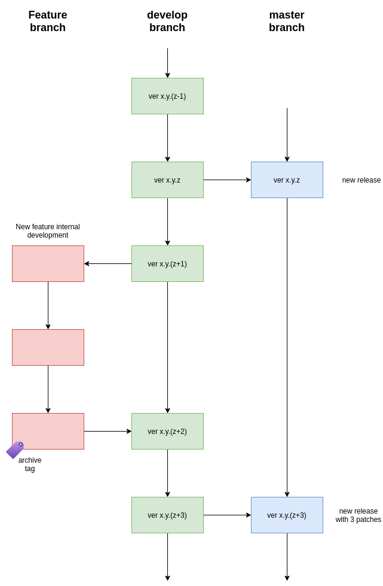
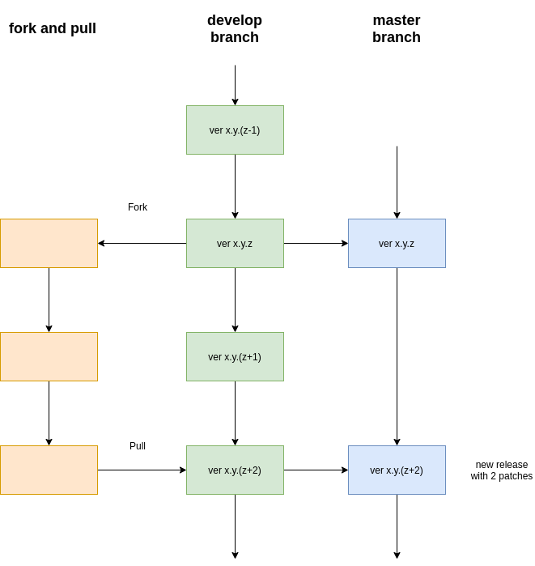
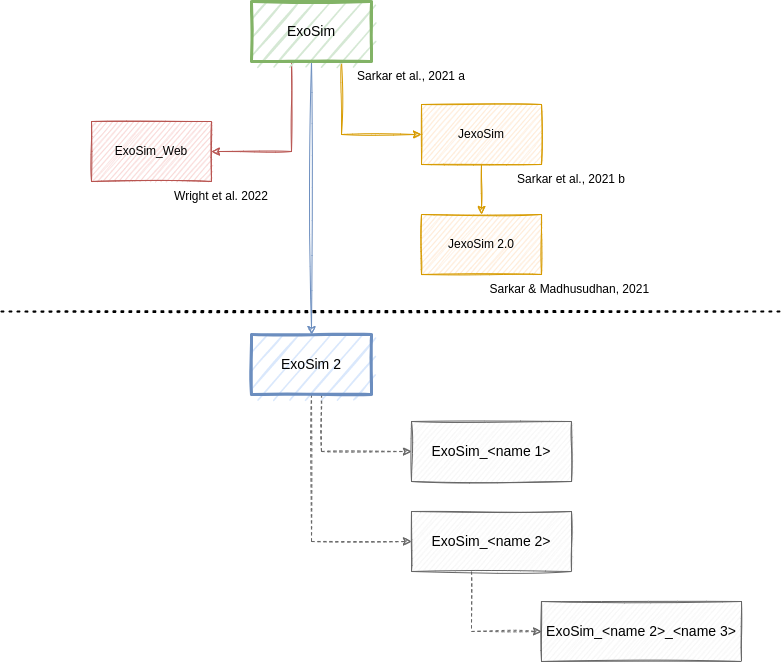

.. _guidelines:

=======================
Contributing guidelines
=======================

Bugs and issues
---------------

If you find a bug or an issue, the best thing to do is to open an issue on the
`GitHub repository <https://github.com/arielmission-space/ExoSim2-public/issues>`__.

Coding conventions
------------------

The code follows the `PEP 8`_ standard and the Python Zen_. If in doubt, try

.. code-block:: python

    import this

Documentation
-------------

Every function and class should have a docstring in the numpydoc_ style. These
pages are written in reStructuredText_ and built with Sphinx_; if you want to
contribute to them, read the Sphinx_ documentation first. The sources live in the
``docs`` directory.

Two `nox <https://nox.thea.codes/en/stable/>`__ sessions help with the docs:

.. code-block:: bash

    $ nox -s docs
    $ nox -s docs-live

The first builds the documentation. The second builds it and serves it with live
reload at http://localhost:8000/, so you see your changes as you write.

.. note::
    To run a ``nox`` session you need ``nox`` installed:

    .. code-block:: bash

        $ pip install nox

Testing
-------

Unit testing matters for a code as large as `ExoSim 2`. The tests use pytest_. If
you add functionality, add a test for it under the ``tests`` directory. Run the
whole suite with:

.. code-block:: console

    pytest

.. _logging:

Logging
-------

Logging is important while coding, so `ExoSim` provides a
:class:`exosim.log.logger.Logger` class to inherit from:

.. code-block:: python

    import exosim.log as log

    class MyClass(log.Logger):
        ...

The new class then has these methods from
:class:`~exosim.log.logger.Logger`:

.. code-block:: python

    self.info()
    self.debug()
    self.warning()
    self.error()
    self.critical()

The arguments are strings. The output is printed during the run, and also written
to the log file if that option is enabled; enable it with
:func:`exosim.log.add_log_file`.

.. note::
    The logger is inspired by the logging classes in TauREx3_, developed by
    Ahmed Al-Refaie.

You can set the level of the printed messages with
:func:`exosim.log.set_log_level`, and turn messages on or off with
:func:`exosim.log.enableLogging` or :func:`exosim.log.disable_logging`.

To trace every call of a function, use the
:func:`exosim.log.logger.traced` decorator_:

.. code-block:: python

    import exosim.log as log

    @log.traced
    def my_func(args):
        ...

This logs the function every time it is entered and exited, at the ``TRACE``
level.

Versioning conventions
----------------------

The versioning follows Semantic Versioning (semver_) and is compliant with
PEP440_. In the ``[Major].[minor].[patch]`` scheme, each change to the previous
release increases one of the numbers:

+ ``Major`` is increased only when the code is no longer compatible with the
  previous version.
+ ``minor`` is increased when a new feature is added that may change the results
  with respect to previous versions, but not enough to justify a ``Major`` bump.
+ ``patch`` is increased for bug fixes and small additions or changes that do not
  affect the user experience.

Extra information can be appended as
``[Major].[minor].[patch]-[Tag].[update]``:

+ ``Tag`` marks the type of release, for example ``alpha``, ``beta``,
  ``release`` or ``dev`` to signal that the version is not stable yet.
+ ``update`` counts the changes that are not tied to a code patch. It is useful
  during development, to track how many updates there have been since the last
  release.

See also :ref:`ver`.

.. _PEP440: https://www.python.org/dev/peps/pep-0440/

Automatic version numbers
^^^^^^^^^^^^^^^^^^^^^^^^^^

The version number is **not** stored in the repository: it is derived from the
git history by `setuptools-scm <https://setuptools-scm.readthedocs.io/>`__.
Every commit on ``develop`` gets a unique ``X.Y.(Z+1).devN`` version
automatically (no bot commits, no ``-devN`` tags), and a release tag ``vX.Y.Z``
produces the clean ``X.Y.Z``.

Cutting a release is a single command:

.. code-block:: console

    nox -s release

It asks whether the bump is ``major``, ``minor`` or ``patch``, collects the
``changelog.d/`` fragments into the changelog, updates the metadata files, and
pushes the ``vX.Y.Z`` tag. The tag then triggers the pipeline that builds the
package, publishes it to PyPI and creates the GitHub Release.

The full procedure, the branch model, how to write changelog entries and the
one-time PyPI setup, is documented in :ref:`releasing`.

Source control
--------------

The code is hosted on GitHub
(https://github.com/arielmission-space/ExoSim2-public) and has two long-lived
branches:

+ ``main``: the latest stable release only. It is fast-forwarded by the release
  process and is never committed to directly.
+ ``develop``: the working branch where new features land. Releases are cut from
  here with ``nox -s release`` (see :ref:`releasing`).

Adding a new feature
^^^^^^^^^^^^^^^^^^^^^

If you have write access to the repository, branch off ``develop``, build the
feature following the guidelines above, and merge it back into ``develop`` when
it is ready.

Create the branch from the current ``develop``:

.. code-block:: console

    git checkout develop
    git checkout -b feature/<branchname>

The finished feature goes back into ``develop`` in one of two ways: a merge or a
pull_ request.

Merge
+++++

A merge applies the change when the two branches are compatible:

.. code-block:: console

    git merge develop
    git checkout develop
    git merge feature/<branchname>
    git push

Once the feature is merged, archive the branch and delete it to keep the
repository tidy:

.. code-block:: console

    git tag archive/<branchname> feature/<branchname>
    git push --tags
    git branch -d feature/<branchname>

Delete the branch from the remote too. If you need it back later:

.. code-block:: console

    git checkout -b <branchname> archive/<branchname>

Fixing a bug
^^^^^^^^^^^^

The procedure is the same as for a feature, on a ``fix/`` branch:

.. code-block:: console

    git checkout develop
    git checkout -b fix/<branchname>

Then, once the bug is fixed:

.. code-block:: console

    git merge develop
    git checkout develop
    git merge fix/<branchname>
    git push

    git tag archive/fix/<branchname> fix/<branchname>
    git push --tags
    git branch -d fix/<branchname>

Pull request
++++++++++++

The same result can be obtained through the GitHub web interface. When the
feature is ready, go to the branches_ tab, open a pull_ request for your branch,
select ``develop`` as the destination and confirm. GitHub runs the `ExoSim 2`
test suite and checks that the branches are compatible; if everything passes, the
merge can be confirmed. You can then delete the feature branch from the branches_
page.

Fork and pull
+++++++++++++

If you do not have write access to the repository, use the Fork-and-Pull_ model:
fork_ the main repository, clone your fork, implement the feature, and raise a
pull_ request when it is ready.

Derived projects
^^^^^^^^^^^^^^^^

If you maintain a custom fork or a derived project, name the repository after the
original one plus an identifying suffix. The picture below shows one way the
ExoSim family could grow:

Automatic actions
^^^^^^^^^^^^^^^^^

Every push to ``develop`` or ``main`` runs the GitHub actions_ stored in the
``.github/workflows`` directory. The main one, ``ci_pipeline.yml``, runs the full
test suite on Ubuntu with Python 3.12 and 3.13. When the tests pass, the green
badge in the README stays green.

.. _PEP 8: https://www.python.org/dev/peps/pep-0008/
.. _Zen: https://www.python.org/dev/peps/pep-0020/
.. _reStructuredText: https://docutils.sourceforge.io/rst.html
.. _Sphinx: https://www.sphinx-doc.org/en/master/
.. _numpydoc: https://numpydoc.readthedocs.io/en/latest/
.. _Fork-and-Pull: https://en.wikipedia.org/wiki/Fork_and_pull_model
.. _fork: https://docs.github.com/en/get-started/quickstart/fork-a-repo
.. _pull: https://docs.github.com/en/github/collaborating-with-pull-requests/proposing-changes-to-your-work-with-pull-requests/creating-a-pull-request
.. _semver: https://semver.org/spec/v2.0.0.html
.. _pytest: https://docs.pytest.org/en/latest/
.. _decorator: https://realpython.com/primer-on-python-decorators/
.. _TauREx3: https://taurex3-public.readthedocs.io/en/latest/
.. _actions: https://github.com/features/actions
.. _branches: https://github.com/arielmission-space/ExoSim2-public/branches
