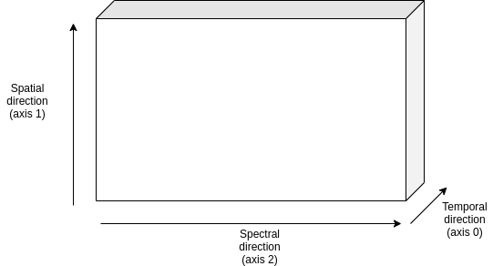
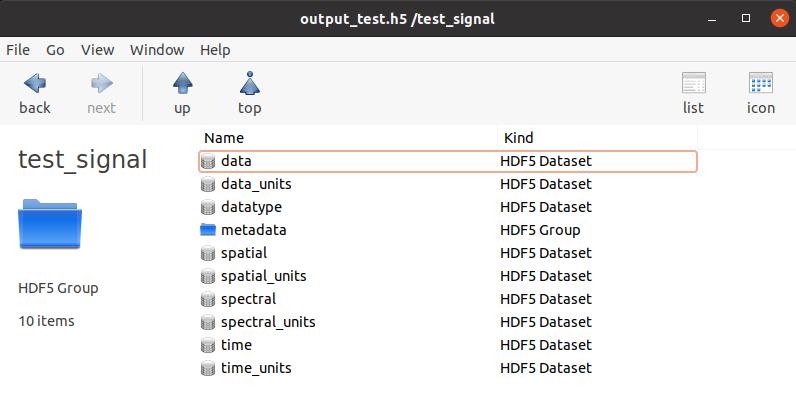
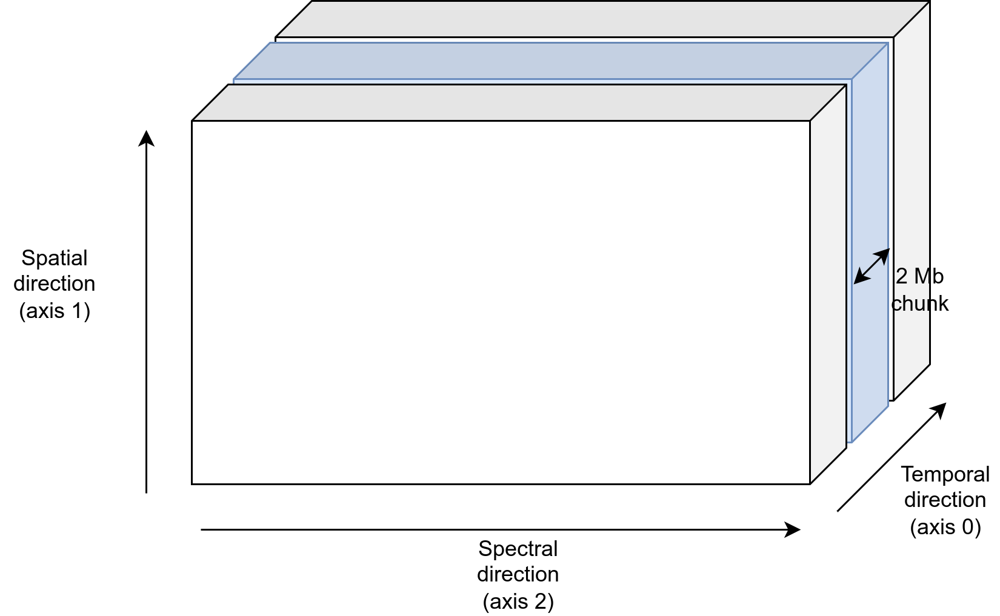

.. _signal:

==========
Signals
==========

The data flow in the code is handled by the :class:`exosim.models.signal.Signal` class.
Signals are similar to array but with methods and a math specifically designed for the code goal.

To understand better how they work, let's produce a simple case:

.. code-block:: python

        import numpy as np
        from exosim.models.signal import Signal

        wl = np.linspace(0.1, 1, 10) * u.um
        data = np.ones((10, 1, 10))
        time_grid = np.linspace(1, 5, 10) * u.hr

        signal = Signal(spectral=wl, data=data, time=time_grid)

The resulting ``signal`` variable now contains a :class:`~exosim.models.signal.Signal` class.
We can access the data stored in the :attr:`~exosim.models.signal.Signal.data` attribute.
If units are attached to the data, are stored in the `data_units`.

The data are stored in a cube as described in the picture.

The grid used for the spectral direction (axis 2) is stored in the `spectral` attribute, with its units in `spectral_units`.
Similarly, the grid used for the spatial direction (axis 1), if any, is stored in the `spatial` attribute, with its units in `spatial_units`,
and the temporal grid (axis 0), if any, is stored in `time` with its units in `time_units`.
If no information are provided for these grid the defaults values are :math:`0 \, \mu m` for spectral and spatial axes and :math:`0 \, hr` for temporal.

Also, `metadata` can be attach to a  :class:`~exosim.models.signal.Signal` class in the form a dictionary.

.. code-block:: python

        data = np.ones((10, 1, 10))
        metadata = {'test': True}
        signal = Signal(data=data, metadata=metadata)

or they can be attached later as

.. code-block:: python

        data = np.ones((10, 1, 10))
        signal = Signal(data=data)
        metadata = {'test': True}
        signal.metadata = metadata

In both cases

    >>> print(signal.metadata)
    {'test': True}

Units
------

If any units is attached to the input data as in

.. code-block:: python

        data = np.ones(10)*u.m
        signal = Signal(data=data)

Or they can be specified as:

.. code-block:: python

        data = np.ones(10)
        signal = Signal(data=data, data_units=u.m)

Then, the data can be converted into a different units as

.. code-block:: python

        signal.to(u.cm)

Derived classes
-----------------

Thanks to the units support, we can derive different derived classes:

+ :class:`exosim.models.signal.Sed`, which has units of :math:`W \, m^{-2} \, \mu m^{-1}`
+ :class:`exosim.models.signal.Radiance`, which has units of :math:`W \, m^{-2} \, \mu m^{-1} \, sr^{-1}`
+ :class:`exosim.models.signal.CountsPerSecond`, which has units of :math:`counts \, s^{-1}`
+ :class:`exosim.models.signal.Counts`, which has units of :math:`counts`
+ :class:`exosim.models.signal.Adu`, which has units of :math:`adu`
+ :class:`exosim.models.signal.Dimensionless`, which has no units

The user can directly initialise one of these classes to specify the data units.
Otherwise, if units are attached to the data, the main :class:`~exosim.models.signal.Signal` class automatically detects the right derived class to use.

Mathematical operations
---------------------------------

A set of mathematical operations is possible with the :class:`~exosim.models.signal.Signal` class and it derived classes.
Later here are listed the simplest examples to show the concept, however, the supported operation include:

+ operations between :class:`~exosim.models.signal.Signal` classes (as in the exaples);
+ operations between a :class:`~exosim.models.signal.Signal` and a :class:`numpy.ndarray` or a :class:`~astropy.units.Quantity`;
+ operations in reversed order (array + :class:`~exosim.models.signal.Signal` instead of only :class:`~exosim.models.signal.Signal` + array)

Also, the units are taken into account during the operation. In fact, multiplying a :class:`~exosim.models.signal.Dimensionless` for a  :class:`~exosim.models.signal.Sed` results in a  :class:`~exosim.models.signal.Sed`,
as multiply a :class:`exosim.models.signal.Radiance` by a solid angle results in a :class:`~exosim.models.signal.Sed`.
It's not possible to sum or subtract a :class:`~exosim.models.signal.Sed` class to a :class:`~exosim.models.signal.Dimensionless`.
This, again, is true not only between  :class:`~exosim.models.signal.Signal` classes, but also when operating :class:`~exosim.models.signal.Signal` classes and :class:`~astropy.units.Quantity`.

Finally the operations involving :class:`~exosim.models.signal.Signal` classes also work on cached classes. See :ref:`cached` for more.

Sum
^^^^^
.. code-block:: python

        import numpy as np
        import astropy.units as u
        from exosim.models.signal import Signal

        data = np.ones((3))
        signal1 = Signal(data=data)

        data = np.ones((3)) * 2
        signal2 = Signal(data=data)

        signal3 = signal1 + signal2

and hence

        >>> print(signal3.data)
        [[[3. 3. 3.]]]

Subtraction
^^^^^^^^^^^^^^^

.. code-block:: python

        import numpy as np
        import astropy.units as u
        from exosim.models.signal import Signal

        data = np.ones((3))
        signal1 = Signal(data=data)

        data = np.ones((3)) * 2
        signal2 = Signal(data=data)

        signal3 = signal1 - signal2

and hence

        >>> print(signal3.data)
        [[[-1. -1. -1.]]]

Multiplication
^^^^^^^^^^^^^^^^^^^^^
.. code-block:: python

        import numpy as np
        import astropy.units as u
        from exosim.models.signal import Signal

        data = np.ones((3))
        signal1 = Signal(data=data)

        data = np.ones((3)) * 2
        signal2 = Signal(data=data)

        signal3 = signal1 * signal2

and hence

        >>> print(signal3.data)
        [[[2. 2. 2.]]]

Division
^^^^^^^^^^^

.. code-block:: python

        import numpy as np
        import astropy.units as u
        from exosim.models.signal import Signal

        data = np.ones((3))
        signal1 = Signal(data=data)

        data = np.ones((3)) * 2
        signal2 = Signal(data=data)

        signal3 = signal1 / signal2

and hence

        >>> print(signal3.data)
        [[[0.5 0.5 0.5]]]

Floor division
^^^^^^^^^^^^^^^^^^

.. code-block:: python

        import numpy as np
        import astropy.units as u
        from exosim.models.signal import Signal

        data = np.ones((3))
        signal1 = Signal(data=data)

        data = np.ones((3)) * 2
        signal2 = Signal(data=data)

        signal3 = signal1 // signal2

and hence

        >>> print(signal3.data)
        [[[0. 0. 0.]]]

Binning operation
---------------------------------
Among the useful methods included in the :class:`exosim.models.signal.Signal` class, it is worth mentioning the binning.
There are two binning methods included in the class:

+ :func:`exosim.models.signal.Signal.spectral_rebin` to rebing the dataset in the spectral direction
+ :func:`exosim.models.signal.Signal.temporal_rebin` to rebing the dataset in the time direction

They are both based on :func:`exosim.utils.binning.rebin`.
The function resamples a function fp(xp) over the new grid x, rebinning if necessary, otherwise interpolates, but it does not perform extrapolation.
The function is optimised to resample multidimensional array along a given axis.

Both :func:`~exosim.models.signal.Signal.spectral_rebin` and :func:`~exosim.models.signal.Signal.temporal_rebin` are described with examples in their documentation.
Let's use as example here the case of a spectral binning.
We first define the initial values:

        >>> wavelength = np.linspace(0.1, 1, 10) * u.um
        >>> data = np.ones((10, 1, 10))
        >>> time_grid = np.linspace(1, 5, 10) * u.hr
        >>> signal = Signal(spectral=wavelength, data=data, time=time_grid)
        >>> print(signal.data.shape)
        (10,1,10)

We can interpolates at a finer wavelength grid:

        >>> new_wl = np.linspace(0.1, 1, 20) * u.um
        >>> signal.spectral_rebin(new_wl)
        >>> print(signal.data.shape)
        (10,1,20)

or we can bin down the to a new wavelength grid:

        >>> signal = Signal(spectral=wavelength, data=data, time=time_grid)
        >>> new_wl = np.linspace(0.1, 1, 5) * u.um
        >>> signal.spectral_rebin(new_wl)
        >>> print(signal.data.shape)
        (10,1,5)

Writing, copying and converting
---------------------------------
Other useful methods are related to the capability to export the information content of a :class:`exosim.models.signal.Signal` class.

A :func:`exosim.models.signal.Signal` can be casted into a :class:`dict` object as

.. code-block:: python

        import numpy as np
        from exosim.models.signal import Signal

        data = np.ones((3))
        signal = Signal(data=data)

        dict(signal)

This will result in a dictionary with keys named after the class attributes with their content as value.
The casting operation only conserves some of the :class:`exosim.models.signal.Signal` class information.
The attributes that are casted are: `data`, `time`, `spectral`, `spatial`, `metadata`, `data_units`, `time_units`, `spectral_units`, and `spatial_units`.

    >>> print(dict(signal))
    {'data': array([[[1., 1., 1.]]]),
     'time': array([0.]),
     'spectral': array([0.]),
     'spatial': array([0.]),
     'metadata': {},
     'data_units': '',
     'time_units': 'h',
     'spectral_units': 'um',
     'spatial_units': 'um'}

The :func:`exosim.models.signal.Signal.write` method allow to store the content into and :class:`~exosim.output.output.Output` class.
More commonly, into an HDF5 file.
In the following example, we show how to store the signal class into an output file.

.. code-block:: python

        import os
        from exosim.output.hdf5.hdf5 import HDF5Output

        output = os.path.join("output_test.h5")
        with HDF5Output(output) as o:
            signal.write(o, "test_signal")

Then, the output will contains the class information as:

The information stored are the same of :code:`dict(signal)`

Also, an iterator has been implemented in the :class:`~exosim.models.signal.Signal` class, such that the user can access the information as

    >>> for k,v in signal1: print(k,v)
    data [[[1. 1. 1.]]]
    time [0.]
    spectral [0.]
    spatial [0.]
    metadata {}
    data_units
    time_units h
    spectral_units um
    spatial_units um

Finally, a :class:`~exosim.models.signal.Signal` class can be copied to a new class, thanks to the :func:`exosim.models.signal.Signal.copy` method:

.. code-block:: python

        copied_signal = signal.copy()

.. _cached:

Cached signals
----------------

:class:`~exosim.models.signal.Signal` classes can be used in `cached` mode to handle huge datasets.
This is enabled by chucked :class:`h5py.Dataset`.
The :class:`~exosim.models.signal.Signal` are supported by the The :class:`~exosim.models.utils.cachedData.CachedData` class.
To produce a cached :class:`~exosim.models.signal.Signal` the user must indicate a :class:`~exosim.output.hdf5.hdf5.HDF5OutputGroup`
or :class:`~exosim.output.hdf5.hdf5.HDF5Output`,
the data set shape, and a dataset name:

.. code-block:: python

        import numpy as np
        import astropy.units as u

        from exosim.models.signal import Signal
        from exosim.output import SetOutput

        output = SetOutput('test_file.h5')
        with output.use(append=True, cache=True) as out:
            cached_signal = Signal(spectral = np.arange(0,100) * u.um,
                                    data=None,
                                    shape=(1000,100,100),
                                    cached=True, output=out,
                                    dataset_name='cached_dataset')

The dataset is stored in the indicated file un chunks of the user-defined size.
By default the chunk size is set to 2 MB.
Each chunk is a cube of the full spectral and spatial shapes and the number of time steps needed to weigh 2 MB.

Then, the chunk size can be set using the :class:`~exosim.utils.runConfig.RunConfig` class, as described in :ref:`chunk_size`:

.. code-block:: python

        from exosim.utils import RunConfig

        RunConfig.chunk_size = N

where `N` is the desired size of chunk in MB, which will be set for the environment.

If no output file is indicated, the code produce a temporary file.
Having a cached :class:`~exosim.models.signal.Signal` is little different from a normal one.
While for the normal one we usually access the datacube content using the ``data`` attribute,
for a cached :class:`~exosim.models.signal.Signal` is preferred to use the ``dataset``:
while the former forces the system to load all the datacube, which should be avoided for big dataset,
the latter refers to the associate chunked :class:`h5py.Dataset` class.

To access the chunks and set the dataset values, one can use the :class:`h5py.Dataset` methods.
In the following example, we iterate over the class chunks and set the values to 1.

.. code-block:: python

    for chunk in cached_signal.dataset.iter_chunks():
        dset = np.ones(cached_signal.dataset[chunk].shape)
        cached_signal.dataset[chunk] = dset

Otherwise, the data can be accessed as a normal numpy array

.. code-block:: python

        cached_signal.dataset[10,10,10] = 1

.. note:: A cached :class:`~exosim.models.signal.Signal` allows the access to
        the associated :class:`h5py.Dataset` only as long as the :class:`~exosim.output.hdf5.hdf5.HDF5Output` is open.

To be sure to apply the edit to the dataset in the open file, remember to flush them:

.. code-block:: python

        cached_signal.output.flush()

Finally, if the user wants to loop over the chunks, a dedicate util is available in ExoSim: :func:`~exosim.utils.iterators.iterate_over_chunks`

.. code-block:: python

    for chunk in iterate_over_chunks(cached_signal.dataset,
                                 desc="iterator description"):
        dset = np.ones(cached_signal.dataset[chunk].shape)
        cached_signal.dataset[chunk] = dset
        cached_signal.output.flush()
