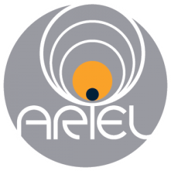
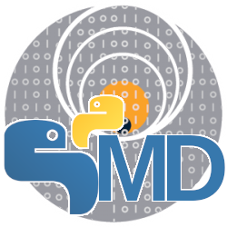

.. _index:

===================================
Welcome to ExoSim2's documentation!
===================================

**Version**: |version|

ExoSim is the time domain simulator exoplanet observations first presented in `Sarkar et al., 2021 <https://link.springer.com/article/10.1007/s10686-020-09690-9>`__.
This refactored version is meant to be easy to use and largely customisable: almost every part of the code can be customised by the user.

This guide will walk you through the simulation steps with examples and descriptions of the simulation strategy.
The guide goal is to train the user to customise the simulator according to the instrument of the observation needed.

.. panels::
    :card: shadow
    :header: text-center
    :body: text-justify

    Installation
    ^^^^^^^^^^^^

    .. image:: _static/install.png
        :width: 250
        :align: center
        

    .. link-button:: installation
            :type: ref
            :text: New to ExoSim? Install ExoSim to start.
            :classes: btn-outline-secondary btn-block stretched-link
    ---

    User Guide 
    ^^^^^^^^^^^^
    
    .. image:: _static/user.png
        :width: 250
        :align: center

    .. link-button:: user/index
        :type: ref
        :text: Learn how to use ExoSim.
        :classes: btn-outline-secondary btn-block stretched-link
    ---

    Developer Guide 
    ^^^^^^^^^^^^^^^
    .. image:: _static/developers.png
        :width: 250
        :align: center

    .. link-button:: contributing/index
        :type: ref
        :text: Learn how to improve or customise ExoSim.
        :classes: btn-outline-secondary btn-block stretched-link   
    
    ---
    
    API Guide 
    ^^^^^^^^^^^^

    .. image:: _static/api.png
        :width: 250
        :align: center

    .. link-button:: api/exosim/index
        :type: ref
        :text: Dig into the complete Api guide.
        :classes: btn-outline-secondary btn-block stretched-link

.. panels::
    :container: container-lg pb-3
    :column: col-lg-4 col-md-4 col-sm-6 col-xs-12 p-2
    :card: shadow
    :header: text-center
    :body: text-justify

    FAQs 
    ^^^^^^^^^^^^
    
    .. image:: _static/faqs.png
        :width: 150
        :align: center

    .. link-button:: FAQs
        :type: ref
        :text: Go To FAQs
        :classes: btn-outline-primary btn-block stretched-link

    ---

    License 
    ^^^^^^^^^^^^
    
    .. image:: _static/license.png
        :width: 150
        :align: center

    .. link-button:: license
        :type: ref
        :text: Go To License
        :classes: btn-outline-primary btn-block stretched-link
    
    ---

    Changelog 
    ^^^^^^^^^^^^
    
    .. image:: _static/changelog.png
        :width: 150
        :align: center

    .. link-button:: CHANGELOG
        :type: ref
        :text: Go To Changelog
        :classes: btn-outline-primary btn-block stretched-link

.. toctree::
    :hidden:
    :maxdepth: 1

    Installation <installation>
    User Guide <user/index>
    Developer Guide  <contributing/index>
    API Guide <autoapi/exosim/index>
    FAQs <FAQs>
    License <license>
    Changelog <CHANGELOG>

.. warning::

    This documentation is not completed yet. If you find any issue or difficulty,
    please contact the developers for help.

Cite
------
A dedicated publication has been submitted and the relative information will be published soon. 
In the meantime, please, send an email to the developers.

.. ExoSim2 has been developed from ExoSim (Sarkar et al. 2021).

.. If you use this software please cite:
.. Sarkar et al., 2021, "`ExoSim: the Exoplanet Observation Simulator <https://link.springer.com/article/10.1007/s10686-020-09690-9>`__", Exp. Astron, 51, 287-317. DOI:10.1007/s10686-020-09690-9

Acknowledgments
------------------

ExoSim 2 has been developed under the umbrella of `Ariel Space Mission <https://arielmission.space/>`__,
with the support of the Ariel Consortium and the members of Simulator Software, Management and Documentation (S2MD) Working Group.

During the development of the first alpha and beta versions of this software,
`L. V. Mugnai <https://www.lorenzomugnai.com/>`__ was affiliated to `Sapienza University of Rome <https://www.phys.uniroma1.it/fisica/en-welcome>`__
and supported by `ASI <https://www.asi.it/en/>`__.

We thank Ahmed Al-Refaie for his support during the development and the inspiration provided by his code: `TauREx3 <https://arxiv.org/abs/1912.07759>`__ .

.. The icons used in this page are from `Font PNGEgg <https://https://www.pngegg.com>`__, 
    and all the icons are licensed under `Non commercial license <https://www.pngegg.com/tos>`__.
    Non-commercial means something is not primarily intended for, or directed towards, commercial advantage or monetary compensation by an individual or organisation. 
    As ExoSim is a publicly available software, under BSD-3-Clause license, we are allowed to use these icons in our documentation, because they are not used for commercial purposes. 
    We believe that our work do not conflict with the legitimate interests of the creator of the artistic icons.
    We also edited some of the icon to fit our needs.
