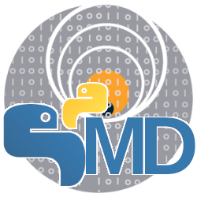

.. _index:

===================================
Welcome to ExoSim 2's documentation!
===================================

**ExoSim 2** is an end-to-end, time-domain simulator for exoplanet observations
from space telescopes, ground-based observatories, and sub-orbital platforms.
It models the full observation chain -- astronomical sources, instrument optics,
dispersers, detector arrays, and readout electronics -- reproducing both the
astrophysical signal and the instrumental systematics. Written in Python 3 with
a modular, object-oriented design, almost every component can be replaced with a
custom implementation without rewriting the rest of the pipeline.

This guide walks through the simulation steps with worked examples and explains
how to configure ExoSim 2 for the instrument you want to model.

.. grid:: 2 2 2 2
    :gutter: 3

    .. grid-item-card:: Installation
        :text-align: center
        :shadow: md
        :link: installation
        :link-type: doc

        .. image:: _static/install.png
            :width: 250
            :align: center

        +++

        New to ExoSim? Install ExoSim to start.

    .. grid-item-card:: User Guide
        :text-align: center
        :shadow: md
        :link: user/index
        :link-type: doc

        .. image:: _static/user.png
            :width: 250
            :align: center

        +++

        Learn how to use ExoSim.

    .. grid-item-card:: Developer Guide
        :text-align: center
        :shadow: md
        :link: contributing/index
        :link-type: doc

        .. image:: _static/developers.png
            :width: 250
            :align: center

        +++

        Learn how to improve or customise ExoSim.

    .. grid-item-card:: API Guide
        :text-align: center
        :shadow: md
        :link: api/exosim/index
        :link-type: doc

        .. image:: _static/api.png
            :width: 250
            :align: center

        +++

        Dig into the complete API guide.

.. grid:: 3 3 3 3
    :gutter: 3

    .. grid-item-card:: FAQs
        :text-align: center
        :shadow: md
        :link: FAQs
        :link-type: doc

        .. image:: _static/faqs.png
            :width: 150
            :align: center

        +++

        Go To FAQs

    .. grid-item-card:: License
        :text-align: center
        :shadow: md
        :link: license
        :link-type: doc

        .. image:: _static/license.png
            :width: 150
            :align: center

        +++

        Go To License

    .. grid-item-card:: Changelog
        :text-align: center
        :shadow: md
        :link: CHANGELOG
        :link-type: doc

        .. image:: _static/changelog.png
            :width: 150
            :align: center

        +++

        Go To Changelog

.. toctree::
    :hidden:
    :maxdepth: 1

    Installation <installation>
    User Guide <user/index>
    Developer Guide  <contributing/index>
    API Guide <api/index>
    FAQs <FAQs>
    License <license>
    Changelog <CHANGELOG>

.. warning::

    This documentation is not complete yet. If you find any issue or difficulty,
    please contact the developers for help.

What can ExoSim 2 do?
=====================

- **Radiometric modelling** -- fast estimates of signal and noise budgets,
  aperture photometry, saturation analysis, and multiaccum readout factors for
  performance prediction and observing-time calculations.
- **Full time-domain simulation** -- focal-plane evolution, sub-exposures with
  pointing jitter, and realistic detector readouts (NDRs) to test data reduction
  pipelines against a known truth.
- **Comprehensive noise budget** -- photon noise, read noise, dark current, and
  user-defined noise sources with realistic detector behaviour.
- **Low-frequency systematics** -- pointing jitter, thermal fluctuations, and
  detector drifts captured across the full observation timescale.
- **Multi-instrument support** -- configured out of the box for the Ariel space
  mission, with community-contributed configurations for JWST and ground-based
  spectrographs.
- **Flexible configuration and outputs** -- XML and YAML parameter files with
  inheritance and full unit handling via Astropy, and structured,
  self-documenting HDF5 outputs.

Who should use ExoSim 2?
========================

Mission planners and instrument scientists exploring design trade-offs before
hardware is built; observers estimating signal-to-noise ratios and feasibility
before proposal submission; data-pipeline developers validating reduction
algorithms against known-truth synthetic data; and students gaining hands-on
experience of realistic observation scenarios without needing telescope time.

Cite
------

If you use this software please cite:

Mugnai et al., 2025, "`ExoSim 2: the new exoplanet observation simulator applied to the Ariel space mission <https://link.springer.com/article/10.1007/s10686-024-09976-2>`__", Exp. Astron, 59, 9. DOI:10.1007/s10686-024-09976-2.

Acknowledgments
------------------

ExoSim 2 has been developed under the umbrella of `Ariel Space Mission <https://arielmission.space/>`__,
with the support of the Ariel Consortium and the members of the Simulator Software, Management and Documentation (S2MD) Working Group.

During the development of the first alpha and beta versions of this software,
`L. V. Mugnai <https://www.lorenzomugnai.com/>`__ was affiliated to `Sapienza University of Rome <https://www.phys.uniroma1.it/fisica/en-welcome>`__
and supported by `ASI <https://www.asi.it/en/>`__.

We thank Ahmed Al-Refaie for his support during the development and the inspiration provided by his code: `TauREx3 <https://arxiv.org/abs/1912.07759>`__ .

.. The icons used in this page are from `Font PNGEgg <https://https://www.pngegg.com>`__,
    and all the icons are licensed under `Non commercial license <https://www.pngegg.com/tos>`__.
    Non-commercial means something is not primarily intended for, or directed towards, commercial advantage or monetary compensation by an individual or organisation.
    As ExoSim is a publicly available software, under BSD-3-Clause license, we are allowed to use these icons in our documentation, because they are not used for commercial purposes.
We believe that our work does not conflict with the legitimate interests of the creator of the artistic icons.
    We also edited some of the icon to fit our needs.
