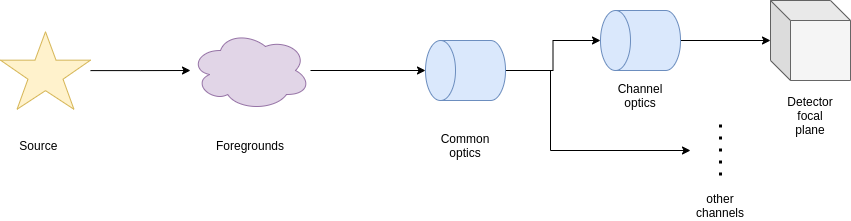

.. _channel:

===================================
Channel
===================================

Remembering the road to the production of the focal plane, presented in :ref:`Focal plane creation`,
after the parsing of source, the foregrounds and the common optics, we have to move inside each channel.

The channels are described in the `.xml` ad

.. code-block:: xml

    <channel> channel_name
        <type>spectrometer</type>
    </channel>

Where the channel `type` can either be `spectrometer` or `photometer`.

These are then handled by the :class:`~exosim.models.channel.Channel` class.

As already mentioned in :ref:`channel optical path`, the :class:`~exosim.models.channel.Channel` class shall be initialised as

.. code-block:: python

    from exosim.models import Channel

    with output.use(append=True, cache=True) as out:

        channel = Channel(parameters=payloadConfig['channel']['channel_name'],
                          wavelength=wl_grid, time=time_grid, output=out)

Where the output use and keyword are to use only if needed.

Optical path
------------
The first action to do with a channel is to parse the dedicated optical path, as already shown in :ref:`channel optical path`.

The channel optical path is to be reported under the channel section in the `.xml` configuration file.

.. code-block:: xml

    <channel> channel_name

        <optical_path>
            <opticalElement> first_optical_element
            </opticalElement>

            <opticalElement> second_optical_element
            </opticalElement>
        </optical_path>

    </channel>

The following script to be attach to the previous ans it assumes that all the previous script have been run already:

.. code-block:: python

        channel.parse_path(light_path=common_path)

This will parse the channel dedicated optical path and attach it after the common optical path already parsed and stored in `common_path`.
The :meth:`~exosim.models.channel.Channel.parse_path` method populates the `path` attribute.
The resulting transmission and radiances are datacubes of the size of :ref:`wavelength grid` and :ref:`temporal grid`, encapsulated in :class:`~exosim.models.signal.Signal` classes.
To learn more about :class:`~exosim.models.signal.Signal` class, refer to :ref:`signal`. This format allow for the use of wavelength and time dependent contributions.

.. _responsivity:

Estimate responsivity
------------------------

The channel responsivity is derived from the detector quantum efficiency (QE).
It is defined in the `.xml` configuration file under the relevant channel section as:

.. code-block:: xml

    <channel> channel_name

        <qe>
            <responsivity_task>LoadResponsivity</responsivity_task>
            <datafile>__ConfigPath__/qe.ecsv</datafile>
        </qe>

    </channel>

As described in :ref:`user foreground` and discussed in :ref:`optical element`, the `responsivity_task` key defines a customisable task that estimates the detector responsivity.
This task typically loads the quantum efficiency and converts it to responsivity.
To learn how to customise this behaviour, see :ref:`Custom Tasks`.

The default task is :class:`~exosim.tasks.instrument.loadResponsivity.LoadResponsivity`.
This task loads a `.csv` or `.ecsv` file specified by `datafile`, which must contain:

- a first column named `Wavelength` (in units convertible to metres),
- one or more columns named after the payload channels, containing QE values (dimensionless) as a function of wavelength.

The default implementation simply selects the column corresponding to the channel, rebins the QE over the simulation grids, and converts it to responsivity using the formula:

.. math::

   R(\lambda) = \frac{QE(\lambda) \cdot \lambda}{h \cdot c}

The result is expressed in :math:`\text{counts/Joule}`, and returned as a datacube over the :ref:`wavelength grid` and :ref:`temporal grid`, encapsulated in a :class:`~exosim.models.signal.Signal`.

For more details on the `Signal` format, see :ref:`signal`. This allows responsivity to vary with both wavelength and time, if needed.

To trigger this action in code, the user should call:

.. code-block:: python

    channel.estimate_responsivity()

.. caution::

    If the `responsivity_task` keyword is omitted from the channel description,
    the method :func:`~exosim.models.channel.Channel.estimate_responsivity`
    will automatically use the default task: :class:`~exosim.tasks.instrument.loadResponsivity.LoadResponsivity`.

Propagate foreground
---------------------

To propagate the foregrounds means to multiply the results of the optical path for the detector responsivity and the right solid angle.

.. math::

    S_{path, i} = A_{pix} \cdot \Omega_{pix} \cdot \nu \cdot I_{path, i}

Where :math:`A_{pix}` is the pixel area, :math:`\Omega_{pix}` is the solid angle and :math:`\nu` is the detector responsivity.
The pixel surface, :math:`A_{pix}`, is computed from the detector section of `.xml` coinfiguration file:

.. code-block:: xml

    <channel> channel_name
        <detector>
            <delta_pix unit="micron"> 18.0 </delta_pix>
        </detector>
    </channel>

.. image:: _static/detector_irradiation.png
    :width: 600
    :align: center

The solid angle, :math:`\Omega_{pix}`, as already discussed in :ref:`supported optical elements`, depends on the position of the optical element respect to the detector.
Everything the comes from the pixel field of view is multiply by the solid angle subtended by an elliptical aperture on-axis.
The used algorithm is from Equation n. 56 of "John T. Conway. Nuclear Instruments and Methods in Physics Research Section A: Accelerators, Spectrometers, Detectors and Associated Equipment, 614(1), 17:27, 2010 (https://doi.org/10.1016/j.nima.2009.11.075).
To estimate the :math:`\Omega_{pix}` from this equation, other information are required as the f-numbers in the two directions:

.. code-block:: xml

    <channel> channel_name
       <Fnum_x>15.5</Fnum_x>
       <Fnum_y>15.5</Fnum_y>
    </channel>

where `x` is the dispersion direction and `y` is the spatial direction. If only `x` is provided the two are assumed to be equal.
If they are equal the solid angle for a circular aperture is estimated.

If the light comes from the optics box, it is then multiplied by :math:`\pi - \Omega_{pix}`. It it comes from the back of the detector, the `detector box`, then is multiplied by :math:`\pi`.

The results will be a dictionary containing the contributions of all the foregrounds (the light paths) expressed as :math:`counts / s / \mu m`.

To run this action, the user shall call the :func:`~exosim.models.channel.Channel.propagate_foreground` method:

.. code-block:: python

        channel.propagate_foreground()

This method will update the `path` attribute.

Propagate Source
-------------------

Similarly to what seen before, to propagate the foreground means multiply the source SED by the instrument efficiency to get the density signal expressed as :math:`counts / s / \mu m`.

For each source parsed as described in :ref:`sky from xml`, the resulting density signal is

.. math::

    S_{source, i} = A_{tel} \cdot \Phi_{tot} \cdot \nu \cdot I_{source, i}

Where :math:`A_{tel}` is the telescope aperture to be indicated in the `common optics` description in the `.xml` file:

.. code-block:: xml

    <Telescope>
        <Atel unit="m**2">  0.63  </Atel>
        <optical_path>
            ...
        </optical_path>
    </Telescope>

:math:`\Phi_{tot}` is the final transmission of the optical chain and :math:`\nu` is the detector responsivity.

To run this action, the user shall call the :func:`~exosim.models.channel.Channel.propagate_sources` method:

.. code-block:: python

        channel.propagate_sources(sources = sources,
                                  Atel = payloadConfig['Telescope']['Atel'])

This method will update the `sources` attribute.
