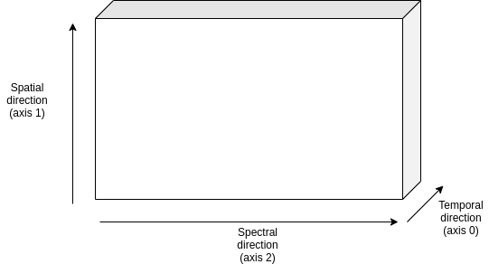
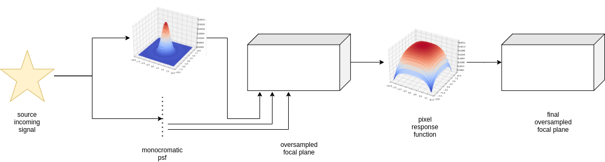
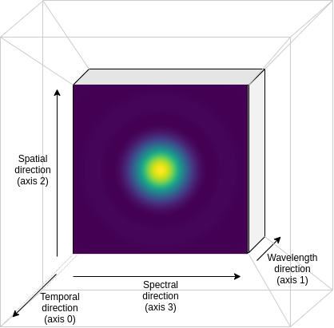
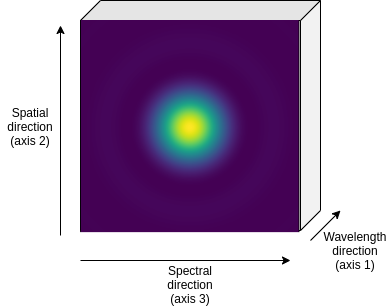
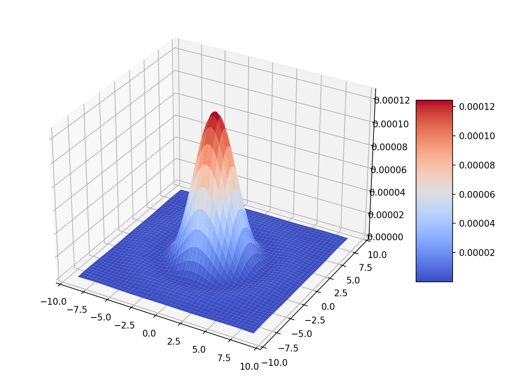
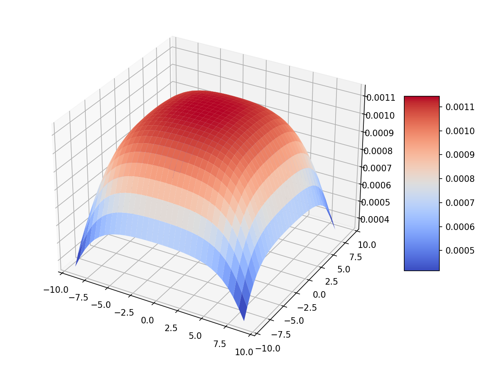

===================================
Focal plane
===================================

Create focal planes
---------------------

The next step in the the :class:`~exosim.models.channel.Channel` pipeline is to create an empty focal planet to populate.
This can be done with the method :func:`~exosim.models.channel.Channel.create_focal_planes`

.. code-block:: python

        channel.create_focal_planes()

This method calls the :class:`~exosim.tasks.instrument.createFocalPlane.CreateFocalPlane` task.
This tasks, first build the focal plane array, by using :class:`~exosim.tasks.instrument.createFocalPlaneArray.CreateFocalPlaneArray`.

.. _detector geometry:

Detector geometry
^^^^^^^^^^^^^^^^^^^

The first step is the detector geometry that needs to be specified in the channel detector description:

.. code-block:: xml

    <channel> channel_name

        <detector>
            <delta_pix unit="micron"> 18.0 </delta_pix>
            <spatial_pix>64</spatial_pix>
            <spectral_pix>364</spectral_pix>
            <oversampling>4</oversampling>
        </detector>

    </channel>

In this case we are building a detector with 64 pixels in the spatial direction and 364 pixel in the dispersion direction, with pixel 18 micron wide.
The `oversampling` key allows us to use sub-pixels. In this case we are splitting each pixel in 4 in each direction, hence having 16 sub-pixels.

.. note::
    The main reason to have an oversampling factor is the jitter effect (see :ref:`Instantaneous readout`).
    The oversampling factor is only needed to assure that the PSF is Nyquist sampled (at least 2 per FWHM).
    The oversampling factor can be any number, but for efficiency reasons it should be a power of 2.

Wavelength solution
^^^^^^^^^^^^^^^^^^^^
If the channel is a `spectrometer`, then the wavelength solution is used to find the wavelength collected by each pixel in the dispersion.
The solution can be specified as

.. code-block:: xml

    <channel> channel_name
        <wl_solution>
            <wl_solution_task>LoadWavelengthSolution</wl_solution_task>
            <datafile>__ConfigPath__/wl_sol.ecsv</datafile>
            
auto

        </wl_solution>
    </channel>

The `wl_sol.ecsv` file is a table with 3 columns: `Wavelength`, `x`, `y`, where `x` is the dispersion direction and `y` is the spatial direction.
If `y` is set to 0 for each wavelength, the source light is assumed to be dispersed only along the dispersion direction, otherwise is to be dispersed also on the spatial direction.
The wavelength associated to each pixel in the spectral and spatial directions are stored along the focal plane in the :class:`~exosim.models.signal.Signal` class in the `spectral` and `spatial` attributes..

The `wl_solution_task` indicates the task to use to load the wavelength solution.
By the default the :class:`~exosim.tasks.instrument.loadWavelengthSolution.LoadWavelengthSolution` is used.
This :class:`~exosim.tasks.task.Task` can be customised, as described in :ref:`Custom Tasks`.

The **center** key is used to set the central pixel in the spectral direction.
If "auto" it sets the central wavelength of the channel in the center of the pixel array.
If a wavelength  is indicated, it centers the wl solution on that wavelength.
Else, it shifts the pixel array by the indicated number of pixels.

If the channel is a `photometer` there is no need to specify the wavelength solution.
The :class:`~exosim.tasks.instrument.createFocalPlaneArray.CreateFocalPlaneArray` tasks will use the detector responsivity to estimate a wavelength solution to use for the next step (:ref:`rescale contribution`).

Source and foregrounds Focal planes
-----------------------------------------
Once the array is built, the :class:`~exosim.tasks.instrument.createFocalPlane.CreateFocalPlane` task creates a stack of array along the temporal direction.

Finally, :func:`~exosim.models.channel.Channel.create_focal_planes` duplicates it to produce a focal plane for the foreground contributions.
This method populates the `focal_plane` and `frg_focal_plane` attributes in the  :class:`~exosim.models.channel.Channel` class.

.. _rescale contribution:

Rescale Contributions
-----------------------

Knowing now the size of the focal planes and the wavelength solutions, we can rescale the incoming signal to convert them from signal densities (:math:`counts/s/\mu m`) into proper signals (:math:`counts/s/pixel`)

.. code-block:: python

        channel.rescale_contributions()

The :func:`~exosim.models.channel.Channel.rescale_contributions` method updates the `sources` and the `path` keys in the :class:`~exosim.models.channel.Channel` class by rebinning the the signals according to the focal plane dispersion binning.
Then it estimates the wavelength solution gradient from the pixel wavelength solution and it multiply the signal by this gradient.

Populate focal plane
----------------------

Next it is finally time to populate the source focal plane. We now follow the following scheme:

First we need to produce a monochromatic PSF for each wavelength sampled in the pixel wavelength solution.
Then we multiply PSF by the source signal to the respective wavelength and we add the result on the relative pixel.
On the now populated focal plane, we then apply the Intra-pixel Response Function (IRF).

The first steps are handled by

.. code-block:: python

        channel.populate_focal_plane()

The :func:`~exosim.models.channel.Channel.populate_focal_plane` method calls :class:`~exosim.tasks.instrument.populateFocalPlane.PopulateFocalPlane` task.

PSF
^^^^^^^^
The first step mentioned above is the production of the Point Spread Function ipercube.

For each temporal step, the PSF cube is defined as in the following figure:

The PSF specifics are to be listed in the `psf` section of the `.xml` channel description.
The simplest PSF are described by the `Airy` or by the `Gauss` functions.

.. code-block:: xml

    <channel> channel_name
        <psf>
            <shape>Airy</shape>
        </psf>
    </channel>

In this case, the :class:`~exosim.tasks.instrument.populateFocalPlane.PopulateFocalPlane` task calls :func:`~exosim.utils.psf.create_psf`
This function produce a PSF cube as the one showed before, where the volume of ech PSF is normalised to unity:

The `psf` section can be customised by adding the following keys:

.. code-block:: xml

    <channel> channel_name
        <psf>
            <shape>Airy</shape>
            <nzero> 8 </nzero>
            <size_y> 64 </size_y>
            <size_x> 64 </size_x>
        </psf>
    </channel>

Where, `nzero` indicates the numbers of zero in the Airy function, `size_x` and `size_y` are the size of the PSF cube in the spectral and spatial directions.
`size_x` and `size_y` can also be set to `full` to use the full size of the focal plane.

However, the user may want to load specific PSF shapes.
This can be done by writing a dedicated :class:`~exosim.tasks.instrument.loadPsf.LoadPsf` task.
:class:`~exosim.tasks.instrument.loadPsf.LoadPsf` task produces an iper-cube, where to each temporal step of the focal plane is associated a PSF cube as the one in the previous picture.
The native PSF format supported by `ExoSim` is PAOS format and the functionality is provided by :class:`~exosim.tasks.instrument.loadPsfPaos.LoadPsfPaos`.
In this case the user shall specify it in the `.xml` file as

.. code-block:: xml

    <channel> channel_name
        <psf>
            <psf_task>LoadPsfPaos</psf_task>
            <filename>__ConfigPath__/paos_file.h5</filename>
        </psf>
    </channel>

The :class:`~exosim.tasks.instrument.loadPsfPaos.LoadPsfPaos` task loads the PSF cube provided by the `filename` data.
The PSF are then interpolated over a grid matching the one used to produce the focal planes, to convert them into the physical units.
Then the total volume of the interpolated PSF is rescaled to the total volume of the original one.
This allow to take into account for loss in the transmission due to the optical path.
The PSF are then interpolated over a wavelength grid matching the one used to for the focal plane, producing the cube.
This would fasten up the successive `ExoSim` steps.
The default :class:`~exosim.tasks.instrument.loadPsfPaos.LoadPsfPaos` task does not include a temporal dependency,
and therefore the PSF cube is repeated on the temporal axis.

.. note::
   
    For long observations with a small "low frequiencies variation" 
    memory needed to keep the repeated PAOS Psf could be very high. 
    It is possible to memorize and store only one PSF, switching 
    to False the `time_dependence` parameter  in the `psf` section,
    e.g.:
    
    .. code-block:: xml

        <channel> channel_name
            <psf>
                <psf_task>LoadPsfPaos</psf_task>
                <filename>__ConfigPath__/paos_file.h5</filename>
                 <time_dependence>False</time_dependence>
            </psf>
        </channel>

The user can define a temporal dependence by using a custom :class:`~exosim.tasks.instrument.loadPsf.LoadPsf` task.
An example using PAOS PSF is reported in :class:`~exosim.tasks.instrument.loadPsfPaosTimeInterp.LoadPsfPaosTimeInterp`.

Finally, the PSF obtained are stored in the output file.

Adding PSF to the focal plane
^^^^^^^^^^^^^^^^^^^^^^^^^^^^^^^
Once the PSF cube is ready, for each temporal step of the focal plane, we add a monochromatic PSF to the relative pixel multiplying it by the relative intensity of the source signal at the same temporal step.
This allow us to produce a dispersed image in the case of a `spectrometer` or to cumulate the PSF in the case of a `photometer`.
Also, if the source signal as a time dependent variation, this is propagated to the image on the focal plane thanks to the use of the same temporal step both in the focal plane and the source signal.
The results will be an oversampled focal plane.

Intra-pixel Response Function
--------------------------------

The pixels on the focal plane do not have an uniform responsivity to the incoming light on their surfaces.
They are known to be more responsive at the center and less to the edges.
This effect can be represented in `ExoSim` introducing the IRF.

This is handled by the :func:`~exosim.models.channel.Channel.apply_irf` method:

.. code-block:: python

        channel.apply_irf()

Create IRF
^^^^^^^^^^^^^
The task to use to estimate the IRF is indicated as

.. code-block:: xml

    <channel> channel_name
        <detector>
            <irf_task>CreateIntrapixelResponseFunction</irf_task>
        </detector>
    </channel>

where :class:`~exosim.tasks.instrument.createIntrapixelResponseFunction.CreateIntrapixelResponseFunction` is the default class.
This tasks implements the equation presented in Barron et al., PASP, 119, 466-475, 2007 (https://doi.org/10.1086/517620).
It required the pixel `diffusion length` and the `intra-pixel distance`:

.. code-block:: xml

    <channel> channel_name
        <detector>
            <irf_task>CreateIntrapixelResponseFunction</irf_task>
            <diffusion_length unit="micron">1.7</diffusion_length>
            <intra_pix_distance unit="micron">0.0</intra_pix_distance>
        </detector>
    </channel>

Two other default tasks are available to create the IRF:
:class:`~exosim.tasks.instrument.createOversampledIntrapixelResponseFunction.CreateOversampledIntrapixelResponseFunction`.
The first one is a simple oversampling of the IRF, while the second one is a oversampling of the IRF with a larger size.

The user can however specify its own tasks and the relative parameters.
Notice that the IRF volume is expected to be normalised to unity.
Here is an example of a resulting IRF:

.. caution::
    If no `irf_task` key is provided in the channel description,
    the :func:`~exosim.models.channel.Channel.apply_irf` method
    automatically uses the default :class:`~exosim.tasks.instrument.createIntrapixelResponseFunction.CreateIntrapixelResponseFunction` task.

IRF application
^^^^^^^^^^^^^^^^^

When the Pixel response function is produced, we apply it using the :class:`~exosim.tasks.instrument.applyIntraPixelResponseFunction.ApplyIntraPixelResponseFunction`.
This task performs a convolution between the focal plane and the IRF.

Now the source focal plane is completed.

.. note::

    In the default recipe (:ref:`focal plane recipe`), if no `irf_task` key is provided in the channel description, the IRF step is skipped.

The user can specify the convolution method to use:

.. code-block:: xml

    <channel> channel_name
        <detector>
            <convolution_method>fftconvolve</convolution_method>
        </detector>
    </channel>

The available methods are: `fftconvolve` (:func:`scipy.signal.fftconvolve`), `convolve` (:func:`scipy.signal.convolve`), `ndimage.convolve` (:func:`scipy.ndimage.convolve`) and `fast_convolution` (:func:`exosim.utils.convolution.fast_convolution`).
If no convolution_method is specified, the default is `fftconvolve`.

.. note::

    The `fast_convolution` method is the same implemented in `Sarkar et al., 2021 <https://link.springer.com/article/10.1007/s10686-020-09690-9>`__`.
    It is very accurate but it is slower than the other methods and requires a lot of memory.
    It is therefore recommended to use it only for small oversampling factor. 

The :class:`~exosim.tasks.instrument.createIntrapixelResponseFunction.CreateIntrapixelResponseFunction`  task creates a kernel compatible with both `fftconvolve` (:func:`scipy.signal.fftconvolve`), `convolve` (:func:`scipy.signal.convolve`) and `ndimage.convolve` (:func:`scipy.ndimage.convolve`).
The tasks :class:`~exosim.tasks.instrument.createOversampledIntrapixelResponseFunction.CreateOversampledIntrapixelResponseFunction` is instead compatible with `fast_convolution` (:func:`exosim.utils.convolution.fast_convolution`), which is a method developed specifically for ExoSim. 

Populate foreground focal plane
--------------------------------

To populate the foregrounds focal plane, we can call the :func:`~exosim.models.channel.Channel.populate_foreground_focal_plane` method:

.. code-block:: python

        channel.populate_foreground_focal_plane()

This involves the :class:`~exosim.tasks.instrument.foregroundsToFocalPlane.ForegroundsToFocalPlane` task,
that simply adds the foregrounds contributions, stored in the `path` attribute, to the foreground focal planet, stored in the `frg_focal_plane` attribute.

If the `path` element to add is before a slit, the signal is dispersed.
Therefore the contribution signal is convolved with a kernel of the width of the slit expressed as number of pixel, and then summed to the full array.
If the slit width is expressed in number of pixel at the focal plane is :math:`L`, and the spectral resolving power computed at a certain :math:`\lambda_0` is :math:`R(\lambda_0)`,
the detector received diffuse radiation over the wavelength range :math:`\left( \lambda_j - \frac{L \lambda_0}{4 R(\lambda_0)} \, , \, \lambda_j  + \frac{L \lambda_0}{4 R(\lambda_0)} \right)`,
and not over the full range of wavelength accepted by the filter. So, the :math:`j`-th pixel sampling the :math:`\lambda_j` wavelength the collected signal is

.. math::
    S(j) = \int_{\lambda_j - \frac{L \lambda_0}{4 R(\lambda_0)}}^{\lambda_j  + \frac{L \lambda_0}{4 R(\lambda_0)}} S_{for} (\lambda) d \lambda

If the `path` element to add is after a slit, or if no slit is in the path, the signal integrated on the full wavelength range is simply added to each pixel:

.. math::
    S = \int S_{for} (\lambda) d \lambda

Now the foreground focal plane is completed.

.. _sub focal planes:

Foreground sub focal planes
^^^^^^^^^^^^^^^^^^^^^^^^^^^
If at least one optical element has

.. code-block:: xml

    <optical_path>
        <opticalElement>
            ...
            <isolate> True <isolate>
        </opticalElement>
    </optical_path>

Then the sub focal planes are computed. The same :func:`~exosim.models.channel.Channel.populate_foreground_focal_plane` method also populates a `frg_sub_focal_planes` attribute.
This is a dictionary containing all the foreground signal contribution, highlighting the ones marked with ``isolate=True``.
The sum of all the sub focal planes matches `frg_focal_plane`.

This mode allows the user to investigate the effects of a single optical surface.
