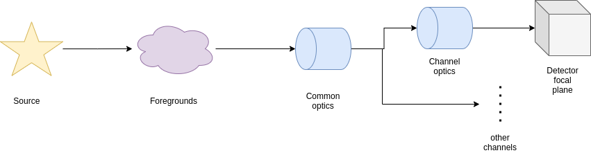

.. _Focal plane creation:

===================================
Focal plane creation
===================================

The first step of an `ExoSim` simulation is the creation of the instrument focal planes.
With `focal plane` here we are referring to the production of a time-dependent focal plane that can account for low-frequency time dependences.
The focal plane creation is automated by a recipe: :class:`~exosim.recipes.create_focal_plane.CreateFocalPlane`.
In this section we explain the steps that lead to the focal plane creation.

First, we discuss the definition of the light sources and their propagation.

As explained in the figure above, we start from the light source. Next we explore the foregrounds and the common optical contributions.
Then, for each channel we estimate the channel optical path and produce the detector focal plane.

.. toctree::
   :maxdepth: 1

    General settings <general>
    Sources <sky_sources>
    Foregrounds <foregrounds>
    Optical Paths <optical_paths>
    Channel <channel>
    Focal plane <focal_plane_array>
    Resulting focal planes <resulting_focal_plane>
    Automatic pipeline <pipeline>

Other useful capabilities of the focal plane creation process are documented in:

.. toctree::
   :maxdepth: 1

    Telescope pointing and multiple sources <pointing>
