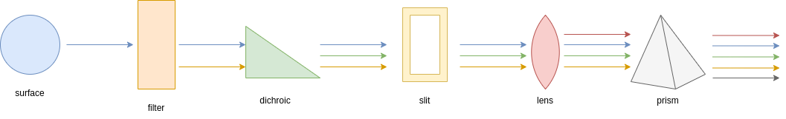
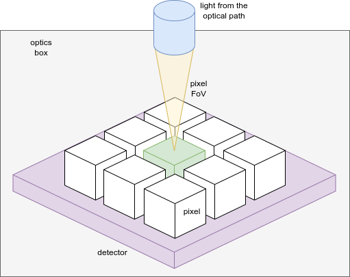

===================================
Optical path
===================================

After the :ref:`foregrounds`, comes the optical path.
`ExoSim` considers two different paths: the common optics path and the channel optical path.

Both the path are described under the `payload` keyword in the configuration file, as mentioned in :ref:`configuration file`.

.. _optical element:

Optical elements
----------------
As the :ref:`foregrounds`, each piece of the optical chain is parsed as an optical element by :class:`~exosim.tasks.parse.parseOpticalElement.ParseOpticalElement`.
More optical elements make an optical path, and therefore are parsed by :class:`~exosim.tasks.parse.parsePath.ParsePath`.

Each optical element in the chain should be clearly defined in the `.xml` configuration file under the `optical_path` keyword.

.. code-block:: xml

    <optical_path>
        <opticalElement> first_optical_element
        </opticalElement>

        <opticalElement> second_optical_element
        </opticalElement>
    </optical_path>

Each parsed optical element contains a radiance in units of :math:`W/m^2/\mu m/sr`, which is contained in a :class:`~exosim.models.signal.Radiance` class,
and a transmission, which is contained in a :class:`~exosim.models.signal.Dimensionless` class. Both classes are children of the :class:`~exosim.models.signal.Signal` class.

.. note::
    `ExoSim 2` does not include an optic simulator. The optical path here is only used to estimate the system transmission and the instrument self emission.
    Any other effect on the performance due to the optical path will be provided to the system in the for of PSF.

As already discussed in :ref:`user foreground`, :class:`~exosim.tasks.load.loadOpticalElement.LoadOpticalElement` is the default :class:`~exosim.tasks.task.Task` included in `ExoSim` to load and optical element.
An optical element is defined by it a radiance, that shall be expressed in units of :math:`W/m^2/\mu m/sr` and contained in a :class:`~exosim.models.signal.Radiance` class,
and an efficiency, contained in a :class:`~exosim.models.signal.Dimensionless` class, both expressed in function of the wavelength.
Hence, this default class looks into the indicated `datafile` to load of the three quantities.
The data file should contain a table such that the three quantities are identified by the keys reported in the `.xml` description.
In this case the wavelength is reported under a column called `Wavelength`, the radiance under the column `Radiance` and the efficiency under the column `Transmission`.

We recall here, that the user can write a custom :class:`~exosim.tasks.task.Task` to load or estimate the optical element differently.
Each optical element can have its own dedicated class.
This can be done by writing a new class inheriting from the default :class:`~exosim.tasks.load.loadOpticalElement.LoadOpticalElement`
and indicating in the `task_model` key the python file containing such new class.
The user shall only overwrite the `model` method in the new class.
The output of a custom model method, as indicated in the :class:`~exosim.tasks.load.loadOpticalElement.LoadOpticalElement` documentation,
shall be a :class:`~exosim.models.signal.Radiance` and a :class:`~exosim.models.signal.Dimensionless`.
The first containing the optical element radiance, and the second the optical element transmission.
The two classes should be binned to the general :ref:`wavelength grid` and :ref:`temporal grid`.
Notice that the binning can be handled by the :func:`~exosim.models.signal.Signal.spectral_rebin` and :func:`~exosim.models.signal.Signal.temporal_rebin` methods of the :class:`~exosim.models.signal.Signal` class.
To learn more about customizing tasks, please refer to :ref:`Custom Tasks`.

.. caution::
    If the user doesn't include the `task_model` keyword in the optical element description,
    the default :class:`~exosim.tasks.load.loadOpticalElement.LoadOpticalElement` task is used.

.. _supported optical elements:

Supported optical elements
---------------------------
The optical element type is indicated in the keyword `type`.
The supported types are listed in the following image and discussed in the following.

Surface & filter
^^^^^^^^^^^^^^^^^^

By default optical elements labelled as surfaces or filters are parsed by :class:`~exosim.tasks.load.loadOpticalElement.LoadOpticalElement`
to estimate the radiance and transmission.
While the transmission can be simply read by the indicated data file, the radiance can either be provided by the user in the same data file,
or it can be estimated by the code. In the second case, the user can provide an emissivity column in the data file and a temperature.
Then the resulting radiance will be estimated as

.. math::

    I_{surf}(\lambda) = \epsilon (\lambda) \cdot BB(\lambda, T)

where :math:`\epsilon` is the indicated emissivity and :math:`BB(\lambda, T)` is the Planck black body law.

.. code-block:: xml

    <optical_path>
        <opticalElement> mirror
            <type>surface</type>
            <task_model>LoadOpticalElement</task_model>
            <temperature unit='K'>60</temperature>
            <datafile>__ConfigPath__/mirror.ecsv</datafile>
            <wavelength_key>wavelength</wavelength_key>
            <emissivity_key>emissivity</emissivity_key>
            <efficiency_key>reflectivity</efficiency_key>
        </opticalElement>

        <opticalElement> filter
            <type>filter</type>
            <task_model>LoadOpticalElement</task_model>
            <temperature unit='K'>60</temperature>
            <datafile>__ConfigPath__/filter.ecsv</datafile>
            <wavelength_key>wavelength</wavelength_key>
            <emissivity_key>emissivity</emissivity_key>
            <efficiency_key>transmission</efficiency_key>
        </opticalElement>
    </optical_path>

In `ExoSim` surface, filter, dichroic, lens and prisms are handled in the same way by default.
However, because dichroics are used as beam splitter, they may compare multiple times in the payload description.
In this case, the user should be carefully in indicating the right efficiency data column (transmission or reflectivity),
according to the optical path branch the element is located in.

slit
^^^^^^^^
`ExoSim` allow the introduction of slits into the payload configuration, to be used as field stops.
The user must indicate the slit size on the focal plane in physical units.

.. code-block:: xml

    <optical_path>
        <opticalElement> slit
            <type>slit</type>
            <width unit="mm">1.5</width>
    </optical_path>

optics box & detector box
^^^^^^^^^^^^^^^^^^^^^^^^^^^^^

Other elements supported by `ExoSim` are the optics box and the detector box.
In these cases the data file, here indicated as `black_box.ecsv` include emissivity and tranmission both set to 1 for every wavelegth.
This are the box containing the optics and the detector and their light reach each pixel in the detector from a solid angle equal to
:math:`\pi - \Omega_{pix}` for the optics box and :math:`\pi` for the light coming from the detector box.

The image summarize the problem. The green detector is illuminated by the yellow cone from the optical path.
The optics box, represented in gray, irradiates it from the top, except from the yellow cone, and hence :math:`\pi - \Omega_{pix}`.
The detector box, in purple, irradiates the pixel from the back: :math:`\pi`.

.. code-block:: xml

    <channel> channel_name
        <optical_path>
            <opticalElement>enclosure
                <type>optics box</type>
                <task_model>LoadOpticalElement</task_model>
                <temperature unit='K'>55</temperature>
                <datafile>__ConfigPath__/black_box.ecsv</datafile>
                <wavelength_key>wavelength</wavelength_key>
                <emissivity_key>emissivity</emissivity_key>
                <efficiency_key>transmission</efficiency_key>
                <solid_angle>pi-omega_pix</solid_angle>
            </opticalElement>

           <opticalElement>detector
                <type>detector box</type>
                <task_model>LoadOpticalElement</task_model>
                <temperature unit='K'>42</temperature>
                <datafile>__ConfigPath__/black_box.ecsv</datafile>
                <wavelength_key>wavelength</wavelength_key>
                <emissivity_key>emissivity</emissivity_key>
                <efficiency_key>transmission_eol</efficiency_key>
                <solid_angle>pi</solid_angle>
            </opticalElement>
        </optical_path>
    </channel>

Custom solid angles can be indicated with steradians units:

.. code-block:: xml

    <channel> channel_name
        <optical_path>
            <opticalElement>enclosure
                <type>optics box</type>
                <task_model>LoadOpticalElement</task_model>
                <temperature unit='K'>55</temperature>
                <datafile>__ConfigPath__/black_box.ecsv</datafile>
                <wavelength_key>wavelength</wavelength_key>
                <emissivity_key>emissivity</emissivity_key>
                <efficiency_key>transmission</efficiency_key>
                <solid_angle unit='sr'> 3.14 </solid_angle>
            </opticalElement>
    </channel>

Parsing the path
------------------
If more optical elements are listed, the :class:`~exosim.tasks.parse.parsePath.ParsePath` class orders them in the same order used by the user in the `.xml` file
and it propagates their light top to bottom. So the first element radiance is multiply by the second element transmission, then the second element radiance is summed.
The obtained radiance is then multiply by the third element transmission and the third element radiance is summed to the result.
The process is summarised in the previous figure.
The final transmission is the product of all the transmission. At the end of the pipeline we have a resulting radiance, still expressed in units of :math:`W/m^2/\mu m/sr`,
and still contained in a :class:`~exosim.models.signal.Radiance` class, which is the resulting radiance at the end of the chain, and a transmission that is the equivalent transmission of al the chain.
This can be considered as an optical element equivalent to the full optical chain.

Similarly to what presented in :ref:`foreground propagation`, we can summarise the process as

.. math::

    I_{opt, i+1} = I_{opt, i+1} + I_{opt, i} \cdot \Phi_{opt, i+1}

.. math::

    \Phi_{opt,i+1} = \Phi_{opt,i+1} \cdot \Phi_{opt,i}

Where :math:`I_{opt, i}` is the radiance of :math:`i` optical element and :math:`\Phi_{opt,i}` is its transmission.

.. note::

    Because of the way the light path is parsed. It's important to be careful of the order of writing for the optical element. Optical elements further from the detector should be write first in the `.xml` file.

The :class:`~exosim.tasks.parse.parsePath.ParsePath` class, allow to combine different optical path. If another optical path has been already parsed, for example, the :ref:`foregrounds` path,
the user can set that path as a starting point for the new one to be parser by using the "ligh_path" keyword.
Combining more path allow us to have at the end of the cain, a single optical element in front of the detector.
In this case, referring to the previous equations we can write

.. math::

    I_{opt, 1} = I_{opt, 1} + I_{prev} \cdot \Phi_{opt, 1}

.. math::

    \Phi_{opt,1} = \Phi_{1} \cdot \Phi_{prev}

Where :math:`opt,1` identifies the first element of the new optical chain, while :math:`prev` is the result of the previous optical chain.

The output of :class:`~exosim.tasks.parse.parsePath.ParsePath` is not a single radiance an transmission, but a dictionary containing multiple radiances.
In fact, when the light reach the slit, it's diffused. But because the estimation of the diffusion is computed on the focal plane, the code stores the information,
and starts collecting the light after the slit as a new radiance. The same happens with the optics and detector box. Because are to be multiplied by different solid angles,
and the information is not available to the code until the all channel is parsed, `ExoSim` separates the light in different radiances.
So, at the end, we have a the radiance from the contributions before the slits in one key of the dictionary that is the output of :class:`~exosim.tasks.parse.parsePath.ParsePath`;
a radiance from the contributions after the slit but the boxes; a radiance for the optics box and one for the detector boxes.

The user may also want to investigate the effects of a specific surface or contribution. In this case the user can use the keyword `isolate`:

.. code-block:: xml

    <optical_path>
        <opticalElement>
            ...
            <isolate> True <isolate>
        </opticalElement>
    </optical_path>

This forces the code to isolate that specific contribution and store it separately from the others in the output.

Common optics
--------------

The common optics path is describe under the `Telescope` keyword in the descriptions.

.. code-block:: xml

    <Telescope>
        <optical_path>
            ...
        </optical_path>
    </Telescope>

To optimise the code efficiency in case there are more channels in the payload, we estimate this contribution first.
To estimate it we use :class:`~exosim.tasks.parse.parsePath.ParsePath`.
If :ref:`foregrounds` have been parsed before, they should be attached to this path.

.. code-block:: python

    import exosim.tasks.parse as parse

    with output.use(append=True, cache=True) as out:

        payloadConfig = mainConfig['payload']
        out_payload = out.create_group('payload')

        parsePath = parse.ParsePath()
        common_path = parsePath(
            parameters=payloadConfig['Telescope']['optical_path'],
            wavelength=wl_grid, time=time_grid,
            output=out_payload, group_name='telescope',
            light_path=for_contrib )

Where `for_contrib` has been produced in :ref:`foreground propagation` .

.. _channel optical path:

Channel optical path
------------------------
For each channel a specific optical path can be define and parsed.
This can either be estimate with :class:`~exosim.tasks.parse.parsePath.ParsePath` or using the :class:`~exosim.models.channel.Channel` class.

The :class:`~exosim.models.channel.Channel` class contains all the routing to move forward to the focal plane production.
The class can be instantiated providing a dictionary with the channel description and the :ref:`wavelength grid` and :ref:`temporal grid`.
Then the path can be parsed using :func:`~exosim.models.channel.Channel.parse_path`.

.. code-block:: python

    from exosim.models import Channel

    with output.use(append=True, cache=True) as out:

        channel = Channel(parameters=payloadConfig['channel']['channel_name'],
                          wavelength=wl_grid, time=time_grid, output=out)
        channel.parse_path(light_path=common_path)

Other functions of the :class:`~exosim.models.channel.Channel` class are discussed in :ref:`channel`.
