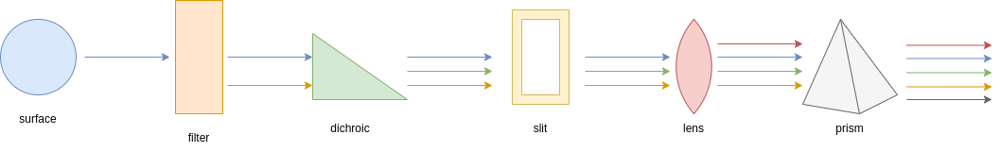
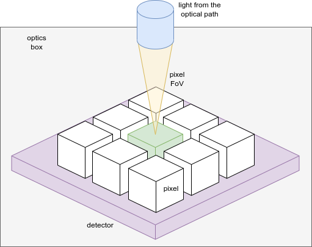

============
Optical path
============

After the :ref:`foregrounds` comes the optical path. `ExoSim` considers two
optical paths: the **common optics** path and the **channel** optical path.

Both are described under the `payload` keyword in the configuration file (see
:ref:`configuration file`).

.. _optical element:

Optical elements
----------------

As with the :ref:`foregrounds`, every piece of the optical chain is parsed as an
optical element by
:class:`~exosim.tasks.parse.parseOpticalElement.ParseOpticalElement`, and
several optical elements together form a path parsed by
:class:`~exosim.tasks.parse.parsePath.ParsePath`.

Each optical element is defined in the `.xml` configuration file under the
`optical_path` keyword:

.. code-block:: xml

    <optical_path>
        <opticalElement> first_optical_element
        </opticalElement>

        <opticalElement> second_optical_element
        </opticalElement>
    </optical_path>

Each parsed optical element carries a radiance in units of
:math:`W/m^2/\mu m/sr`, in a :class:`~exosim.models.signal.Radiance` object, and
a transmission, in a :class:`~exosim.models.signal.Dimensionless` object. Both
are subclasses of :class:`~exosim.models.signal.Signal`.

.. note::
    `ExoSim 2` does not include an optical simulator. The optical path is used
    only to estimate the system transmission and the instrument self-emission.
    Any other effect of the optics on performance is fed to the system as a PSF.

As already discussed in :ref:`user foreground`,
:class:`~exosim.tasks.load.load_optical_element.LoadOpticalElement` is the
default :class:`~exosim.tasks.task.Task` for loading an optical element. An
optical element is defined by its radiance (in :math:`W/m^2/\mu m/sr`, a
:class:`~exosim.models.signal.Radiance`) and its efficiency (a
:class:`~exosim.models.signal.Dimensionless`), both as functions of wavelength.
The default task reads three columns from `datafile`, identified by the keys in
the `.xml` description: `Wavelength` for the wavelength, `Radiance` for the
radiance, and `Transmission` for the efficiency.

As with the foregrounds, you can write a custom
:class:`~exosim.tasks.task.Task` to load or estimate an optical element
differently, and each optical element can have its own task. Write a new class
that inherits from
:class:`~exosim.tasks.load.load_optical_element.LoadOpticalElement`, point the
`task_model` key at the Python file that contains it, and override only the
`model` method. As described in the
:class:`~exosim.tasks.load.load_optical_element.LoadOpticalElement`
documentation, `model` must return a :class:`~exosim.models.signal.Radiance`
(the element radiance) and a :class:`~exosim.models.signal.Dimensionless` (the
element transmission), both binned to the :ref:`wavelength grid` and the
:ref:`temporal grid`. The
:func:`~exosim.models.signal.Signal.spectral_rebin` and
:func:`~exosim.models.signal.Signal.temporal_rebin` methods of
:class:`~exosim.models.signal.Signal` can do the binning. See :ref:`Custom
Tasks` for more.

.. caution::
    If you omit the `task_model` keyword from an optical-element description,
    the default
    :class:`~exosim.tasks.load.load_optical_element.LoadOpticalElement` task is
    used.

.. _supported optical elements:

Supported optical elements
--------------------------

The optical-element type is set with the `type` keyword. The supported types are
shown in the figure and described below.

Surface & filter
^^^^^^^^^^^^^^^^^

By default, optical elements of type `surface` or `filter` are parsed by
:class:`~exosim.tasks.load.load_optical_element.LoadOpticalElement` to estimate
their radiance and transmission. The transmission is read directly from the data
file. The radiance is either given in the same data file or computed by the
code: in the latter case, provide an emissivity column and a temperature, and
the radiance is estimated as

.. math::

    I_{surf}(\lambda) = \epsilon (\lambda) \cdot BB(\lambda, T)

where :math:`\epsilon` is the emissivity and :math:`BB(\lambda, T)` is the
Planck black-body law.

.. code-block:: xml

    <optical_path>
        <opticalElement> mirror
            <type>surface</type>
            <task_model>LoadOpticalElement</task_model>
            <temperature unit='K'>60</temperature>
            <datafile>__ConfigPath__/mirror.ecsv</datafile>
            <wavelength_key>wavelength</wavelength_key>
            <emissivity_key>emissivity</emissivity_key>
            <efficiency_key>reflectivity</efficiency_key>
        </opticalElement>

        <opticalElement> filter
            <type>filter</type>
            <task_model>LoadOpticalElement</task_model>
            <temperature unit='K'>60</temperature>
            <datafile>__ConfigPath__/filter.ecsv</datafile>
            <wavelength_key>wavelength</wavelength_key>
            <emissivity_key>emissivity</emissivity_key>
            <efficiency_key>transmission</efficiency_key>
        </opticalElement>
    </optical_path>

By default, `ExoSim` handles surfaces, filters, dichroics, lenses and prisms in
the same way. Because dichroics are used as beam splitters, they may appear more
than once in the payload description; in that case, choose the correct
efficiency column (transmission or reflectivity) for the branch of the optical
path where the element sits.

Slit
^^^^

`ExoSim` lets you add slits to the payload configuration as field stops. You
give the slit size on the focal plane in physical units.

A slit acts as a geometric filter on the optical path. It fully diffuses
contributions that are completely extended or diffuse, such as the self-emission
of mirrors placed before the slit, or the foreground: these are treated as
extended sources, and after the slit their distribution is diffused on the focal
plane.

A slit does not account for the dispersion of partially extended elements, and
it does not affect vignetting or the propagation of the PSF. In short: a slit
only diffuses fully extended or diffuse contributions, and leaves the PSF
propagation unchanged.

.. code-block:: xml

    <optical_path>
        <opticalElement> slit
            <type>slit</type>
            <width unit="mm">1.5</width>
        </opticalElement>
    </optical_path>

Optics box & detector box
^^^^^^^^^^^^^^^^^^^^^^^^^^

`ExoSim` also supports the optics box and the detector box. For these, the data
file (here `black_box.ecsv`) sets emissivity and transmission to 1 at every
wavelength. These are the enclosures around the optics and the detector; their
light reaches each detector pixel from a solid angle of
:math:`\pi - \Omega_{pix}` for the optics box and :math:`\pi` for the detector
box.

The figure summarises the geometry. The green detector is illuminated by the
yellow cone from the optical path. The optics box (grey) irradiates it from the
front, everywhere except the yellow cone, hence :math:`\pi - \Omega_{pix}`. The
detector box (purple) irradiates the pixel from the back, hence :math:`\pi`.

.. code-block:: xml

    <channel> channel_name
        <optical_path>
            <opticalElement>enclosure
                <type>optics box</type>
                <task_model>LoadOpticalElement</task_model>
                <temperature unit='K'>55</temperature>
                <datafile>__ConfigPath__/black_box.ecsv</datafile>
                <wavelength_key>wavelength</wavelength_key>
                <emissivity_key>emissivity</emissivity_key>
                <efficiency_key>transmission</efficiency_key>
                <solid_angle>pi-omega_pix</solid_angle>
            </opticalElement>

           <opticalElement>detector
                <type>detector box</type>
                <task_model>LoadOpticalElement</task_model>
                <temperature unit='K'>42</temperature>
                <datafile>__ConfigPath__/black_box.ecsv</datafile>
                <wavelength_key>wavelength</wavelength_key>
                <emissivity_key>emissivity</emissivity_key>
                <efficiency_key>transmission_eol</efficiency_key>
                <solid_angle>pi</solid_angle>
            </opticalElement>
        </optical_path>
    </channel>

Custom solid angles can be given in steradians:

.. code-block:: xml

    <channel> channel_name
        <optical_path>
            <opticalElement>enclosure
                <type>optics box</type>
                <task_model>LoadOpticalElement</task_model>
                <temperature unit='K'>55</temperature>
                <datafile>__ConfigPath__/black_box.ecsv</datafile>
                <wavelength_key>wavelength</wavelength_key>
                <emissivity_key>emissivity</emissivity_key>
                <efficiency_key>transmission</efficiency_key>
                <solid_angle unit='sr'> 3.14 </solid_angle>
            </opticalElement>
        </optical_path>
    </channel>

Load from HDF5 file
^^^^^^^^^^^^^^^^^^^

You can also load an optical element from an HDF5 file, with
:class:`~exosim.tasks.load.load_optical_element.LoadOpticalElementHDF5`:

.. code-block:: xml

    <channel> channel_name
        <optical_path>
            <opticalElement> mirror
                <type>surface</type>
                <task_model>LoadOpticalElement</task_model>
                <temperature unit='K'>60</temperature>
                <hdf5_file>__ConfigPath__/optics.hdf5</hdf5_file>
                <group_key>mirrors</group_key>
                <wavelength_key>wavelength</wavelength_key>
                <emissivity_key>emissivity</emissivity_key>
                <efficiency_key>reflectivity</efficiency_key>
            </opticalElement>
        </optical_path>
    </channel>

Parsing the path
----------------

When several optical elements are listed,
:class:`~exosim.tasks.parse.parsePath.ParsePath` keeps them in the `.xml` order
and propagates the light from top to bottom: the radiance of the first element
is multiplied by the transmission of the second, then the radiance of the second
is added; that result is multiplied by the transmission of the third, and the
radiance of the third is added; and so on (this is the process shown in the
figure above). The final transmission is the product of all the individual
transmissions. The result is a single radiance (still in
:math:`W/m^2/\mu m/sr`, still a :class:`~exosim.models.signal.Radiance`) and a
single transmission, together equivalent to the whole optical chain.

As in :ref:`foreground propagation`, the recursive relation is

.. math::

    I_{opt, i+1} = I_{opt, i+1} + I_{opt, i} \cdot \Phi_{opt, i+1}

.. math::

    \Phi_{opt,i+1} = \Phi_{opt,i+1} \cdot \Phi_{opt,i}

where :math:`I_{opt, i}` is the radiance of optical element :math:`i` and
:math:`\Phi_{opt,i}` is its transmission.

.. note::
    Because of how the light path is parsed, the order of the optical elements
    matters. Elements further from the detector must be written first in the
    `.xml` file.

:class:`~exosim.tasks.parse.parsePath.ParsePath` can also chain optical paths
together. If another path has already been parsed (for example the
:ref:`foregrounds` path), use the `light_path` keyword to set it as the starting
point for the new one. Chaining paths this way leaves a single equivalent
optical element in front of the detector. In terms of the equations above:

.. math::

    I_{opt, 1} = I_{opt, 1} + I_{prev} \cdot \Phi_{opt, 1}

.. math::

    \Phi_{opt,1} = \Phi_{1} \cdot \Phi_{prev}

where :math:`opt,1` is the first element of the new chain and :math:`prev` is
the result of the previous chain.

The output of :class:`~exosim.tasks.parse.parsePath.ParsePath` is not a single
radiance and transmission but a dictionary of several radiances. When the light
reaches the slit it is diffused, but because the diffusion is computed on the
focal plane, the code records the information and starts collecting the light
after the slit as a new radiance. The same happens with the optics and detector
boxes: they must be multiplied by different solid angles, which are not known
until the whole channel is parsed, so `ExoSim` keeps their light in separate
radiances. In the end the dictionary holds: the radiance from the contributions
before the slit, the radiance from the contributions after the slit but before
the boxes, the radiance for the optics box, and the radiance for the detector
box.

To study the effect of one specific surface or contribution, use the `isolate`
keyword:

.. code-block:: xml

    <optical_path>
        <opticalElement>
            ...
            <isolate> True </isolate>
        </opticalElement>
    </optical_path>

This makes the code isolate that contribution and store it separately in the
output.

Common optics
-------------

The common optics path is described under the `Telescope` keyword:

.. code-block:: xml

    <Telescope>
        <optical_path>
            ...
        </optical_path>
    </Telescope>

When the payload has several channels, it is more efficient to estimate this
contribution first, with :class:`~exosim.tasks.parse.parsePath.ParsePath`. If the
:ref:`foregrounds` were parsed earlier, attach them to this path:

.. code-block:: python

    import exosim.tasks.parse as parse

    with output.use(append=True, cache=True) as out:

        payloadConfig = mainConfig['payload']
        out_payload = out.create_group('payload')

        parsePath = parse.ParsePath()
        common_path = parsePath(
            parameters=payloadConfig['Telescope']['optical_path'],
            wavelength=wl_grid, time=time_grid,
            output=out_payload, group_name='telescope',
            light_path=for_contrib )

Here `for_contrib` was produced in :ref:`foreground propagation`.

.. _channel optical path:

Channel optical path
--------------------

Each channel can define and parse its own optical path, either with
:class:`~exosim.tasks.parse.parsePath.ParsePath` or through the
:class:`~exosim.models.channel.Channel` class.

The :class:`~exosim.models.channel.Channel` class holds all the routing needed
to move forward to the focal-plane production. Instantiate it with a dictionary
describing the channel plus the :ref:`wavelength grid` and :ref:`temporal grid`,
then parse the path with :func:`~exosim.models.channel.Channel.parse_path`:

.. code-block:: python

    from exosim.models import Channel

    with output.use(append=True, cache=True) as out:

        channel = Channel(parameters=payloadConfig['channel']['channel_name'],
                          wavelength=wl_grid, time=time_grid, output=out)
        channel.parse_path(light_path=common_path)

The other methods of :class:`~exosim.models.channel.Channel` are discussed in
:ref:`channel`.
