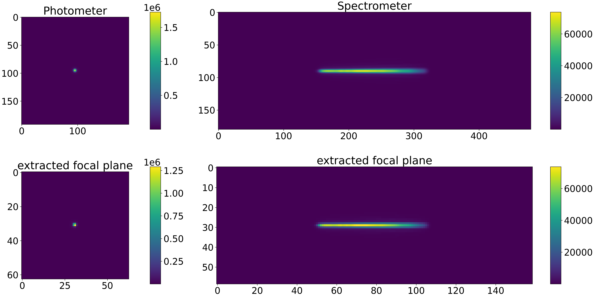
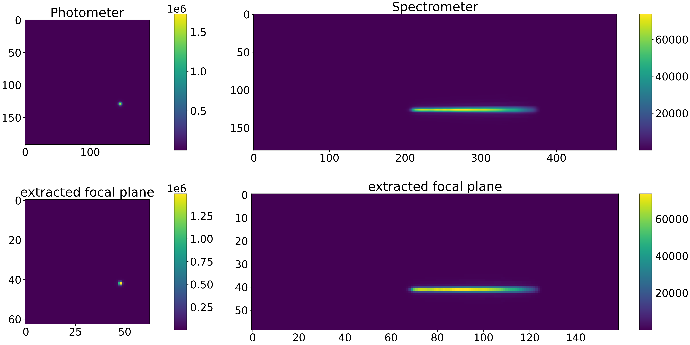
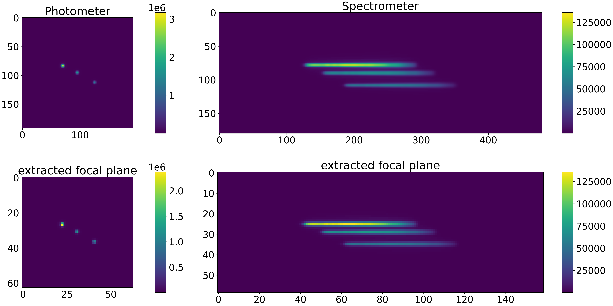

.. _pointing:

===========================================
Telescope pointing and multiple sources
===========================================

In this section we will discuss how to simulate the source position in the sky, relatively to the telescope pointing.
In a real observation, the telescope is pointed to a certain location in the sky, where the target is expected to be, and other sources can be in the field.

.. note::
    This pointing section has nothing to do with pointing stability simulations or with a pointing direction changing with time.
    Here we are only simulating the telescope ideal pointing.

The position of the target from the sky to the focal plane is handled in :class:`~exosim.tasks.instrument.populateFocalPlane.PopulateFocalPlane`
by the :class:`~exosim.tasks.instrument.computeSourcesPointingOffset.ComputeSourcesPointingOffset`. The offset resolution is in integer multiple of the subpixel size.

Telescope pointing
--------------------

In `exosim` the telescope pointing direction can be set in the main configuration `.xml` file (see :ref:`general settings`).
Assuming we want to observe HD209458_ we point the telescope to the target coordinates by adding

.. code-block:: xml

    <root>
        <pointing>
            <ra> 22h03m10.8s </ra>
            <dec> +18d53m04s </dec>
        </pointing>
    </root>

Then, we need to add the coordinates also to the star in the source description (see :ref:`sources`):

.. code-block:: xml

   <source> HD 209458
        <source_type> planck </source_type>

        <R unit="R_sun"> 1.17967 </R>
        <M unit="M_sun"> 1.1753 </M>
        <T unit="K"> 6086 </T>
        <D unit="pc"> 47.4567 </D>
        <z unit=""> 0.0 </z>

        <ra> 22h03m10.8s </ra>
        <dec> +18d53m04s </dec>
    </source>

Another important information is the channel plane scale. In fact, `exosim` needs to estimate the angle of view of each pixel
to estimate the star position in the focal plane. Assuming the instrument has two channel: a photometer and a spectrometer,
we can add this information under the `detector` section as

.. code-block:: xml

    <channel> Photometer
        <type> photometer </type>
        <detector>
            <plate_scale unit="arcsec/micron"> 0.01 </plate_scale>
        <detector>
    </channel>

    <channel> Spectrometer
        <type> spectrometer </type>
        <detector>
            <plate_scale>
                <spatial unit="arcsec/micron"> 0.01 </spatial>
                <spectral unit="arcsec/micron"> 0.05 </spectral>
            </plate_scale>
        <detector>
    </channel>

In this example, the spectrometer has different plate scales in the two detector directions.

Because we are pointing directly to the target, the star will be at the center of the focal plane:

Pointing offset
------------------

If we want to simulate an offset of the source on the focal plane, we can mode the telescope pointing.
In this example we simply changed the pointing in the main configuration `.xml` file:

.. code-block:: xml

    <root>
        <pointing>
            <ra> 22h03m11s </ra>
            <dec> +18d53m06s </dec>
        </pointing>
    </root>

The result will be a different location of the target on the focal plane

.. _multiple_sources:

Multiple sources in the field
----------------------------------

Another useful case is the simulation of multiple sources on the focal plane.
In this example we add two other targets. To keep things simple, we add two HD209458 stars to the field: HD209458 1 and HD209458 2.
We change the star distances a little, to differentiate them on the focal plane: HD209458 1 is set at 55 pc and
HD209458 2 is set at 35 pc instead of 47 pc as the original star location.
Also the star locations on the sky are little changed to generate the offsets:

.. code-block:: xml

    <source> HD 209458 1
        <source_type> phoenix </source_type>
        <path>/usr/local/project_data/sed </path>

        <R unit="R_sun"> 1.17967 </R>
        <M unit="M_sun"> 1.1753 </M>
        <T unit="K"> 6086 </T>
        <D unit="pc"> 55 </D>
        <z unit=""> 0.0 </z>

        <ra> 22h03m10.68s </ra>
        <dec> +18d53m03s </dec>

    </source>

    <source> HD 209458 2
        <source_type> phoenix </source_type>
        <path>/usr/local/project_data/sed </path>

        <R unit="R_sun"> 1.17967 </R>
        <M unit="M_sun"> 1.1753 </M>
        <T unit="K"> 6086 </T>
        <D unit="pc"> 35 </D>
        <z unit=""> 0.0 </z>

        <ra> 22h03m10.9s </ra>
        <dec> +18d53m04.7s </dec>
    </source>

The results will be like:

.. _HD209458: http://simbad.u-strasbg.fr/simbad/sim-id?Ident=HD%20209458

For the following, it is important to separate the target source,
which is the source that we expect to have an astronomical signal associated (see :ref:`Astronomical signals`),
from the others.
This can be done by adding the `source_target` attribute to the source description:

.. code-block:: xml

   <source> HD 209458
        <source_target>True</source_target>
    </source>

Then the target source will be treated differently from the others.
In the focal plane data product, the target source will be stored under the ``focal_plane`` group.
The other sources are considered `background sources` and will be stored under the ``bkg_focal_plane`` group.
