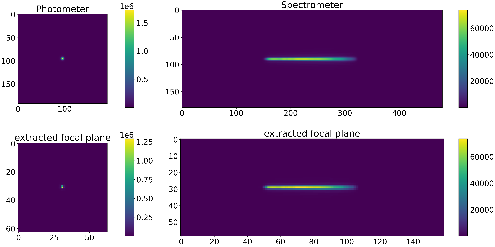
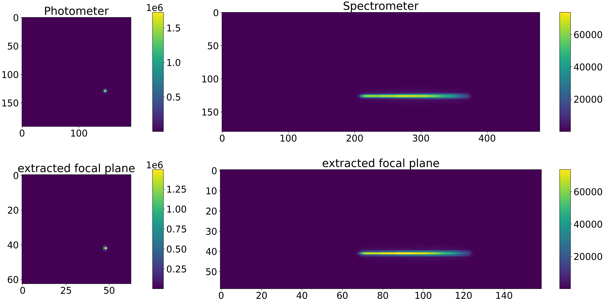
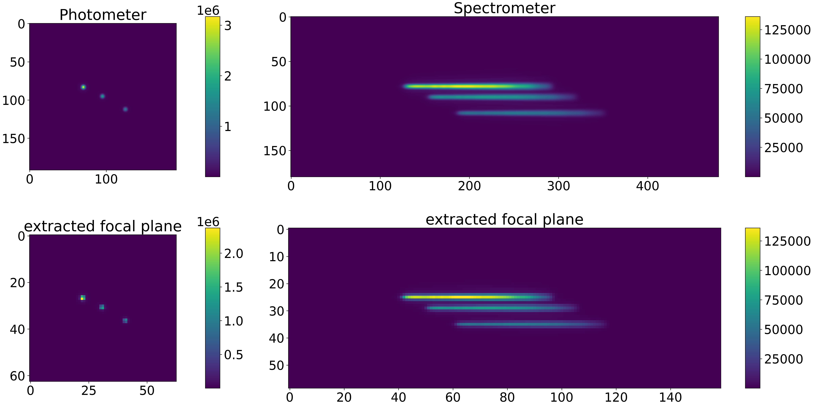

.. _pointing:

=======================================
Telescope pointing and multiple sources
=======================================

This section explains how to simulate where a source sits in the sky relative to
the telescope pointing. In a real observation, the telescope points at a
location in the sky where the target is expected to be, and other sources may
fall in the field.

.. note::
    This section has nothing to do with pointing-stability simulations or a
    pointing direction that changes with time. Here we simulate only the ideal,
    static telescope pointing.

The path of the target from the sky to the focal plane is handled in
:class:`~exosim.tasks.instrument.populate_focal_plane.PopulateFocalPlane` by
:class:`~exosim.tasks.instrument.compute_sources_pointing_offset.ComputeSourcesPointingOffset`.
The offset resolution is an integer multiple of the sub-pixel size.

Telescope pointing
------------------

The telescope pointing direction is set in the main configuration `.xml` file
(see :ref:`general settings`). To observe HD209458_, point the telescope at the
target coordinates:

.. code-block:: xml

    <root>
        <pointing>
            <ra> 22h03m10.8s </ra>
            <dec> +18d53m04s </dec>
        </pointing>
    </root>

Then add the same coordinates to the star in the source description (see
:ref:`sources`):

.. code-block:: xml

   <source> HD 209458
        <source_type> planck </source_type>

        <R unit="R_sun"> 1.17967 </R>
        <M unit="M_sun"> 1.1753 </M>
        <T unit="K"> 6086 </T>
        <D unit="pc"> 47.4567 </D>
        <z unit=""> 0.0 </z>

        <ra> 22h03m10.8s </ra>
        <dec> +18d53m04s </dec>
    </source>

`ExoSim` also needs the channel plate scale, so it can work out the angular size
of each pixel and place the star on the focal plane. For an instrument with a
photometer and a spectrometer, add it under the `detector` section:

.. code-block:: xml

    <channel> Photometer
        <type> photometer </type>
        <detector>
            <plate_scale unit="arcsec/micron"> 0.01 </plate_scale>
        </detector>
    </channel>

    <channel> Spectrometer
        <type> spectrometer </type>
        <detector>
            <plate_scale>
                <spatial unit="arcsec/micron"> 0.01 </spatial>
                <spectral unit="arcsec/micron"> 0.05 </spectral>
            </plate_scale>
        </detector>
    </channel>

Here the spectrometer has different plate scales in the two detector directions.

Because we point straight at the target, the star lands at the centre of the
focal plane:

Pointing offset
---------------

To offset the source on the focal plane, move the telescope pointing. In this
example we simply changed the pointing in the main configuration `.xml` file:

.. code-block:: xml

    <root>
        <pointing>
            <ra> 22h03m11s </ra>
            <dec> +18d53m06s </dec>
        </pointing>
    </root>

The target now lands at a different position on the focal plane:

.. _multiple_sources:

Multiple sources in the field
-----------------------------

`ExoSim` can also put several sources on the focal plane. In this example we add
two more targets. To keep things simple, they are two more copies of HD 209458,
called HD 209458 1 and HD 209458 2, at slightly different distances so they can
be told apart on the focal plane: HD 209458 1 at 55 pc and HD 209458 2 at 35 pc,
against 47 pc for the original star. Their sky positions are also nudged to
create the offsets:

.. code-block:: xml

    <source> HD 209458 1
        <source_type> phoenix </source_type>
        <path>/usr/local/project_data/sed </path>

        <R unit="R_sun"> 1.17967 </R>
        <M unit="M_sun"> 1.1753 </M>
        <T unit="K"> 6086 </T>
        <D unit="pc"> 55 </D>
        <z unit=""> 0.0 </z>

        <ra> 22h03m10.68s </ra>
        <dec> +18d53m03s </dec>

    </source>

    <source> HD 209458 2
        <source_type> phoenix </source_type>
        <path>/usr/local/project_data/sed </path>

        <R unit="R_sun"> 1.17967 </R>
        <M unit="M_sun"> 1.1753 </M>
        <T unit="K"> 6086 </T>
        <D unit="pc"> 35 </D>
        <z unit=""> 0.0 </z>

        <ra> 22h03m10.9s </ra>
        <dec> +18d53m04.7s </dec>
    </source>

The result looks like this:

.. _HD209458: http://simbad.u-strasbg.fr/simbad/sim-id?Ident=HD%20209458

For the next steps it matters to separate the **target source**, the one
expected to carry an astronomical signal (see :ref:`Astronomical signals`), from
the others. Do this with the `source_target` attribute:

.. code-block:: xml

   <source> HD 209458
        <source_target>True</source_target>
    </source>

The target source is then treated differently from the rest: in the focal-plane
data product it is stored under the ``focal_plane`` group, while the others are
treated as background sources and stored under ``bkg_focal_plane``.
