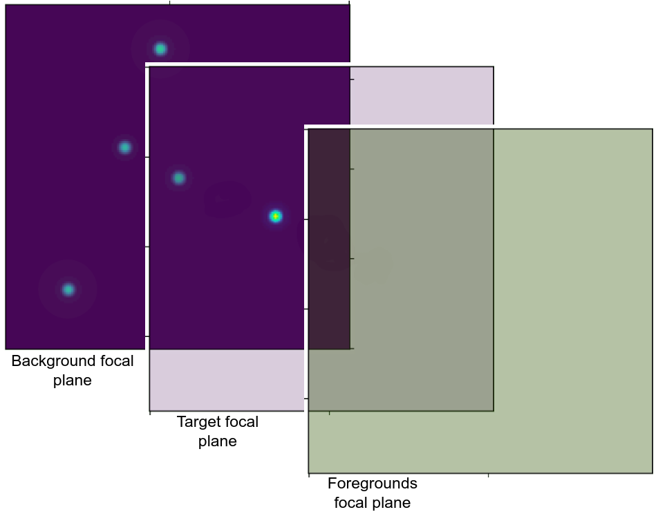
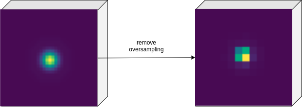
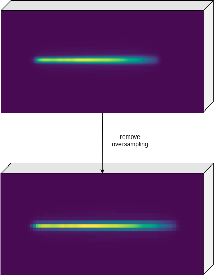
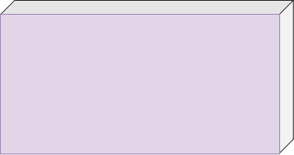
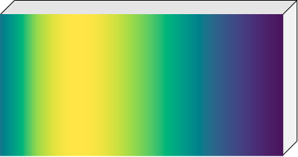

===================================
Resulting focal planes
===================================

In the previous sections we saw how to produce the focal planes for different channels.
Here we'll explain how this focal planes looks like.

Note that so far we have built three different focal planes, that can be considered are three layers:

    - ``focal_plane``: containing the signal from the target star
    - ``bkg_focal_plane``: containing the stars in the field of view 
    - ``frg_focal_plane``: containing the signal from the foreground

The reason for this separation is cleared when the astronomical signal (see :ref:`Astronomical signals`) needs to be added to the target star.

We remember here that in the previous sections we mentioned the possibility to oversampling the pixel array.
In that case the resulting focal plane will be oversampled.

In the following we report examples for both the oversampled focal plane and the real focal plane.
To move from the oversampled focal plane to the original one, one can use the following script

.. code-block:: python

    osf = 4
    original = focal_plane.data[:, osf//2::osf, osf//2::osf]

where we assumed `focal_plane` to be the produced oversampled focal plane with an oversampling factor `osf=3`.

Photometers
-------------------------

Here we report both the oversampled focal plane and the original one.
In this example we used an oversampling factor of 4.

The focal planes looks like data cube because we recall here that the first axis is for time evolution.

Spectrometers
-------------------------
Here we report again both the oversampled focal plane and the original one.
We still used an oversampling factor of 4.

Foregrounds
-------------------------
In this example, we report first the case of a not-dispersed foreground focal plane,
which results in a constant value over the full oversampled array.

Then we include the example of a dispersed foreground focal plane:

Store and load the focal planes
--------------------------------------------
To store the focal plane into the output file, the user can simply use the :func:`~exosim.models.signal.Signal.write` method of the :class:`~exosim.models.signal.Signal` class:

.. code-block:: python

        channel.focal_plane.write()
        channel.frg_focal_plane.write()

The sub focal planes, if generated, can be stored as

.. code-block:: python

        for key, value in channel.frg_sub_focal_planes.items():
            value.write()

If the output format is the default HDF5_, refer to :ref:`loadHDF5` in the :ref:`FAQs` section for how to use the data,
and see :ref:`load signal table` in particular to cast the focal plane into a :class:`~exosim.models.signal.Signal` class.

.. _HDF5: https://www.hdfgroup.org/solutions/hdf5/
