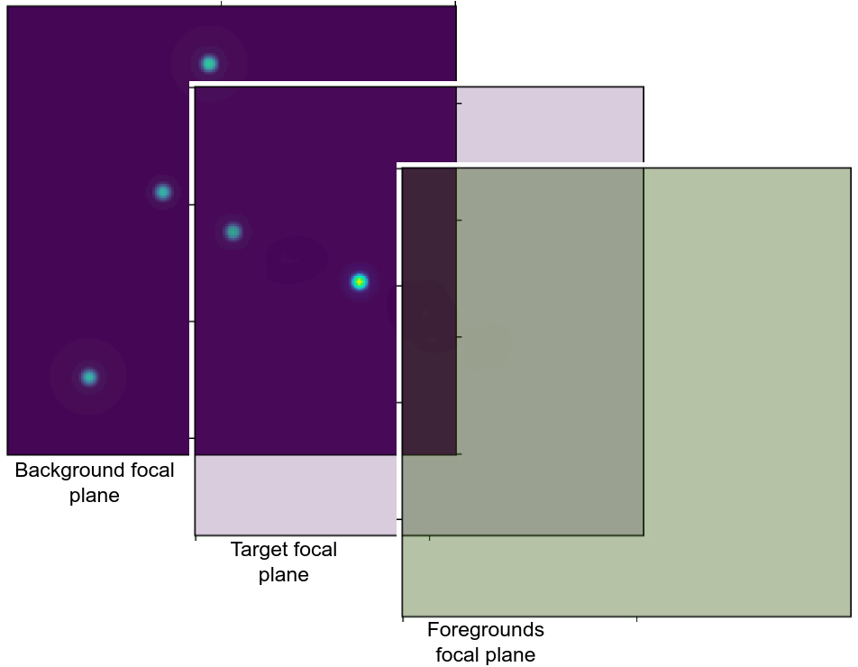
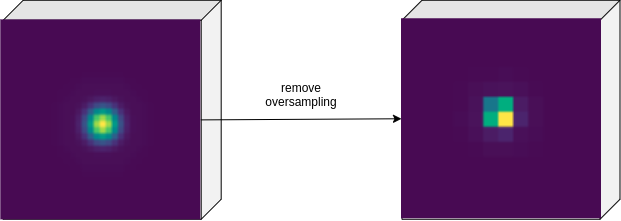
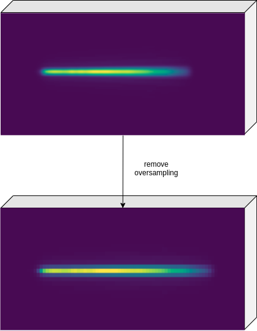
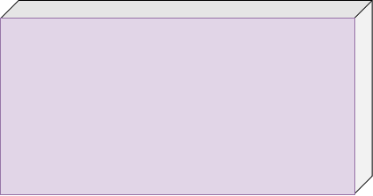
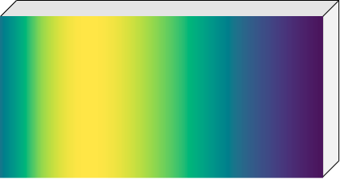

======================
Resulting focal planes
======================

The previous sections showed how to build the focal planes for each channel.
This section shows what they look like.

So far we have built three focal planes, which can be thought of as three
layers:

- ``focal_plane``: the signal from the target star;
- ``bkg_focal_plane``: the other stars in the field of view;
- ``frg_focal_plane``: the signal from the foreground.

The reason for keeping them separate becomes clear when the astronomical signal
(see :ref:`Astronomical signals`) has to be added to the target star.

As mentioned earlier, the pixel array can be oversampled; in that case the
resulting focal plane is oversampled too. The examples below show both the
oversampled focal plane and the real one. To go from the oversampled focal
plane back to the real one:

.. code-block:: python

    osf = 4
    original = focal_plane.data[:, osf//2::osf, osf//2::osf]

where `focal_plane` is the oversampled focal plane and `osf` is its oversampling
factor.

Photometers
-----------

The oversampled focal plane and the real one, for an oversampling factor of 4:

The focal planes look like data cubes because the first axis is time.

Spectrometers
-------------

Again, the oversampled focal plane and the real one, with an oversampling factor
of 4:

Foregrounds
-----------

First, a non-dispersed foreground focal plane, which is a constant value over
the whole oversampled array:

Then a dispersed foreground focal plane:

Store and load the focal planes
-------------------------------

To store a focal plane in the output file, use the
:func:`~exosim.models.signal.Signal.write` method of
:class:`~exosim.models.signal.Signal`:

.. code-block:: python

        channel.focal_plane.write()
        channel.frg_focal_plane.write()

The sub-focal planes, if generated, are stored with:

.. code-block:: python

        for key, value in channel.frg_sub_focal_planes.items():
            value.write()

If the output format is the default HDF5_, see :ref:`loadHDF5` in the
:ref:`FAQs` section for how to use the data, and :ref:`load signal table` in
particular for casting a focal plane back into a
:class:`~exosim.models.signal.Signal`.

.. _HDF5: https://www.hdfgroup.org/solutions/hdf5/
