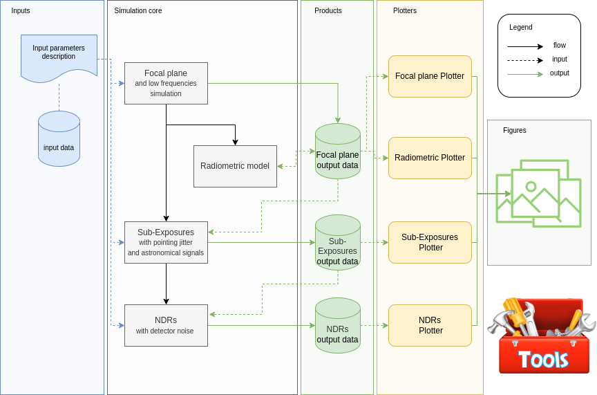

==========
User guide
==========

This guide walks you through `ExoSim 2` one pipeline at a time. Each section
documents a stage of the simulation and the functionality it provides, with
worked examples.

`ExoSim 2` is built from a set of pipelines, called `recipes`. The figure below
shows how they fit together:

On the left are the inputs; this guide introduces each one at the point where it
is needed. The grey area holds the recipes, the pipelines that produce the
simulated observation. The green column is the output: `ExoSim` writes one file
per pipeline, so you can change the configuration between recipes without
re-running everything, since the output of one recipe is the input of the next.
The plotters are in yellow, and the figures they produce are on the far right.

The starting point is the focal plane. From its output file the radiometric
model, the sub-exposures and then the NDRs can be run in turn. `ExoSim` also
ships a set of :doc:`tools <tools/index>` that help you prepare the inputs.

.. grid:: 2 2 3 3
    :gutter: 3

    .. grid-item-card:: :octicon:`rocket;1.3em;sd-mr-1` Quick start
        :link: quickstart
        :link-type: doc

        Launch `ExoSim` from the console and read its outputs.

    .. grid-item-card:: :octicon:`telescope;1.3em;sd-mr-1` Focal plane
        :link: focal_plane/index
        :link-type: doc

        Build the instrument focal plane and its low-frequency time evolution.

    .. grid-item-card:: :octicon:`graph;1.3em;sd-mr-1` Radiometric model
        :link: radiometric_model/index
        :link-type: doc

        Fast estimates of signal, noise and saturation for performance studies.

    .. grid-item-card:: :octicon:`stack;1.3em;sd-mr-1` Sub-exposures
        :link: sub-exposures/index
        :link-type: doc

        Jitter the focal planes, add the astronomical signal, and build the
        sub-exposures.

    .. grid-item-card:: :octicon:`cpu;1.3em;sd-mr-1` NDRs
        :link: ndrs/index
        :link-type: doc

        Pass the sub-exposures through the detector to produce the NDRs.

    .. grid-item-card:: :octicon:`image;1.3em;sd-mr-1` Plotter
        :link: plotter/index
        :link-type: doc

        Quick-look plots for every pipeline product.

    .. grid-item-card:: :octicon:`tools;1.3em;sd-mr-1` Tools
        :link: tools/index
        :link-type: doc

        Helpers that prepare maps, coefficients and reading schemes.

.. toctree::
   :hidden:
   :maxdepth: 1

   Quick start <quickstart>
   Focal plane and low-frequency simulation <focal_plane/index>
   Radiometric model <radiometric_model/index>
   Sub-exposures with pointing jitter and astronomical signal <sub-exposures/index>
   NDRs <ndrs/index>
   Plotter <plotter/index>
   Tools <tools/index>
