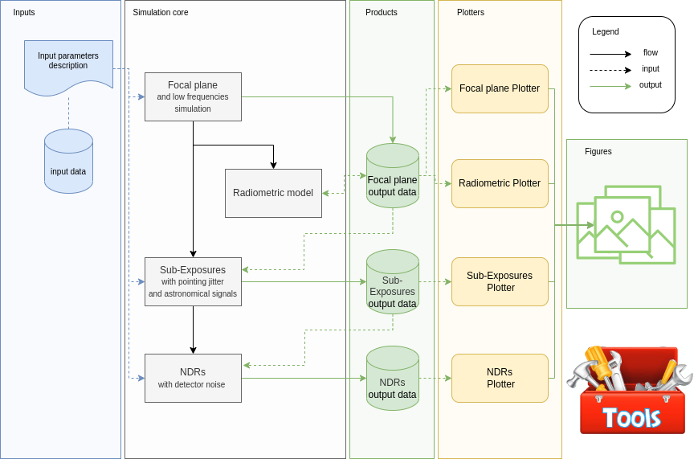

===================================
User guide
===================================

This guide will walk you through `ExoSim 2`.
Here are listed the guides for all `ExoSim` pipelines and functionalities.

.. toctree::
   :maxdepth: 1

    Quick start <quickstart>
    Focal plane and low frequencies simulation  <focal_plane/index>
    Radiometric Model  <radiometric_model/index>
    Sub-Exposures with pointing jitter and astronomical signal  <sub-exposures/index>
    NDRs  <ndrs/index>
    Plotter  <plotter/index>
    Tools  <tools/index>
