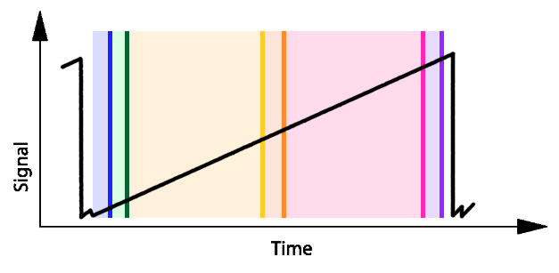

.. _accumulate:

===================================
Accumulate NDRs
===================================

So far we have worked with sub-exposures. Each sub-exposures collects the signal incoming after the end of the collection of the previous sub-exposure,
as indicated in the following figure from :ref:`sub-exposures creation`:

Now we want to accumulate the subsequent sub-exposures of the same exposure, building the ramp.
This means that, starting from the first sub-exposure of the ramp, all the successive are equal of themselves plus the previous one.
If an exposure is made of :math:`N` sub-exposure, we have

.. math::

    Sub_0 = Sub_0

But then for every other sub-exposure on the same ramp

.. math::

    Sub_i = Sub_i + Sub_{i-1}

This is handled by :class:`~exosim.tasks.detector.accumulateSubExposures.AccumulateSubExposures`, which overwrites the input cached dataset with the new one.
