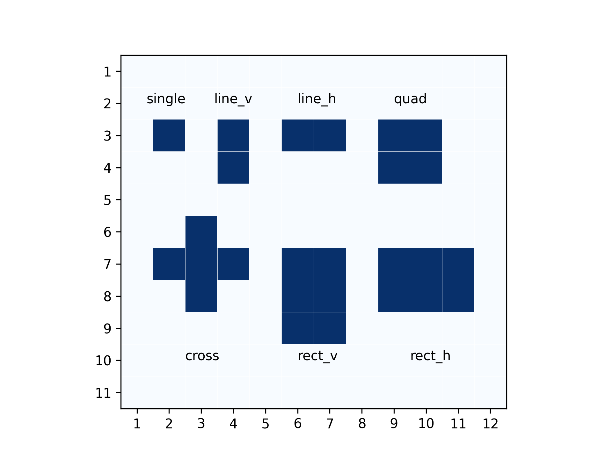
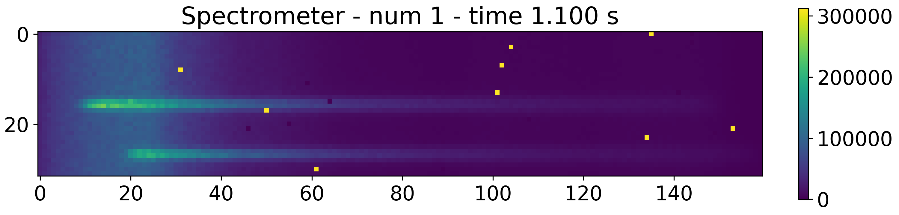

.. _cosmic_rays:

===================================
Cosmic Rays
===================================

The :class:`~exosim.tasks.detector.addCosmicRays.AddCosmicRays` task is part of the Exosim simulation package. 
It models the impact of cosmic rays on a detector during its exposure time. 
Cosmic rays are high-energy particles originating from space, which can introduce noise into the captured data. 
This class provides a simulation of this effect by adding cosmic ray events to the detector's sub-exposures.

Phenomenon Overview
-------------------

Cosmic rays can interact with the detector pixels in various predefined shapes such as crosses, rectangles, or isolated pixels. 
These interactions can saturate the affected pixels, setting their value to the detector's full well depth. 
The class provides flexibility in specifying these interaction shapes and their associated probabilities.

The number of cosmic ray events is calculated based on several parameters:

- Cosmic ray flux rate (in ct/s/cm\ :sup:`2`)
- Pixel size
- Saturation rate due to cosmic rays
- Number of spatial and spectral pixels in the detector
- Integration times for the sub-exposures

These parameters should be specified in the configuration XML file as shown below:

.. code-block:: xml

    <channel>
        <detector>
            <delta_pix unit="micron"> 18.0 </delta_pix>
            <spatial_pix> 64 </spatial_pix>
            <spectral_pix> 364 </spectral_pix>
            <well_depth unit="count"> 100000 </well_depth>

            <cosmic_rays> True </cosmic_rays>
            <cosmic_rays_task> AddCosmicRays </cosmic_rays_task>
            <cosmic_rays_rate unit="ct/cm^2/s"> 5 </cosmic_rays_rate>
            <saturation_rate> 0.03 </saturation_rate>
            <cosmic_rays_randomise>True</cosmic_rays_randomise>
        </detector>
    </channel>

So the number of pixels hit by a cosmic ray during a sub-exposures is 

.. math::

    hits = rate_{cosmic \, rays} * delta_{pix}^2 * N_{pix\, spatial} * N_{pix\, spectral} * t_{int}

Where 

- :math:`rate_{cosmic \, rays}` is the `cosmic_rays_rate`;
- :math:`delta_{pix}` is the `delta_pix`;
- :math:`N_{pix\, spatial}` is the `spatial_pix`;
- :math:`N_{pix\, spectral}` is the `spectral_pix`;
- :math:`t_{int}` is the sub-exposure integration times.

Then we can estimate how many of these events can saturate our pixel using the pixel saturation rate:

.. math::
    saturated = hits * rate_{saturation}

where :math:`rate_{saturation}` is the `saturation_rate`.

Then for each of these events, at least one pixel is saturated.
If the `cosmic_rays_randomise` is set to `True`, the task randomise the number of hits following a Poisson distribution.

Interaction Shapes
------------------

The class includes predefined interaction shapes that describe the group of pixels saturated by each cosmic ray event. These are:

- Single pixel (``single``)
- Vertical line (``line_v``)
- Horizontal line (``line_h``)
- Square (``square``)
- Cross (``cross``)
- Vertical rectangle (``rect_v``)
- Horizontal rectangle (``rect_h``)

Specifying Probabilities
------------------------

The user can specify the probability for each of these shapes in the XML configuration file:

.. code-block:: xml

    <channel>
        <detector>
            <interaction_shapes>
                <line_v>0.5</line_v>
                <square>0.5</square>
            </interaction_shapes>
        </detector>
    </channel>

If the sum of the specified probabilities is not equal to 1, the task will automatically use the ``single`` shape as a contingency to balance the probabilities.

Output
--------

If an output group is provided, the default task will save all the pixels saturated by cosmic rays in a table, for reproducibility. 

.. note::
    Other custom realizations of this Task can be developed by the user (see :ref:`Custom Tasks`).
