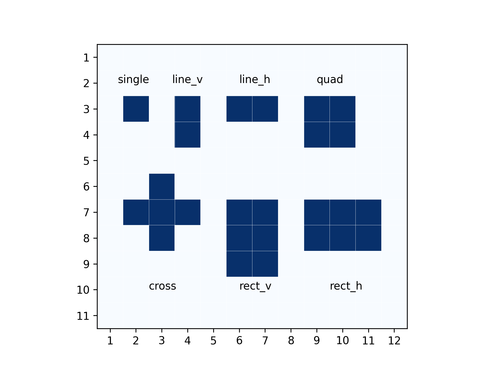
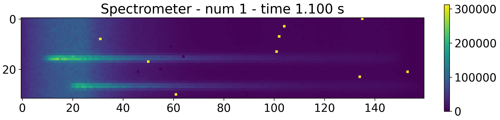

.. _cosmic_rays:

===========
Cosmic rays
===========

The :class:`~exosim.tasks.detector.addCosmicRays.AddCosmicRays` task models the
effect of cosmic rays on the detector during the exposure. Cosmic rays are
high-energy particles from space that add noise to the data; this task simulates
that effect by adding cosmic-ray events to the sub-exposures.

How it works
------------

A cosmic ray can hit the detector in one of several predefined shapes (a cross,
a rectangle, a single pixel, and so on) and can saturate the pixels it touches,
setting them to the detector full-well depth. You can specify the shapes and
their probabilities.

The number of cosmic-ray events is computed from:

- the cosmic-ray flux rate (in ct/s/cm\ :sup:`2`);
- the pixel size;
- the saturation rate due to cosmic rays;
- the number of spatial and spectral pixels;
- the sub-exposure integration times.

Set these in the configuration file:

.. code-block:: xml

    <channel>
        <detector>
            <delta_pix unit="micron"> 18.0 </delta_pix>
            <spatial_pix> 64 </spatial_pix>
            <spectral_pix> 364 </spectral_pix>
            <well_depth unit="count"> 100000 </well_depth>

            <cosmic_rays> True </cosmic_rays>
            <cosmic_rays_task> AddCosmicRays </cosmic_rays_task>
            <cosmic_rays_rate unit="ct/cm^2/s"> 5 </cosmic_rays_rate>
            <saturation_rate> 0.03 </saturation_rate>
            <cosmic_rays_randomise>True</cosmic_rays_randomise>
        </detector>
    </channel>

The number of pixels hit by a cosmic ray during a sub-exposure is

.. math::

    hits = rate_{cosmic \, rays} * delta_{pix}^2 * N_{pix\, spatial} * N_{pix\, spectral} * t_{int}

where

- :math:`rate_{cosmic \, rays}` is `cosmic_rays_rate`;
- :math:`delta_{pix}` is `delta_pix`;
- :math:`N_{pix\, spatial}` is `spatial_pix`;
- :math:`N_{pix\, spectral}` is `spectral_pix`;
- :math:`t_{int}` is the sub-exposure integration time.

The number of events that saturate a pixel is

.. math::
    saturated = hits * rate_{saturation}

where :math:`rate_{saturation}` is `saturation_rate`.

Each of these events saturates at least one pixel. If `cosmic_rays_randomise` is
`True`, the number of hits is drawn from a Poisson distribution.

Interaction shapes
------------------

The predefined shapes, each describing the group of pixels saturated by one
event, are:

- single pixel (``single``);
- vertical line (``line_v``);
- horizontal line (``line_h``);
- square (``square``);
- cross (``cross``);
- vertical rectangle (``rect_v``);
- horizontal rectangle (``rect_h``).

Specifying probabilities
------------------------

Set the probability of each shape in the configuration file:

.. code-block:: xml

    <channel>
        <detector>
            <interaction_shapes>
                <line_v>0.5</line_v>
                <square>0.5</square>
            </interaction_shapes>
        </detector>
    </channel>

If the probabilities do not sum to 1, the task fills the gap with the ``single``
shape.

Output
------

If an output group is provided, the default task saves every pixel saturated by
a cosmic ray in a table, for reproducibility.

.. note::
    You can develop custom versions of this task (see :ref:`Custom Tasks`).
