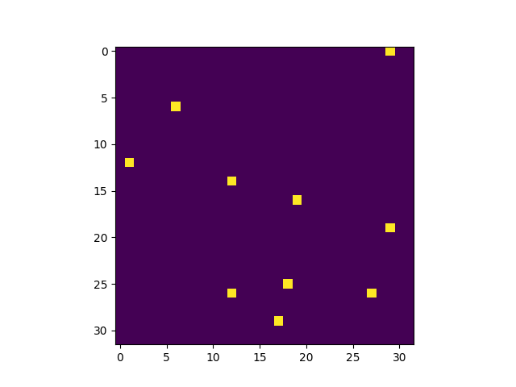
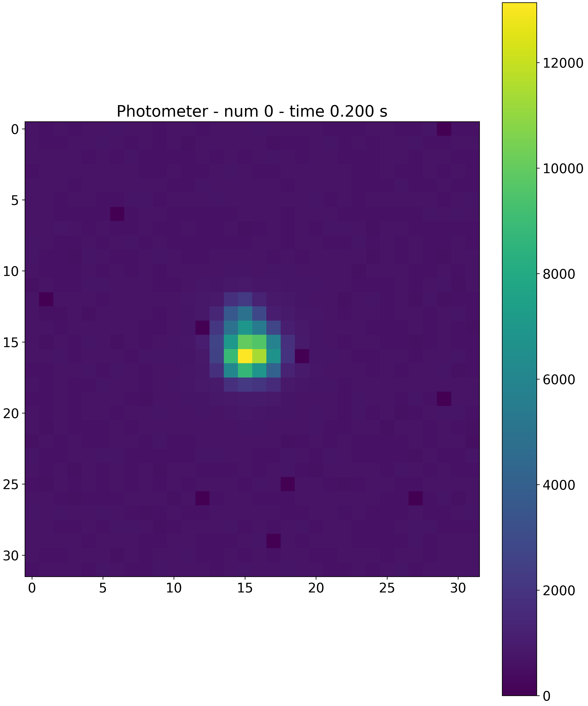

.. _dead_pixels:

=================
Dead pixels map
=================

Dead pixel map can be applied by default using :class:`~exosim.tasks.detector.applyDeadPixelMap.ApplyDeadPixelsMap`, as

.. code-block:: xml

    <channel> channel
        <detector>
            <dead_pixels> True </dead_pixels>
            <dp_map_task> ApplyDeadPixelsMap </dp_map_task>
            <dp_map> __ConfigPath__/data/payload/dead_pixel_map.csv </dp_map>
        <detector>
    </channel>

As shown, the input is a `.csv` file.
The file contains two columns with the spectral and spatial coordinates of the dead pixels: `spectral_coords` and `spatial_coords`.

Alternatively, the dead pixel map can be provided as a numpy array (see `numpy documentation <https://numpy.org/devdocs/reference/generated/numpy.lib.format.html>`_), 
and parsed with the :class:`~exosim.tasks.detector.applyDeadPixelMapNumpy.ApplyDeadPixelMapNumpy` task:  

.. code-block:: xml

    <channel> channel
        <detector>
            <dead_pixels> True </dead_pixels>
            <dp_map_task> AddReadNoiseMapNumpy </dp_map_task>
            <dp_map_filename> dead_pixel_map.npy </dp_map_filename>
        <detector>
    </channel>

Applying these maps to the focal plane will result in

.. note::
    Other custom realizations of this Task can be developed by the user (see :ref:`Custom Tasks`).

.. note::
    If a dead pixel map is not available, `ExoSim` includes a dedicated tool to simulate one: :ref:`dead_pixel_map`.
