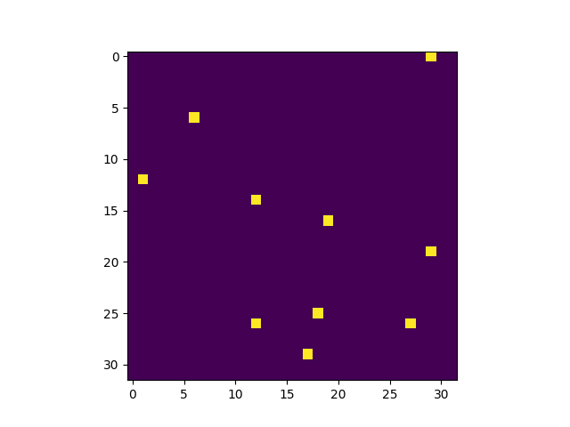
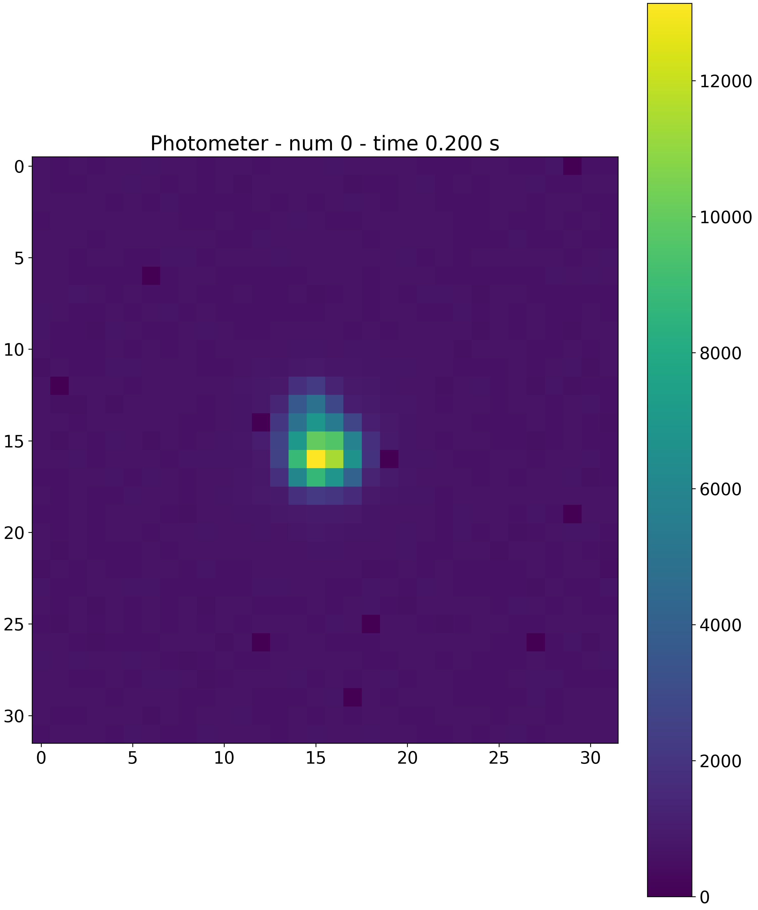

.. _dead_pixels:

===============
Dead pixels map
===============

A dead pixel map is applied by default with
:class:`~exosim.tasks.detector.applyDeadPixelMap.ApplyDeadPixelsMap`:

.. code-block:: xml

    <channel> channel
        <detector>
            <dead_pixels> True </dead_pixels>
            <dp_map_task> ApplyDeadPixelsMap </dp_map_task>
            <dp_map> __ConfigPath__/data/payload/dead_pixel_map.csv </dp_map>
        </detector>
    </channel>

Here the input is a `.csv` file with two columns, `spectral_coords` and
`spatial_coords`, giving the coordinates of the dead pixels.

Alternatively, the dead pixel map can be a NumPy array (see the `NumPy
documentation
<https://numpy.org/devdocs/reference/generated/numpy.lib.format.html>`_), parsed
with
:class:`~exosim.tasks.detector.applyDeadPixelMapNumpy.ApplyDeadPixelMapNumpy`:

.. code-block:: xml

    <channel> channel
        <detector>
            <dead_pixels> True </dead_pixels>
            <dp_map_task> ApplyDeadPixelMapNumpy </dp_map_task>
            <dp_map_filename> dead_pixel_map.npy </dp_map_filename>
        </detector>
    </channel>

Applying such a map to the focal plane gives:

.. note::
    You can develop custom versions of this task (see :ref:`Custom Tasks`).

.. note::
    If no dead pixel map is available, `ExoSim` includes a dedicated tool to
    simulate one: :ref:`dead_pixel_map`.
