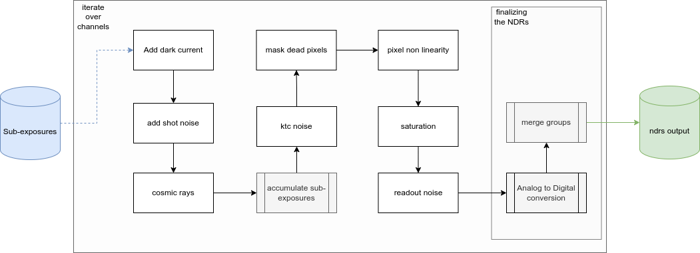

.. _ndrs creation:

===================================
NDRS
===================================

Finally, we can produce the NDRs.

The steps flow is summarised in the following figure.
The Tasks are divided here into blocks to help the reader.

In the following, we discuss each step, one per time.

.. note::
    Be careful. All of these actions operate on cached data.
    The result of each step is not a new dataset, but the input one with overwritten values.

The NDRs creation is automatized by a recipe: :class:`~exosim.recipes.createNDRs.CreateNDRs`.

`ExoSim` also includes a dedicated Plotter, called :class:`~exosim.plots.ndrsPlotter.NDRsPlotter`,
which is described in :ref:`ndrs plotter`

.. toctree::
    :maxdepth: 1

    Dark current <darkcurrent>
    Shot noise <shot_noise>
    Cosmic Rays <cosmic_rays>
    Accumulate NDRs <accumulate>
    KTC noise <reset_bias>
    Dead Pixels <dead_pixels>
    Pixels Non-Linearity and saturation <pixel_non_linearity>
    Gain Drift <gain_drift>
    Read Noise <readnoise>
    Analog to Digital conversion <analogtodigtital>
    Merge NDRs and Results <results>
    Automatic Recipe <pipeline>
