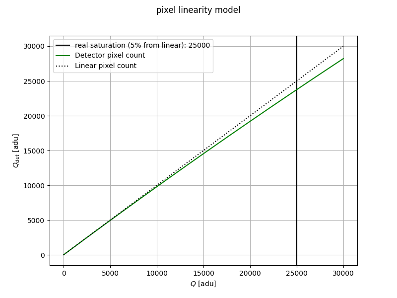

.. _apply_pixel_non_linearity:

==================================
Pixel non-linearity and saturation
==================================

Pixel non-linearity
===================

A detector does not respond linearly to incoming light. This non-linearity can
be modelled as a function of the pixel value.

The non-linearity is usually written as a polynomial:

.. math::
    Q_{det} = Q \cdot (1 + \sum_i a_i \cdot Q^i)

where :math:`Q_{det}` is the charge read by the detector and :math:`Q` is the
ideal count, :math:`Q = \phi\,t`, with :math:`\phi` the number of electrons
generated per unit time and :math:`t` the elapsed time.

The non-linearity is applied by the
:class:`~exosim.tasks.detector.applyPixelsNonLinearity.ApplyPixelsNonLinearity`
task, which needs a map of polynomial coefficients per pixel. Load the map with
:class:`~exosim.tasks.detector.loadPixelsNonLinearityMap.LoadPixelsNonLinearityMap`
and name the file in your configuration. As usual, the default task can be
replaced with a custom one. In this example the `pnl_map.h5` file is produced
with one of the methods in :ref:`pixel_non_linearity`.

.. code-block:: xml

    <channel> channel
        <detector>
            <pixel_non_linearity> True </pixel_non_linearity>
            <pnl_task> ApplyPixelsNonLinearity </pnl_task>
            <pnl_map_task> LoadPixelsNonLinearityMap </pnl_map_task>
            <pnl_filename>__ConfigPath__/data/payload/pnl_map.h5</pnl_filename>
        </detector>
    </channel>

Alternatively, the coefficient map can be a NumPy array (see the `NumPy
documentation
<https://numpy.org/devdocs/reference/generated/numpy.lib.format.html>`_), loaded
with
:class:`~exosim.tasks.detector.loadPixelsNonLinearityMapNumpy.LoadPixelsNonLinearityMapNumpy`:

.. code-block:: xml

    <channel> channel
        <detector>
            <pixel_non_linearity> True </pixel_non_linearity>
            <pnl_task> ApplyPixelsNonLinearity </pnl_task>
            <pnl_map_task> LoadPixelsNonLinearityMapNumpy </pnl_map_task>
            <pnl_filename>__ConfigPath__/data/payload/pnl_map.npy</pnl_filename>
        </detector>
    </channel>

Saturation
==========

After the non-linear correction, a pixel may reach its saturation point, or
full-well capacity. The
:class:`~exosim.tasks.detector.applySimpleSaturation.ApplySimpleSaturation` task
handles this: it clips every pixel above the full-well capacity to the maximum
allowed count.

It needs the full-well capacity:

.. code-block:: xml

    <channel> channel
        <detector>
            <well_depth unit="count"> 100000  </well_depth>
            <saturation> True </saturation>
            <sat_task> ApplySimpleSaturation </sat_task>
        </detector>
    </channel>
