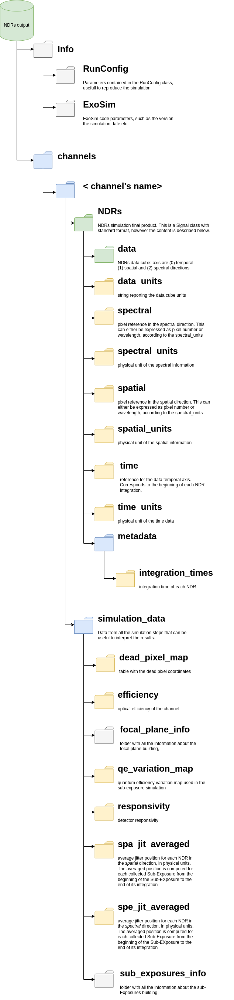

.. _merge:

======================
Merge NDRs and results
======================

The NDRs of the same group are merged, automatically, by
:class:`~exosim.tasks.detector.mergeGroups.MergeGroups`. This
:class:`~exosim.tasks.task.Task` iterates over the exposures, finds all the NDRs
of the same group, and averages them into a single NDR.

If the :math:`k`-th NDR is the average of :math:`N` NDRs in the same group:

.. math::

    NDR_{k} = \frac{1}{N} \sum_{i}^N S_{out, \, i}

.. _results_ndr:

Resulting NDRs
==============

The resulting NDRs are shown below.

.. image:: _static/Photometer_ndrs_1.png
    :width: 600
    :align: center

.. image:: _static/Spectrometer_ndrs_1.png
    :width: 600
    :align: center

See :ref:`ndrs plotter` for how to produce these plots.

.. _output_ndr:

Output description
==================

This figure describes the structure of the NDRs data output.

