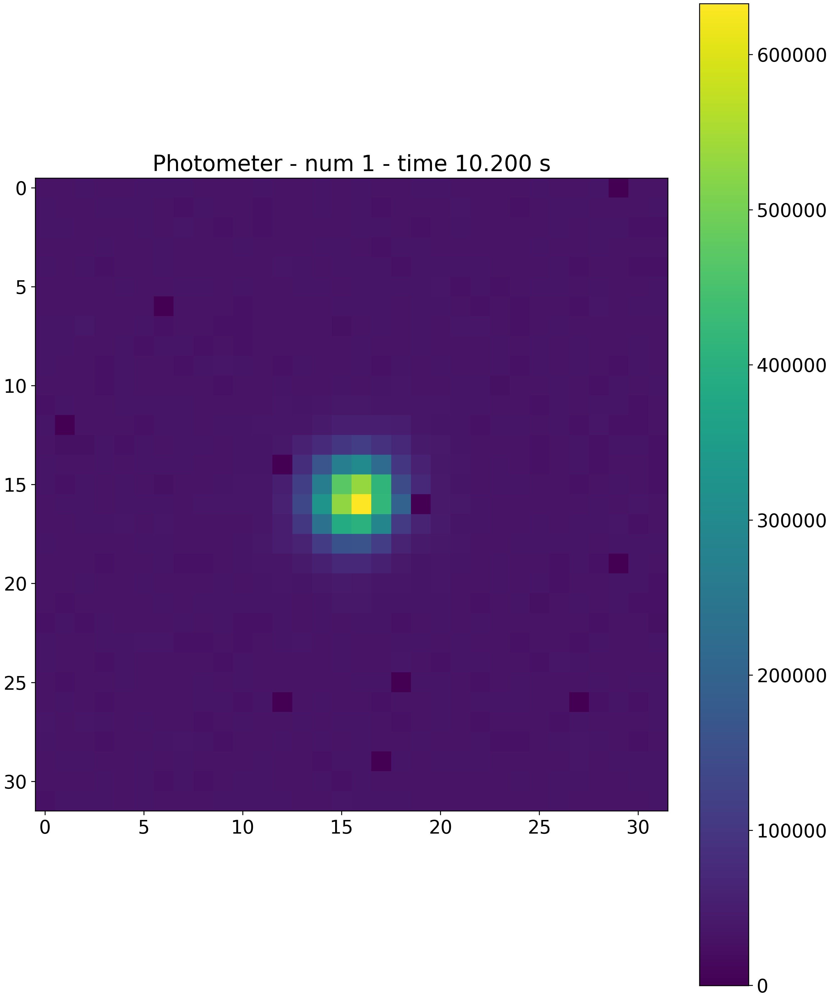
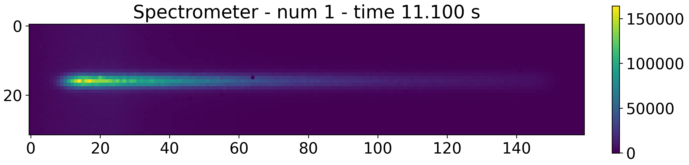

.. _merge:

===================================
Merge NDRs and Results
===================================

NDRs of the same group are to be merged. This is automatically handled by :class:`~exosim.tasks.detector.mergeGroups.MergeGroups`.
This :class:`~exosim.tasks.task.Task` simply iterates over the exposures and finds all the NDRs belonging to the same group.
These are then averaged together, returning a single NDR.

Assuming that the :math:`k`-th NDR comes from the combination of :math:`N` NDRs in the same group,
we can write this as

.. math::

    NDR_{k} = \frac{1}{N} \sum_{i}^N S_{out, \, i}

.. _results_ndr:

Resulting NDRs
===================================

The resulting NDRs look like these.

To produce such plots see also :ref:`ndrs plotter`.

.. _output_ndr:

Output description
===================================

The following picture describes the structure of the NDRs data output.

