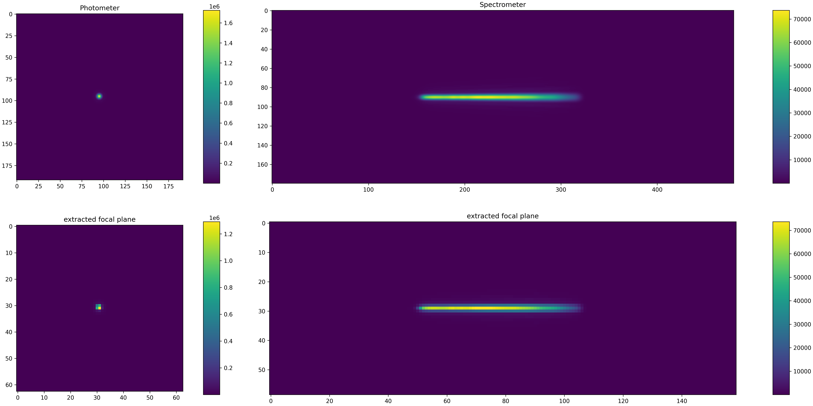
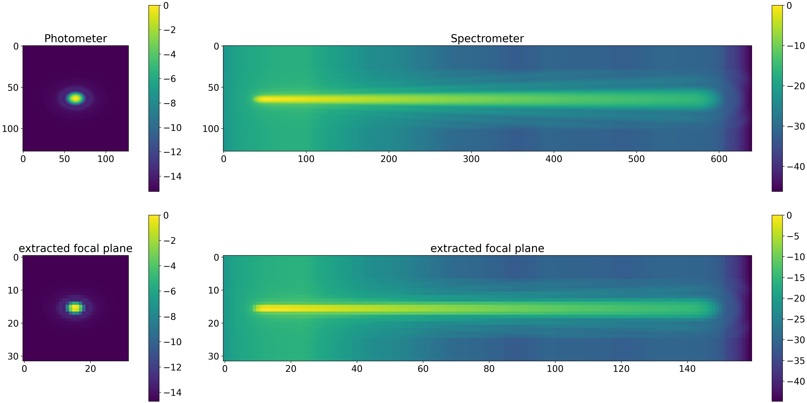
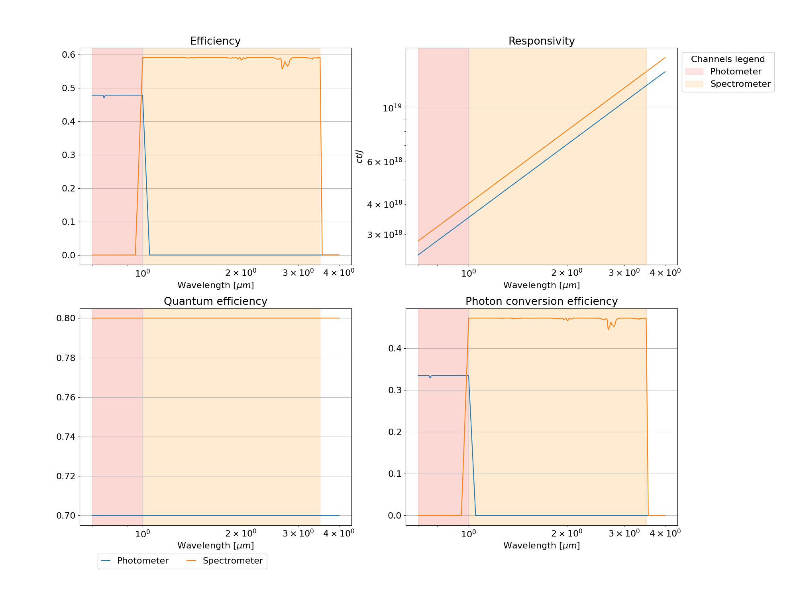
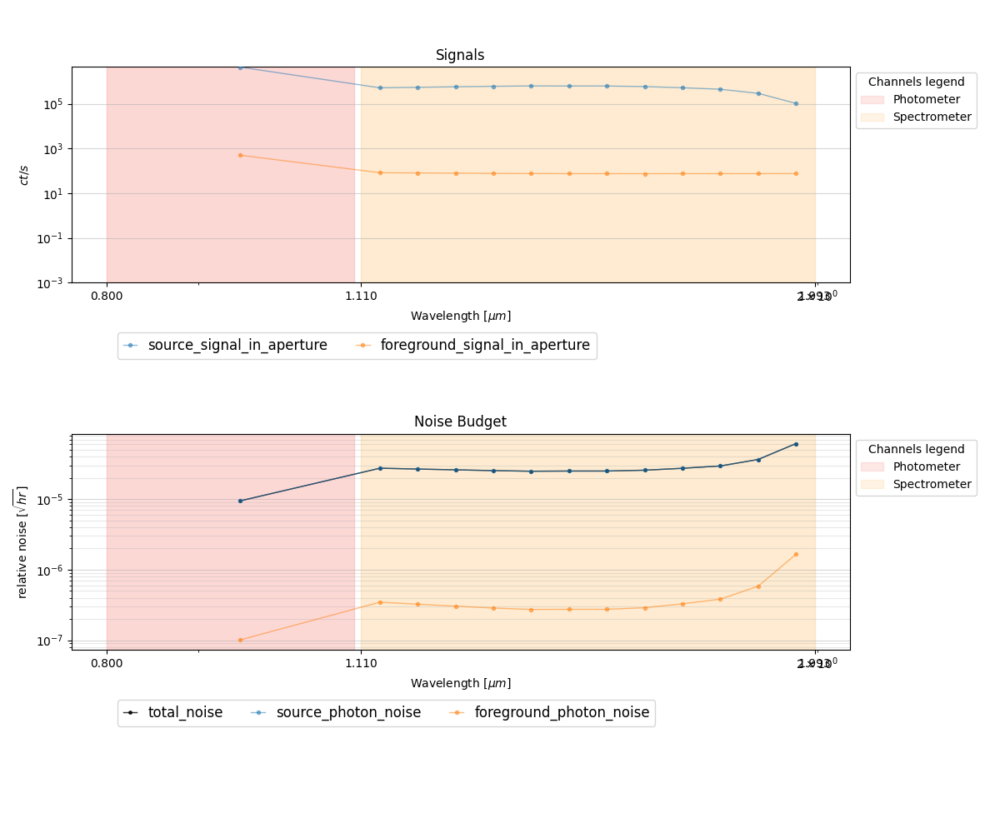
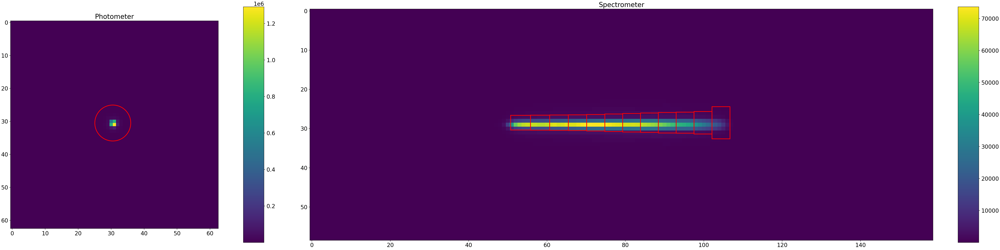
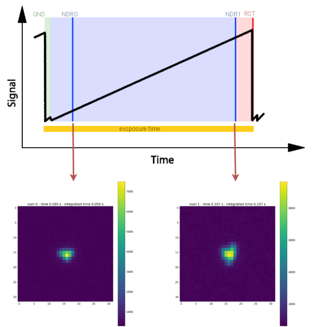
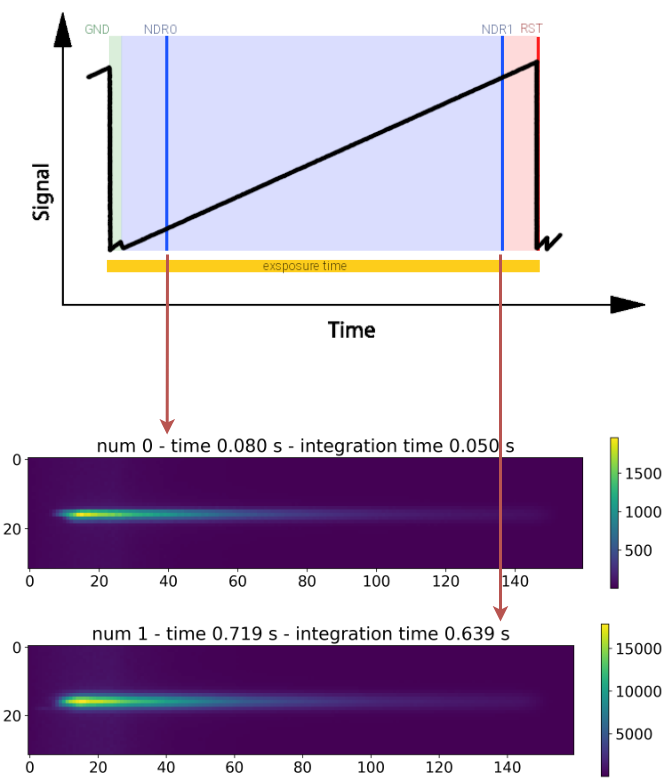
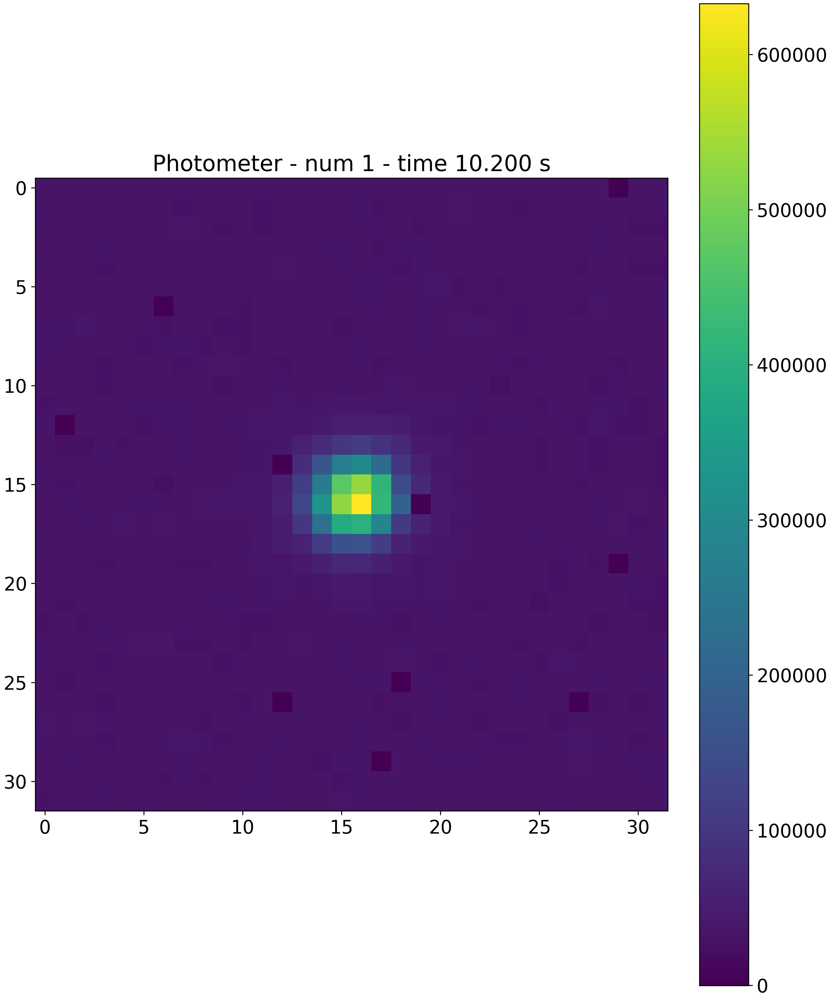
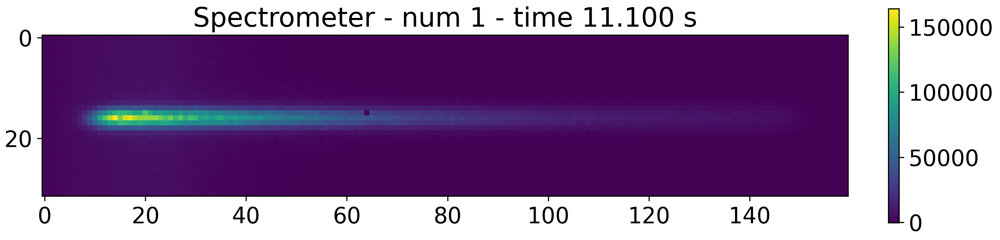

.. _plotter:

===================================
Plotters
===================================

`ExoSim 2` includes some plotters which allows a fast evaluation of the produced data.
The default plotter can be run from console as ``exosim-plot``.

The scipt includes two plotters: :class:`~exosim.plots.focalPlanePlotter.FocalPlanePlotter` and
:class:`~exosim.plots.radiometricPlotter.RadiometricPlotter`.

.. _focal plane plotter:

Focal plane Plotter
===================================

:class:`~exosim.plots.focalPlanePlotter.FocalPlanePlotter`
handles the methods to plot the focal planes produced by `exosim`.

It plots the focal planes of each channel at a specific time.
For each channel it adds a :class:`~matplotlib.axes.Axes` to a figure.
It returns a :class:`~matplotlib.figure.Figure` with two rows:
on the first row are reported the oversampled focal planes.
In the second row are reported the extracted focal plane,
where the oversampling is removed.
The focal plane plotted is the combination of the source focal plane
plus the foreground focal plane.

Given the `test_file.h5` produced by Exosim, to plot the focal plane at the first time step,
the user can run from console

.. code-block:: console

    exosim-plot -i test_file.h5 -o plots/ -f -t 0 --plot-scale linear

where ``-o`` is the output directory, ``-f`` is to run the focal plane plotter (:class:`~exosim.plots.focalPlanePlotter.FocalPlanePlotter`)
and ``-t`` is to select the time step, ``--plot-scale`` indicate the image scale to use. 
By default the plot scale is `linear`, but another possible option is `dB`, and the image is plotted as :math:`10 \cdot log_{10} \left( ima/ max(ima) \right)`.

The result will be similar to

The same result can be obtained also by using the plotter in a python script:

.. code-block:: python

    from exosim.plots import FocalPlanePlotter
    focalPlanePlotter = FocalPlanePlotter(input='./test_file.h5')
    focalPlanePlotter.plot_focal_plane(time_step=0, scale='linear')
    focalPlanePlotter.save_fig('focal_plane.png')

if ``-plot-scale`` is set to `dB` the result will be

Inside the focal plane plotter a functionality to plot the total efficiency can be found:

.. code-block:: python

    from exosim.plots import FocalPlanePlotter
    focalPlanePlotter = FocalPlanePlotter(input='./test_file.h5')
    focalPlanePlotter.plot_efficiency()
    focalPlanePlotter.save_fig('efficiency.png')

.. _radiometric plotter:

Radiometric Plotter
===================================

:class:`~exosim.plots.radiometricPlotter.RadiometricPlotter`
handles the methods to plot the radiometric table produced by `exosim`.

Given the `test_file.h5` produced by Exosim and which includes a radiometric table,
to plot the table the user can run from console

.. code-block:: console

    exosim-plot -i test_file.h5 -o plots/ -r

where ``-o`` is the output directory and ``-r`` is to run the radiometric plotter (:class:`~exosim.plots.radiometricPlotter.RadiometricPlotter`).

The result will be similar to

The same result can be obtained also by using the plotter in a python script:

.. code-block:: python

    from exosim.plots import RadiometricPlotter
    radiometricPlotter = RadiometricPlotter(input='./test_file.h5')
    radiometricPlotter.plot_table()
    radiometricPlotter.save_fig('radiometric.png')

The radiometric plotter can also plot the apertures superimposed to the focal planes with

.. code-block:: python

    from exosim.plots import RadiometricPlotter
    radiometricPlotter = RadiometricPlotter(input='./test_file.h5')
    radiometricPlotter.plot_apertures()
    radiometricPlotter.save_fig('apertures.png')

.. _sub-exposures plotter:

Sub-Exposures Plotter
===================================

:class:`~exosim.plots.subExposuresPlotter.SubExposuresPlotter`
handles the methods to plot the Sub-Exposures produced :class:`~exosim.recipes.createSubExposures.CreateSubExposures`,
as described in :ref:`sub-exposures creation`.

Given the `test_se.h5` produced by `ExoSim` and which includes the sub-exposures,
to plot them, the user can run from console

.. code-block:: console

    exosim-plot -i test_se.h5 -o plots/ --subexposures

or

.. code-block:: console

    exosim-plot -i test_se.h5 -o plots/ -s

:class:`~exosim.plots.subExposuresPlotter.SubExposuresPlotter` iteratively store the images of the sub-exposures in the output folder,
along with the sub-exposure time (which is the time where the sub-exposure integration ends) and the integration time.

Here we report for example the first and the second sub-exposures, collected using a CDS reading scheme, for both the channels

.. note::
    Because the ExoSim output may contain a lot of sub-exposures, This plotter only produces images of the sub-exposures of the first exposure (the first ramp).

.. _ndrs plotter:

NDRs Plotter
===================================

:class:`~exosim.plots.ndrsPlotter.NDRsPlotter`
handles the methods to plot the Sub-Exposures produced :class:`~exosim.recipes.createNDRs.CreateNDRs`,
as described in :ref:`ndrs creation`.

Given the `test_ndrs.h5` produced by `ExoSim` and which includes the NDRs,
to plot them, the user can run from console

.. code-block:: console

    exosim-plot -i test_ndrs.h5 -o plots/ -ndrs

or

.. code-block:: console

    exosim-plot -i test_ndrs.h5 -o plots/ -n

:class:`~exosim.plots.ndrsPlotter.NDRsPlotter` iteratively stores the images of the NDRs in the output folder,
along with the NDR exposure time.

