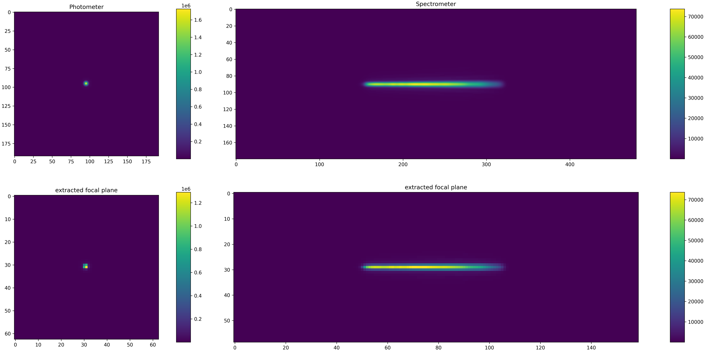
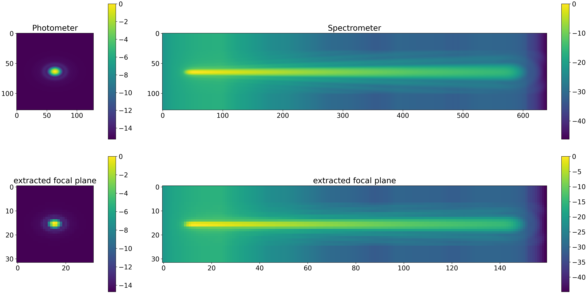
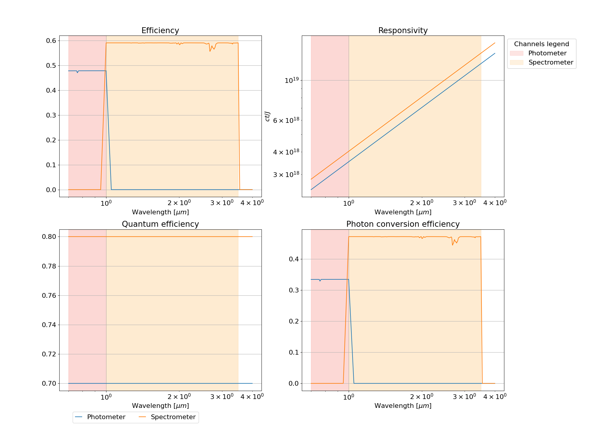
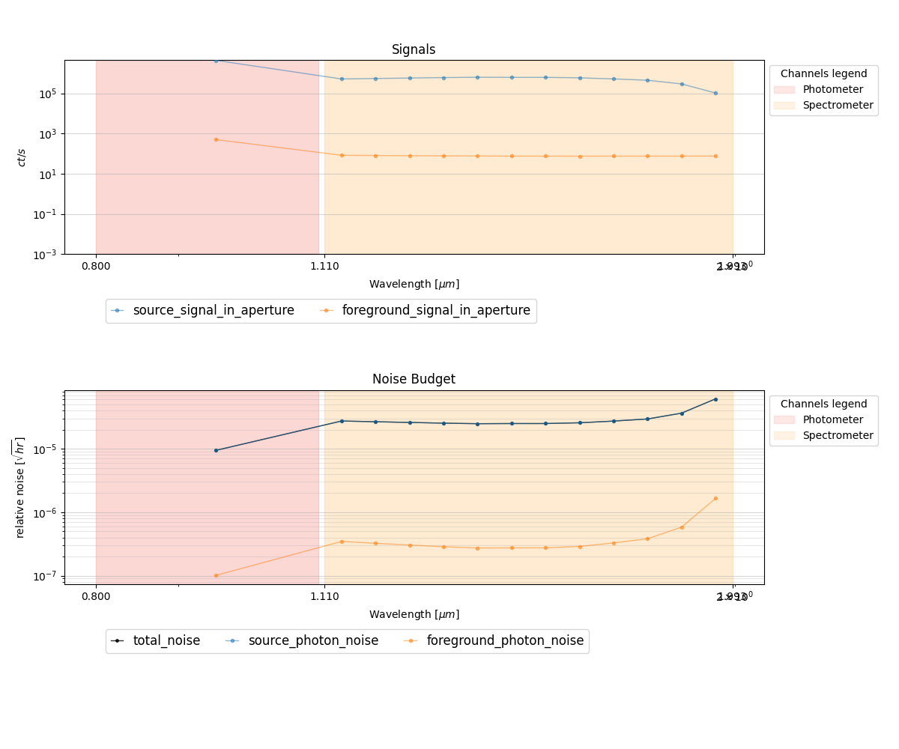
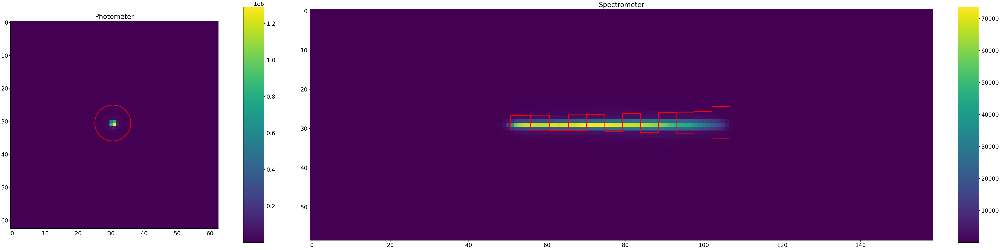
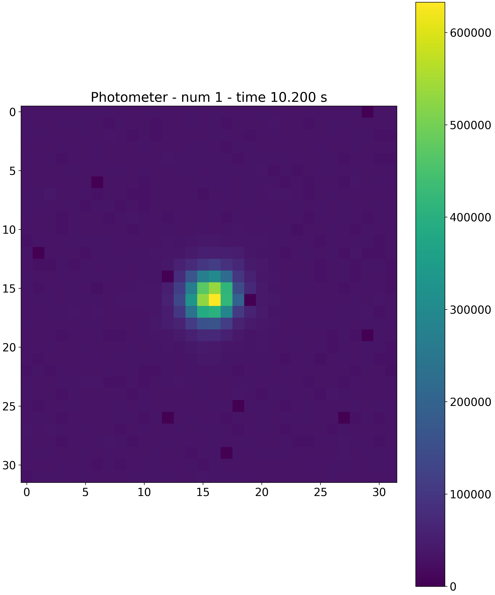
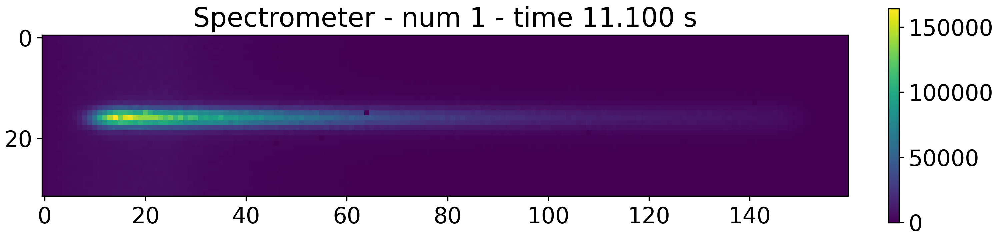

.. _plotter:

========
Plotters
========

`ExoSim 2` includes a few plotters for a quick look at the data it produces. The
default plotter is run from the console as ``exosim-plot``.

It bundles four plotters, one per pipeline product:
:class:`~exosim.plots.focalPlanePlotter.FocalPlanePlotter`,
:class:`~exosim.plots.radiometric_plotter.RadiometricPlotter`,
:class:`~exosim.plots.subExposuresPlotter.SubExposuresPlotter` and
:class:`~exosim.plots.ndrsPlotter.NDRsPlotter`.

.. _focal plane plotter:

Focal plane plotter
===================

:class:`~exosim.plots.focalPlanePlotter.FocalPlanePlotter` plots the focal planes
produced by `ExoSim`.

It plots the focal plane of each channel at a chosen time. For each channel it
adds a :class:`~matplotlib.axes.Axes` to the figure and returns a
:class:`~matplotlib.figure.Figure` with two rows: the first row shows the
oversampled focal planes, the second row the extracted focal planes, with the
oversampling removed. Each focal plane is the sum of the source focal plane and
the foreground focal plane.

Given a ``test_file.h5`` produced by `ExoSim`, to plot the focal plane at the
first time step run:

.. code-block:: console

    exosim-plot -i test_file.h5 -o plots/ -f -t 0 --plot-scale linear

where ``-o`` is the output directory, ``-f`` selects the focal plane plotter
(:class:`~exosim.plots.focalPlanePlotter.FocalPlanePlotter`), ``-t`` selects the
time step, and ``--plot-scale`` sets the image scale. The default scale is
``linear``; the other option is ``dB``, which plots the image as
:math:`10 \cdot log_{10} \left( ima / max(ima) \right)`.

The result looks like this:

The same plot can be produced from a Python script:

.. code-block:: python

    from exosim.plots import FocalPlanePlotter
    focalPlanePlotter = FocalPlanePlotter(input='./test_file.h5')
    focalPlanePlotter.plot_focal_plane(time_step=0, scale='linear')
    focalPlanePlotter.save_fig('focal_plane.png')

With ``--plot-scale dB`` the result is:

The focal plane plotter can also plot the total efficiency:

.. code-block:: python

    from exosim.plots import FocalPlanePlotter
    focalPlanePlotter = FocalPlanePlotter(input='./test_file.h5')
    focalPlanePlotter.plot_efficiency()
    focalPlanePlotter.save_fig('efficiency.png')

.. _radiometric plotter:

Radiometric plotter
===================

:class:`~exosim.plots.radiometric_plotter.RadiometricPlotter` plots the
radiometric table produced by `ExoSim`.

Given a ``test_file.h5`` that contains a radiometric table, to plot it run:

.. code-block:: console

    exosim-plot -i test_file.h5 -o plots/ -r

where ``-o`` is the output directory and ``-r`` selects the radiometric plotter
(:class:`~exosim.plots.radiometric_plotter.RadiometricPlotter`).

The result looks like this:

The same plot can be produced from a Python script:

.. code-block:: python

    from exosim.plots import RadiometricPlotter
    radiometricPlotter = RadiometricPlotter(input='./test_file.h5')
    radiometricPlotter.plot_table()
    radiometricPlotter.save_fig('radiometric.png')

The radiometric plotter can also overlay the apertures on the focal planes:

.. code-block:: python

    from exosim.plots import RadiometricPlotter
    radiometricPlotter = RadiometricPlotter(input='./test_file.h5')
    radiometricPlotter.plot_apertures()
    radiometricPlotter.save_fig('apertures.png')

.. _sub-exposures plotter:

Sub-exposures plotter
=====================

:class:`~exosim.plots.subExposuresPlotter.SubExposuresPlotter` plots the
sub-exposures produced by
:class:`~exosim.recipes.createSubExposures.CreateSubExposures`, as described in
:ref:`sub-exposures creation`.

Given a ``test_se.h5`` that contains the sub-exposures, to plot them run:

.. code-block:: console

    exosim-plot -i test_se.h5 -o plots/ --subexposures

or

.. code-block:: console

    exosim-plot -i test_se.h5 -o plots/ -s

The plotter writes the sub-exposure images into the output folder, each labelled
with the sub-exposure time (the time when the sub-exposure integration ends) and
the integration time.

Below are the first and second sub-exposures for both channels, collected with a
CDS reading scheme:

.. image:: _static/subexposures_plotter-Page-1.png
    :width: 600
    :align: center

.. image:: _static/subexposures_plotter-Page-2.png
    :width: 600
    :align: center

.. note::
    An `ExoSim` output can contain a large number of sub-exposures, so this
    plotter only produces images for the first exposure, that is the first ramp.

.. _ndrs plotter:

NDRs plotter
============

:class:`~exosim.plots.ndrsPlotter.NDRsPlotter` plots the NDRs produced by
:class:`~exosim.recipes.createNDRs.CreateNDRs`, as described in
:ref:`ndrs creation`.

Given a ``test_ndrs.h5`` that contains the NDRs, to plot them run:

.. code-block:: console

    exosim-plot -i test_ndrs.h5 -o plots/ -ndrs

or

.. code-block:: console

    exosim-plot -i test_ndrs.h5 -o plots/ -n

The plotter writes the NDR images into the output folder, each labelled with the
NDR exposure time.

