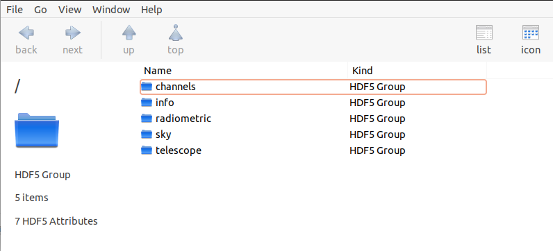
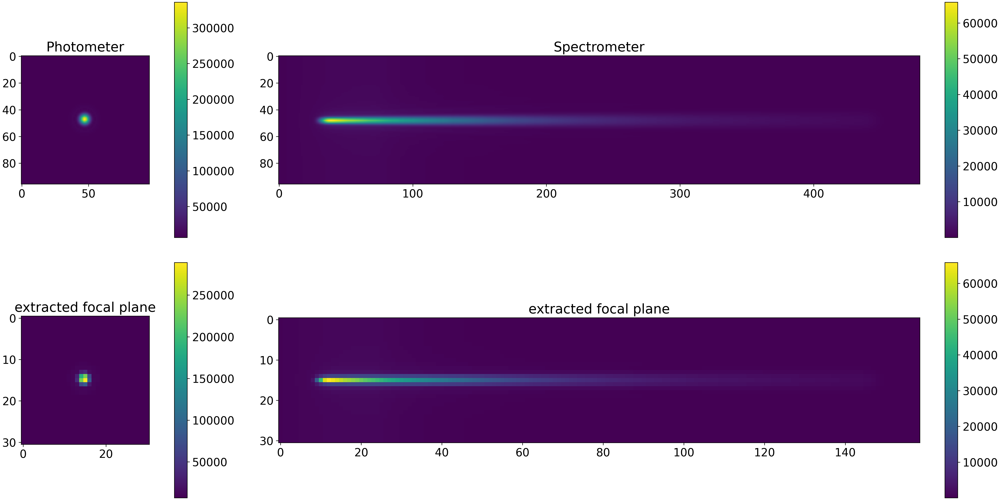
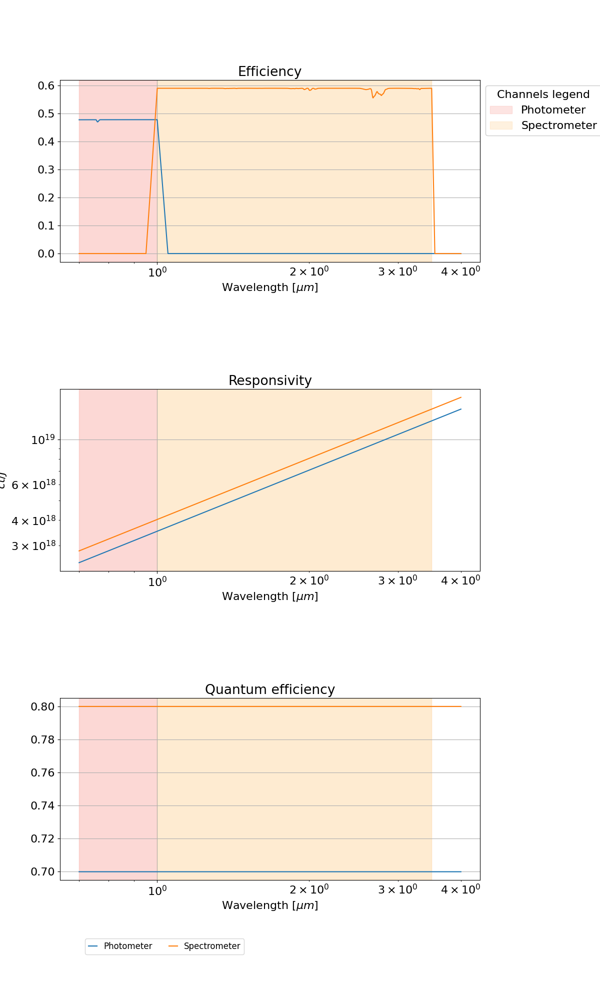
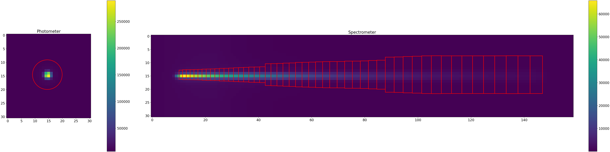
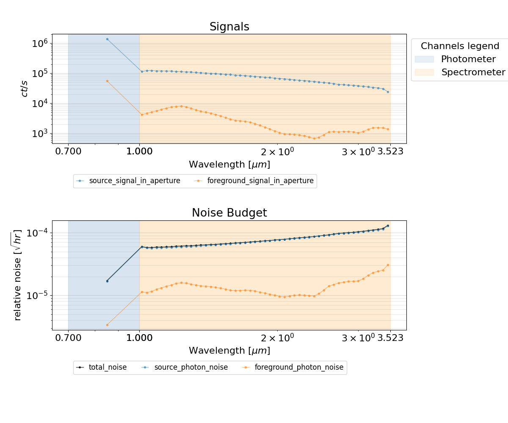

===========
Quick start
===========

This page walks through the main ways of using the new `ExoSim`. The code can be
used in two ways:

- as a **stand-alone tool** that runs ready-made pipelines, called `recipes`;
- as a **library** to build your own custom pipelines.

The rest of the documentation focuses on the functionality inside each recipe,
and therefore on using the code as a library. This page focuses on the fast,
stand-alone run.

Running ExoSim from the console
-------------------------------

After installation, run `ExoSim` from the console to check the installed
version:

.. code-block:: console

      exosim

The ready-made pipelines (`recipes`) are also launched from the console. Each
recipe has its own command:

============================  ======================================================================================
command                       description
============================  ======================================================================================
:code:`exosim-focalplane`     builds the low-frequency focal plane (:ref:`Focal plane creation`)
:code:`exosim-radiometric`    runs the radiometric model (:ref:`radiometric`)
:code:`exosim-sub-exposures`  builds the sub-exposures from the focal plane (:ref:`sub-exposures creation`)
:code:`exosim-ndrs`           builds the NDRs from the sub-exposures (:ref:`ndrs creation`)
============================  ======================================================================================

Add the `help` flag to any command to list its options:

.. code-block:: console

      exosim-focalplane --help

.. tip::
      Every recipe is also reachable through the general `exosim` command by
      passing the recipe name as the first argument:

      .. code-block:: console

            exosim focalplane --help

The main command-line flags are:

============================  =======================================================================
flag                          description
============================  =======================================================================
``-c``, ``--configuration``   input payload description file
``-o``, ``--output``          output file
``-P``, ``--plot``            run the associated plotter (:ref:`plotter`)
``-n``, ``--nThreads``        number of threads for parallel processing
``-d``, ``--debug``           debug-mode screen output
``-l``, ``--log``             write the log output to a file
============================  =======================================================================

The configuration file must be an `.xml` file and the output file an `.h5` file
(see :ref:`h5`). ``-n`` must be followed by an integer. ``-d`` and ``-l`` take no
argument: listing them is enough to enable the option.

Understanding the outputs
-------------------------

.. _h5:

The `.h5` file
^^^^^^^^^^^^^^

The main output product is an HDF5_ `.h5` file. Many viewers can open this
format, such as HDFView_ and HDFCompass_, and it has APIs for Cpp_, FORTRAN_ and
Python_.

To work with the data, see :ref:`loadHDF5` in the :ref:`FAQs` section.

Running the examples
--------------------

If you cloned `ExoSim 2` from the GitHub_ repository (see
:ref:`install from Git <install git>`), you already have an `examples` folder in
the project root. If you installed from PyPI (see
:ref:`install from PyPI <install pip>`), download that folder from the GitHub_
repository.
Once you have it, open a terminal in the `examples` folder.

Before running an example, edit `main_example.xml` and set ``ConfigPath`` to the
path of the `examples` folder on your computer:

.. code-block:: xml

    <ConfigPath>/path/to/ExoSim2/examples</ConfigPath>

The steps below follow the ExoSim diagram:

.. image:: ../_static/Exosim_blocks.png
   :width: 600
   :align: center

From the console
^^^^^^^^^^^^^^^^

Focal plane
~~~~~~~~~~~

The first step is to build the focal plane (see :ref:`Focal plane creation`):

.. code-block:: console

      exosim-focalplane -c main_example.xml -o test_common.h5

The output file appears in the same folder. To produce the plots, run:

.. code-block:: console

   exosim-plot -i test_common.h5 -o plots/ --focal_plane -t 0

This produces two plots: the first focal plane, and the instrument efficiency
versus wavelength.

Radiometric model
~~~~~~~~~~~~~~~~~

Next, run the radiometric model on top of the focal plane you just built (see
:ref:`radiometric`):

.. code-block:: console

      exosim-radiometric -c main_example.xml -o test_common.h5

Again, you can inspect the result with dedicated plots:

.. code-block:: console

      exosim-plot -i test_common.h5 -o plots/ --radiometric

This plots the aperture used for the photometry,

and the radiometric table.

Sub-exposures
~~~~~~~~~~~~~

As with the radiometric model, the sub-exposures are built on top of the focal
plane (see :ref:`sub-exposures creation`):

.. code-block:: console

      exosim-sub-exposures  -c main_example.xml -i test_common.h5 -o test_se.h5

Then use the dedicated plotter:

.. code-block:: console

      exosim-plot -i test_se.h5 -o plots/ --subexposures

This writes an image of every sub-exposure, for every channel, to the folder you
pass.

NDRs
~~~~

Finally, build the NDRs (see :ref:`ndrs creation`) on top of the sub-exposures:

.. code-block:: console

      exosim-ndrs  -c main_example.xml -i test_se.h5 -o test_ndr.h5

And use the dedicated plotter:

.. code-block:: console

      exosim-plot -i test_ndr.h5 -o plots/ --ndrs

This writes an image of every NDR, for every channel, to the folder you pass.

From a Python script
^^^^^^^^^^^^^^^^^^^^

The `example_pipeline.py` script runs the same steps. Its content can be
summarised as:

.. code-block:: python

      import exosim.recipes as recipes
      from exosim.plots import RadiometricPlotter, FocalPlanePlotter, \
                              SubExposuresPlotter, NDRsPlotter

      # create focal plane
      recipes.CreateFocalPlane('main_example.xml',
                              './test_common.h5')
      # run focal plane plotter
      focalPlanePlotter = FocalPlanePlotter(input='./test_common.h5')
      focalPlanePlotter.plot_focal_plane(time_step=0)
      focalPlanePlotter.save_fig('plots/focal_plane.png')
      focalPlanePlotter.plot_efficiency()
      focalPlanePlotter.save_fig('plots/efficiency.png')

      # run radiometric model
      recipes.RadiometricModel('main_example.xml',
                              './test_common.h5')
      # run radiometric plotter
      radiometricPlotter = RadiometricPlotter(input='./test_common.h5')
      radiometricPlotter.plot_table(contribs=False)
      radiometricPlotter.save_fig('plots/radiometric.png')
      radiometricPlotter.plot_apertures()
      radiometricPlotter.save_fig('plots/apertures.png')

      # create sub-exposures
      recipes.CreateSubExposures(input_file='./test_common.h5',
                                 output_file='./test_se.h5',
                                 options_file='main_example.xml')
      # run sub-exposures plotter
      subExposuresPlotter = SubExposuresPlotter(input='./test_se.h5')
      subExposuresPlotter.plot('plots/subexposures')

      # create NDRs
      recipes.CreateNDRs(input_file='./test_se.h5',
                        output_file='./test_ndr.h5',
                        options_file='main_example.xml')
      # run NDRs plotter
      ndrssPlotter = NDRsPlotter(input='./test_ndr.h5')
      ndrssPlotter.plot('plots/ndrs')

From a Jupyter notebook
~~~~~~~~~~~~~~~~~~~~~~~

The `example_pipeline.ipynb` notebook contains the same steps as the script.

ExoSim tools |Tools|
^^^^^^^^^^^^^^^^^^^^

.. |Tools| image:: tools/_static/exosim_tools.png
               :width: 60
               :class: dark-light

`ExoSim 2` also ships a set of tools that help you prepare a simulation (see
:ref:`tools`). The `example_tools.py` script shows how to run them, using the
`tools_input_example.xml` configuration file.

.. _GitHub: https://github.com/arielmission-space/ExoSim2-public

.. _HDF5: https://www.hdfgroup.org/solutions/hdf5/

.. _HDFView: https://www.hdfgroup.org/downloads/hdfview/

.. _HDFCompass: https://support.hdfgroup.org/projects/compass/

.. _FORTRAN: https://support.hdfgroup.org/HDF5/doc/fortran/index.html

.. _Cpp: https://support.hdfgroup.org/HDF5/doc/cpplus_RM/index.html

.. _Python: https://www.h5py.org/
