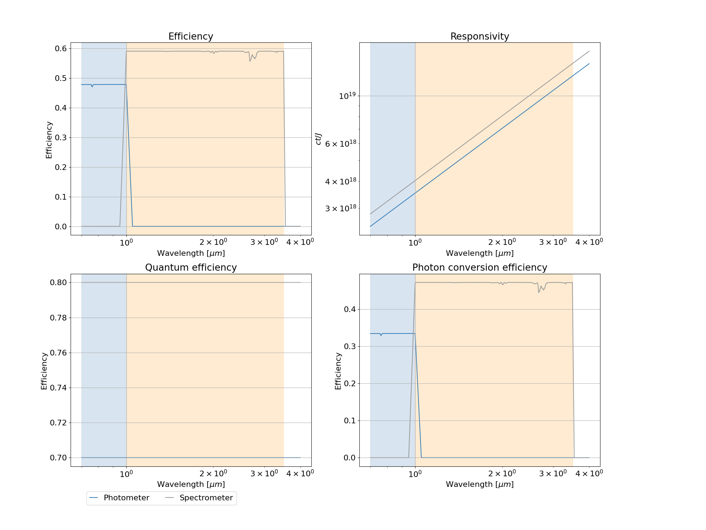

=======================
Quick start
=======================

In the following, we explore the main uses of the new `ExoSim` version.
The code can be either used as stand-alone and run pre-made pipelines called `recipes`,
or can be used as a library to build custom pipelines.

While in the next section of this documentation, we will focus on the functionalities contained in each recipe,
and hence on the use of the code as a library, here we want to focus on the fast run.

Running ExoSim from console
------------------------------
After the installation, the user can run `ExoSim` from the console to verify the installed version:

.. code-block:: console

      exosim

To run pre-made pipelines (called `recipes'`) the user can call `exosim` from the console after the installation.

Different recipes have different commands:

============================  ======================================================================================
command                       description
============================  ======================================================================================
:code:`exosim-focalplane`     runs the recipe to create the low-frequency focal plane (:ref:`Focal plane creation`)
:code:`exosim-radiometric`    runs the radiometric model recipe (:ref:`radiometric`)
:code:`exosim-sub-exposures`  create the sub-exposures from the focal plane (:ref:`sub-exposures creation`)
:code:`exosim-nrds`           create the ndrs from the sub-exposures (:ref:`ndrs creation`)
============================  ======================================================================================

Run it with the `help` flag to read the available options:

.. code-block:: console

      exosim-focalplane --help

.. tip::
      The user can access the specific command also from the general `exosim` command by adding the specific command after it:

      .. code-block:: console

            exosim focalplane --help

Here are listed the command line main flags.

============================  =======================================================================
flag                          description
============================  =======================================================================
``-c``, ``--configuration``   Input payload description file
``-o``, ``--output``          output file
``-P``, ``--plot``            runs the associated plotter (:ref:`plotter`)
``-n``, ``--nThreads``        number of threads for parallel processing
``-d``, ``--debug``           debug mode screen
``-l``, ``--log``             store the log output on file
============================  =======================================================================

Where the configuration file shall be an `.xml` file and the output file and `.h5` file (see later in :ref:`h5`)
`-n` must be followed by an integer. `-d` and `-l` do not need any argument as they simply need to be listed to activate their options.

Understanding the outputs
--------------------------
It's easy.

.. _h5:

The `.h5` file
^^^^^^^^^^^^^^^

The main output product is a HDF5_ `.h5` file.
This format has many viewers such as HDFView_ or HDFCompass_ and APIs such as Cpp_, FORTRAN_ and Python_.

To use the data, see :ref:`loadHDF5` in the :ref:`FAQs` section.

Running the examples
--------------------------

If you downloaded `ExoSim 2` from the GitHub_ repository (see :ref:`install git`), you will find an `examples` folder in the root.
If you installed `ExoSim 2` from Pypi (see :ref:`install pip`), you will have to download the folder from the GitHub_ repository.
Once you have downloaded the example folder, locate yourself there with the command console.

To run the example, you first need to change the path to the example folder in the `main_example.xml` file.
Replace the path in the `main_example.xml` file with the path to the `examples` folder in your computer.

.. code-block:: xml

    <ConfigPath>/path/to/ExoSim2/examples</ConfigPath>

Now, we will follow the Exosim diagram

.. image:: ../_static/Exosim_blocks.png
   :width: 600
   :align: center

From console
^^^^^^^^^^^^^^^

Focal plane
~~~~~~~~~~~~

The first step is to build the focal plane (see :ref:`Focal plane creation`). You can do it by

.. code-block:: console

      exosim-focalplane -c main_example.xml -o test_common.h5

Then you will find the output file in the same folder.
If you want to produce the plots, you can now run

.. code-block:: console

   exosim-plot -i test_common.h5 -o plots/ --focal_plane -t 0

This will produce two plots: the first focal plane and the instrument efficiency vs wavelength:

Radiometric model
~~~~~~~~~~~~~~~~~~~~~~~~

Now you can run the radiometric model on top of the produced focal plane (see :ref:`radiometric`):

.. code-block:: console

      exosim-radiometric -c main_example.xml -o test_common.h5

And, again, we can investigate the content by producing useful plots by

.. code-block:: console

      exosim-plot -i test_common.h5 -o plots/ --radiometric

This will plot the aperture used for the photometry

and the radiometric table

Sub-Exposure
~~~~~~~~~~~~~~~~~~~~~~~~

As for the radiometric model, on top of the produced focal plane we can build the Sub-Exposures (see :ref:`sub-exposures creation`):

.. code-block:: console

      exosim-sub-exposures  -c main_example.xml -i test_common.h5 -o test_se.h5

And, again, we can use the dedicated plotter

.. code-block:: console

      exosim-plot -i test_se.h5 -o plots/ --subexposures

Which will produce an image of each Sub-Exposure for each channel and store it in the indicated folder

NDRs
~~~~~~~~~~~~~~~~~~~~~~~~

Finally, we can build the NDRs (see :ref:`ndrs creation`) on top of the Sub-Exposures:

.. code-block:: console

      exosim-ndrs  -c main_example.xml -i test_se.h5 -o test_ndr.h5

And we can use the dedicated plotter

.. code-block:: console

      exosim-plot -i test_ndr.h5 -o plots/ --ndrs

Which will produce an image of each NDR for each channel and store it in the indicated folder.

From Python script
^^^^^^^^^^^^^^^^^^^^
Alternatively, a Python script is included which follows the previous steps: `example_pipeline.py`.

The content of the scripts can be summarised as

.. code-block:: python

      import exosim.recipes as recipes
      from exosim.plots import RadiometricPlotter, FocalPlanePlotter, \
                              SubExposuresPlotter, NDRsPlotter

      # create focal plane
      recipes.CreateFocalPlane('main_example.xml',
                              './test_common.h5')
      # run focal plane plotter
      focalPlanePlotter = FocalPlanePlotter(input='./test_common.h5')
      focalPlanePlotter.plot_focal_plane(time_step=0)
      focalPlanePlotter.save_fig('plots/focal_plane.png')
      focalPlanePlotter.plot_efficiency()
      focalPlanePlotter.save_fig('plots/efficiency.png')

      # run radiometric model
      recipes.RadiometricModel('main_example.xml',
                              './test_common.h5')
      # run radiometric plotter
      radiometricPlotter = RadiometricPlotter(input='./test_common.h5')
      radiometricPlotter.plot_table(contribs=False)
      radiometricPlotter.save_fig('plots/radiometric.png')
      radiometricPlotter.plot_apertures()
      radiometricPlotter.save_fig('plots/apertures.png')

      # create Sub-Exposures
      recipes.CreateSubExposures(input_file='./test_common.h5',
                                 output_file='./test_se.h5',
                                 options_file='main_example.xml')
      # run Sub-Exposures plotter
      subExposuresPlotter = SubExposuresPlotter(input='./test_se.h5')
      subExposuresPlotter.plot('plots/subexposures')

      # create NDRs
      recipes.CreateNDRs(input_file='./test_se.h5',
                        output_file='./test_ndr.h5',
                        options_file='main_example.xml')
      # run NDRs plotter
      ndrssPlotter = NDRsPlotter(input='./test_ndr.h5')
      ndrssPlotter.plot('plots/ndrs')

From Jupyter notebook
~~~~~~~~~~~~~~~~~~~~~~~~

Finally, a Jupyter notebook is included containing the same scripts: `example_pipeline.ipynb`.

ExoSim Tools |Tools|
^^^^^^^^^^^^^^^^^^^^^

.. |Tools| image:: tools/_static/exosim_tools.png
               :width: 60
               :class: dark-light

`ExoSim 2` includes a list of tools useful to help the user in preparing the simulation (see :ref:`tools`).
An example script to run the tools is included (`example_tools.py`),
which refers to the tools configuration file (`tools_input_example.xml`).

.. _GitHub: https://github.com/arielmission-space/ExoSim2-public

.. _HDF5: https://www.hdfgroup.org/solutions/hdf5/

.. _HDFView: https://www.hdfgroup.org/downloads/hdfview/

.. _HDFCompass: https://support.hdfgroup.org/projects/compass/

.. _FORTRAN: https://support.hdfgroup.org/HDF5/doc/fortran/index.html

.. _Cpp: https://support.hdfgroup.org/HDF5/doc/cpplus_RM/index.html

.. _Python: https://www.h5py.org/
