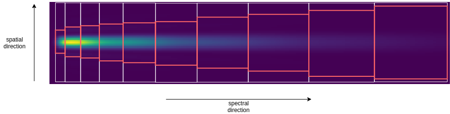

.. _estimate apertures:

=======================
Estimate apertures
=======================

Once the wavelength table is ready, is it time to estimate the aperture sizes for the photometry.
By default this is handled by :class:`~exosim.tasks.radiometric.estimateApertures.EstimateApertures`.
This Task has lot of options inside, but is still possible to define a custom task to replace this one.
To develop a custom :class:`~exosim.tasks.task.Task`, please refer to :ref:`Custom Tasks`.
The aperture task must be specified under the `radiometric` keyword:

.. code-block:: xml

    <channel> channel_name
        <type> photometer </type>

        <radiometric>
            <aperture_photometry>
                <apertures_task> EstimateApertures </apertures_task>
            </aperture_photometry>
            ...
        </radiometric>

    </channel>

Inside :class:`~exosim.recipes.radiometricModel.RadiometricModel` this tasks is handled by the :func:`~exosim.recipes.radiometricModel.RadiometricModel.compute_apertures` method.
To use the default task in a script on a channel, the user can write:

.. code-block:: python

    import exosim.tasks.radiometric as radiometric

    estimateApertures = radiometric.EstimateApertures()
    aperture_table = estimateApertures(table=table,
                                       focal_plane=focal_plane,
                                       description=description['radiometric']['aperture_photometry'],
                                       wl_grid=wl_grid)

Where `table` is the wavelength radiometric table, `focal_plane` is the channel source focal plane array,
`description` is the dictionary containing the aperture photometry information from the `xml` file,
and `wl_grid` is the focal plane wavelength grid.

.. caution::
    If the user doesn't include the `apertures_task` keyword in the channel description,
    the default :class:`~exosim.tasks.radiometric.estimateApertures.EstimateApertures` task is used.
    To develop a custom :class:`~exosim.tasks.task.Task`, please refer to :ref:`Custom Tasks`.

The results of this :class:`~exosim.tasks.task.Task` is a :class:`~astropy.table.QTable` with the centers, sizes and shapes of the apertures for the channel.

====================    ====================================================
keyword                 content
====================    ====================================================
spectral_center         center of the aperture in the spectral direction
spectral_size           size of the aperture in the spectral direction
spatial_center          center of the aperture in the spatial direction
spatial_size            size of the aperture in the spatial direction
aperture_shape          shape of the aperture (rectangular or elliptical)
====================    ====================================================

In the following we will investigate and discuss the :class:`~exosim.tasks.task.Task` options.

Spectral and Spatial modes
===========================

By specifying the spectral and spatial modes, the user can define the way the focal plane data are summed in the two directions.
By combining different options the user can have control on the summing method.

Spectral modes
----------------

Spectral modes specifies how the detector pixels counts are summed inm the two directions.
These, are set with the `spectral_mode` keyword.

Rows
^^^^^^^^^

By setting the `spectral_mode` equal to `row`, the aperture sizes in the spectral direction are set such that the ful pixel row is summed together.

.. code-block:: xml

    <channel> channel_name
        <type> photometer </type>

        <radiometric>
            <aperture_photometry>
                <apertures_task> EstimateApertures </apertures_task>
                <spectral_mode> row </spectral_mode>
            </aperture_photometry>
            ...
        </radiometric>

    </channel>

Wavelength solution
^^^^^^^^^^^^^^^^^^^^

By setting the `spectral_mode` equal to `wl_solution`, the aperture sizes in the spectral direction
are estimated starting from the spectral bin size defined in the radiometric table (see :ref:`wavelength bin`).

.. code-block:: xml

    <channel> channel_name
        <type> spectrometer </type>

        <radiometric>
            <aperture_photometry>
                <apertures_task> EstimateApertures </apertures_task>
                <spectral_mode> wl_solution </spectral_mode>
            </aperture_photometry>
            ...
        </radiometric>

    </channel>

Spatial modes
--------------

At the moment only a spatial mode is available.
By setting the `spatial_mode` equal to `column`, the aperture sizes in the spatial direction
are set such that the ful pixel column is summed together.

.. code-block:: xml

    <channel> channel_name
        <type> photometer </type>

        <radiometric>
            <aperture_photometry>
                <apertures_task> EstimateApertures </apertures_task>
                <spatial_mode> column </spatial_mode>
            </aperture_photometry>
            ...
        </radiometric>

    </channel>

Use cases example
-----------------------

To summarise with a couple of examples, if the user wants to read a photometer by summing up all the pixel values,
it can either use the automatic mode `full` (shown later)

.. code-block:: xml

    <channel> channel_name
        <type> photometer </type>

        <radiometric>
            <aperture_photometry>
                <apertures_task> EstimateApertures </apertures_task>
                <auto_mode> full </auto_mode>
            </aperture_photometry>
            ...
        </radiometric>

    </channel>

or can specify the different methods in the two direction and
ask to the :class:`~exosim.tasks.radiometric.estimateApertures.EstimateApertures` task
to sum all the columns and rows:

.. code-block:: xml

    <channel> channel_name
        <type> photometer </type>

        <radiometric>
            <aperture_photometry>
                <apertures_task> EstimateApertures </apertures_task>
                <spectral_mode> row </spectral_mode>
                <spatial_mode> column </spatial_mode>
            </aperture_photometry>
            ...
        </radiometric>

    </channel>

If the user want to read a spectrometer by summing up all the pixel along the columns of a spectral bin,
it can combine the `column` and `wl_solution` methods:

.. code-block:: xml

    <channel> channel_name
        <type> spectrometer </type>

        <radiometric>
            <aperture_photometry>
                <apertures_task> EstimateApertures </apertures_task>
                <spectral_mode> wl_solution </spectral_mode>
                <spatial_mode> column </spatial_mode>
            </aperture_photometry>
            ...
        </radiometric>

    </channel>

Automatic modes
================
The :class:`~exosim.tasks.radiometric.estimateApertures.EstimateApertures` task
includes come automatic functionalities aimed to optimise the search for the right aperture.

Elliptical apertures
----------------------
This mode can be set with `auto_mode` equal to `elliptical`.
Using this method the :func:`~exosim.utils.aperture.find_elliptical_aperture` is run.
The function look for an elliptical aperture on the focal plane which enclose at least
the Encircled Energy specify by the keyword `EnE`, while minimizing the number of pixel inside in the aperture area.

.. code-block:: xml

    <channel> channel_name
        <type> photometer </type>

        <radiometric>
            <aperture_photometry>
                <apertures_task> EstimateApertures </apertures_task>
                <auto_mode> elliptical </auto_mode>
                <EnE> 0.91 </EnE>
            </aperture_photometry>
            ...
        </radiometric>

    </channel>

Rectangular apertures
----------------------
This mode can be set with `auto_mode` equal to `rectangular`.
Using this method the :func:`~exosim.utils.aperture.find_rectangular_aperture` is run.
The function look for a rectangular aperture on the focal plane which enclose at least
the Encircled Energy specify by the keyword `EnE`, while minimizing the number of pixel inside in the aperture area.

.. code-block:: xml

    <channel> channel_name
        <type> photometer </type>

        <radiometric>
            <aperture_photometry>
                <apertures_task> EstimateApertures </apertures_task>
                <auto_mode> rectangular </auto_mode>
                <EnE> 0.91 </EnE>
            </aperture_photometry>
            ...
        </radiometric>

    </channel>

Spectral bins apertures
------------------------
This mode can be set with `auto_mode` equal to `bin`.
Using this method the :func:`~exosim.utils.aperture.find_bin_aperture` is run.
The function look for a rectangular aperture with fixed spectral size on the focal plane which enclose at least
the Encircled Energy specify by the keyword `EnE`, while minimizing the number of pixel inside in the aperture area.

.. code-block:: xml

    <channel> channel_name
        <type> spectrometer </type>

        <radiometric>
            <aperture_photometry>
                <apertures_task> EstimateApertures </apertures_task>
                <auto_mode> bin </auto_mode>
                <EnE> 0.91 </EnE>
            </aperture_photometry>
            ...
        </radiometric>

    </channel>

Full aperture
------------------------
This mode can be set with `auto_mode` equal to `full` and create a rectangular aperture of the size of the focal plane.

.. code-block:: xml

    <channel> channel_name
        <type> photometer </type>

        <radiometric>
            <aperture_photometry>
                <apertures_task> EstimateApertures </apertures_task>
                <auto_mode> full </auto_mode>
            </aperture_photometry>
            ...
        </radiometric>

    </channel>
