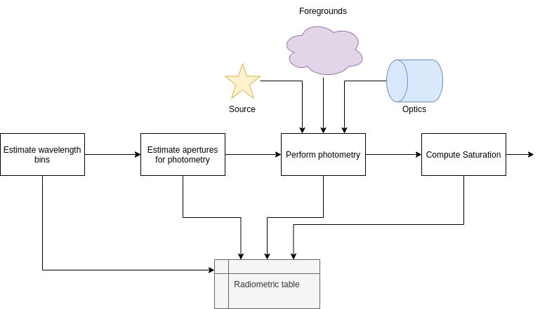
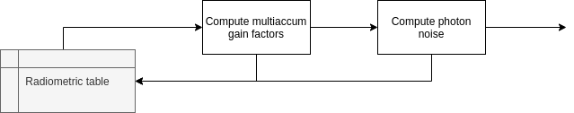

.. _radiometric:

=================
Radiometric model
=================

The radiometric model in `ExoSim` gives a fast estimate of the channel
parameters and performance metrics. It is run as a recipe,
:class:`~exosim.recipes.radiometric_model.RadiometricModel` (see :ref:`recipe`).

This guide follows the pipeline in
:class:`~exosim.recipes.radiometric_model.RadiometricModel`, listing its methods
and the tasks they use.

Operating modes
^^^^^^^^^^^^^^^

The radiometric model has **three operating modes**, chosen automatically from
the configuration and the input files:

1. **Target-list mode**: used when ``targetlist_filepath`` is set in the sky
   configuration. It processes several targets from a CSV file, building a focal
   plane and a radiometric estimate for each one. See :ref:`target_list_mode`.

2. **Existing focal-plane mode**: used when the output file already exists and
   contains focal-plane data but no target list is given. It loads the existing
   focal plane and computes the radiometric estimates directly. See
   :ref:`existing_fp`.

3. **Single-source mode**: used for a single-source configuration when no
   existing focal plane is found. It builds a new focal plane for the source,
   then computes the radiometric estimates. See :ref:`non_existing_fp`.

Common radiometric pipeline
^^^^^^^^^^^^^^^^^^^^^^^^^^^^

Whatever the operating mode, all radiometric models share the same core pipeline
for signal estimation and noise computation.

**Signal estimation.** Starting from a focal plane (existing or newly created),
the first steps build and populate the radiometric table:

1. **Wavelength binning**: build the wavelength grid for the radiometric table
   (see :ref:`wavelength bin`).
2. **Aperture estimation**: estimate aperture sizes and pixel counts for the
   photometry (see :ref:`estimate apertures`).
3. **Signal calculation**: estimate the source and background signals with
   aperture photometry (see :ref:`estimate signals`).
4. **Saturation analysis**: compute the detector saturation times (see
   :ref:`saturation_time`).

**Noise estimation.** Once the radiometric table is built, the noise from the
various sources is estimated:

1. **Multiaccum factors**: compute the factors for multiaccum readout schemes
   (see :ref:`multiaccum`).
2. **Photon noise**: estimate the photon-noise contributions (see
   :ref:`photon noise`).
3. **Total noise**: combine all the noise sources (see :ref:`total noise`).

Guide contents
^^^^^^^^^^^^^^

.. toctree::
   :maxdepth: 1

   Operating modes <operating_modes>
   Wavelength binning <wavelength_bin>
   Estimate apertures <estimate_apertures>
   Estimate signal <estimate_signal>
   Timing model <timing_model>
   Multiaccum <multiaccum>
   Photon noise <photon_noise>
   Read noise <read_noise>
   Dark current noise <dark_current_noise>
   Custom noise <custom_noise>
   Total noise <total_noise>
