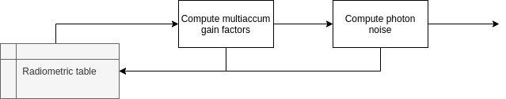

.. _radiometric:

===================================
Radiometric Model
===================================

Once the focal plane has been created (see :ref:`Focal plane creation`), `ExoSim` can run a radiometric model for a fast estimate of channel parameters.
The Radiometric model itself is handled as a recipe: :class:`~exosim.recipes.radiometricModel.RadiometricModel`

For a complete description of the steps involve, we will refer in this guide to the pipeline encapsulated in the :class:`~exosim.recipes.radiometricModel.RadiometricModel` class,
listing its method and discussing the involved :class:`~exosim.tasks.task.Task`.

To initialise the :class:`~exosim.recipes.radiometricModel.RadiometricModel` we assume for now that the user has already a focal plane produced following :ref:`Focal plane creation` or by using :class:`~exosim.recipes.createFocalPlane.CreateFocalPlane`.

Prepare and populate the radiometric table
^^^^^^^^^^^^^^^^^^^^^^^^^^^^^^^^^^^^^^^^^^^^
Starting from a focal plane, the first steps are to create and populate the radiometric table.
This includes the steps reported in the following figure:

To summarise, the first step is to create the wavelength grid for the table, then we can move to estimate the signal.
We can estimate the signal using aperture photometry on every focal plane stored in the input file.
From the source and background focal plane, we can then estimate the saturation time of the detector.

Each step is extensively described in the following pages:

.. toctree::
   :maxdepth: 1

   Wavelength binning <wavelength_bin>
   Estimate apertures <estimate_apertures>
   Estimate signal <estimate_signal>
   Saturation Time <saturation_time>

Estimate the noise
^^^^^^^^^^^^^^^^^^^^^^^^^
Once the radiometric table is built, the next step is to estimate the noise.
Numerous noise sources can be considered. In the following we describe ho to use the standard sources and how to include new or custom ones.

.. toctree::
   :maxdepth: 1

   Multiaccum <multiaccum>
   Photon noise <photon_noise>
   Total Noise <total_noise>

Automatic recipies
^^^^^^^^^^^^^^^^^^^^^^^^^
Finally, an automatic pipeline has been developed to help the user.
The pipeline is handeld by a :class:`~exosim.recipes` of `ExoSim` called :class:`~exosim.recipes.radiometricModel.RadiometricModel`.
In the following we described the different cases handled by the model.

.. toctree::
   :maxdepth: 1

   Automatic Recipe <pipeline>

Where the following cases are addressed:

-   :ref:`existing_fp`
-   :ref:`non_existing_fp`
-   :ref:`targetlist`
