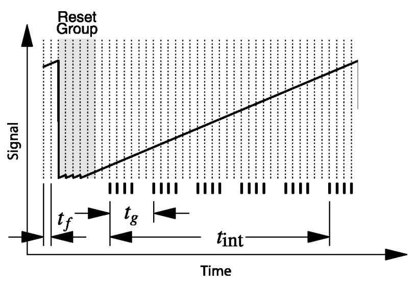

.. _multiaccum:

=======================
Multiaccum
=======================

.. warning::
    Multiaccum factors are not validated yet.

When the detector is collecting light, the pixel are being filled with electrons.
During time the number of electrons in the pixels increases until eh pixel saturates.
This saturation ramp hold the information abut the incoming flux.

Different way to fit this ramp results in different noises.
This analysis has been done in Rauscher and Fox et al. 2007 (http://iopscience.iop.org/article/10.1086/520887/pdf)
with the definition of the MULTIACCUM equation.
Such equation has been later corrected in Robberto 2009 (https://www.stsci.edu/files/live/sites/www/files/home/jwst/documentation/technical-documents/_documents/JWST-STScI-001853.pdf), and also reported in Batalha et al. 2017 (https://doi.org/10.1088/1538-3873/aa65b0).

The picture from Rauscher and Fox et al. 2007 (http://iopscience.iop.org/article/10.1086/520887/pdf)
shows the detector readout scheme using MULTIACCUM sampling. The detector is read out at a constant
cadence of :math:`t_f` but not all the read frames are saved.
Saved frames are averaged, resulting in one averaged group of data every :math:`t_g` seconds.

The resulting total noise, as reported in Batalha et al. 2017 (https://doi.org/10.1088/1538-3873/aa65b0) is

.. math::

    \sigma_{tot}^2 = \frac{12(n-1)}{mn(n+1)} \cdot \sigma_{read}^2 + \frac{6 (n^2+1)}{5n(n+1)}(n-1)t_g \cdot S + \frac{2(m^2-1)(n-1)}{mn(n+1)}t_f \cdot S

where :math:`m` is the number of frames per group, :math:`n` is the number of groups,
:math:`\sigma_{read}` is the read noise and :math:`S` is the incoming photon flux.

To summarise, different fitting patters produce different gain factors for read noise and photon noise.
We can then determine two gain factors: one for the read noise and one for the photon noise.

.. math::

    gain_{read} = \frac{12(n-1)}{mn(n+1)}

.. math::

    gain_{phot} = \frac{6 (n^2+1)}{5n(n+1)}(n-1)t_g  + \frac{2(m^2-1)(n-1)}{mn(n+1)}t_f

In `ExoSim` these gain factor are estimated by :class:`~exosim.tasks.radiometric.multiaccum.Multiaccum`.
Enable this option the user needs to specify the factor inside the `xml` file:

.. code-block:: xml

    <channel> channel_name
        <radiometric>
            <multiaccum>
                <n>  </n>
                <m>  </m>
                <tg unit='s'> </tg>
                <tf unit='s'> </tf>
            </multiaccum>
            ...
        </radiometric>
    </channel>

And then the gain factors are estimated as

.. code-block:: python

    import exosim.tasks.radiometric as radiometric

    estimateApertures = radiometric.Multiaccum()
    gain_read, gain_shot = multiaccum(parameters=description['radiometric']['multiaccum'])
