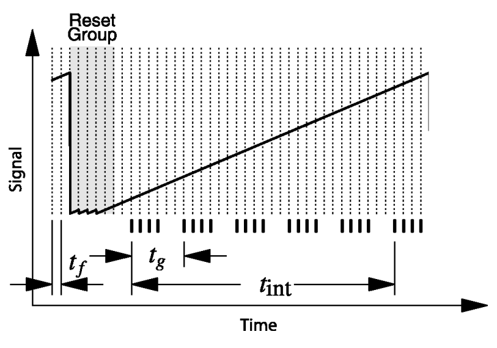

.. _multiaccum:

==========
Multiaccum
==========

.. warning::
    Multiaccum factors are not validated yet.

While the detector collects light, the pixels fill with electrons. Over time the
number of electrons grows until the pixel saturates, and this saturation ramp
carries the information about the incoming flux.

Different ways of fitting the ramp produce different noise. The analysis was done
in `Rauscher and Fox et al. 2007
<http://iopscience.iop.org/article/10.1086/520887/pdf>`_, which defined the
MULTIACCUM equation. The equation was later corrected in `Robberto 2009
<https://www.stsci.edu/files/live/sites/www/files/home/jwst/documentation/technical-documents/_documents/JWST-STScI-001853.pdf>`_
and is also reported in `Batalha et al. 2017
<https://doi.org/10.1088/1538-3873/aa65b0>`_.

The figure, from Rauscher and Fox et al. 2007, shows the detector readout under
MULTIACCUM sampling. The detector is read out at a constant cadence :math:`t_f`,
but not every read frame is kept. The saved frames are averaged, giving one
averaged group every :math:`t_g` seconds.

The resulting total noise, as reported in Batalha et al. 2017, is

.. math::

    \sigma_{tot}^2 = \frac{12(n-1)}{mn(n+1)} \cdot \sigma_{read}^2 + \frac{6 (n^2+1)}{5n(n+1)}(n-1)t_g \cdot S + \frac{2(m^2-1)(n-1)}{mn(n+1)}t_f \cdot S

where :math:`m` is the number of frames per group, :math:`n` is the number of
groups, :math:`\sigma_{read}` is the read noise and :math:`S` is the incoming
photon flux.

In short, different fitting patterns scale the read noise and the photon noise by
different amounts. `ExoSim` captures this with two gain factors, one for each:

.. math::

    gain_{read} = \frac{12(n-1)}{mn(n+1)}

.. math::

    gain_{phot} = \frac{6 (n^2+1)}{5n(n+1)}(n-1)t_g  + \frac{2(m^2-1)(n-1)}{mn(n+1)}t_f

The factors are estimated by
:class:`~exosim.tasks.radiometric.multiaccum.Multiaccum`. To enable the option,
specify the parameters in the ``xml`` file:

.. code-block:: xml

    <channel> channel_name
        <radiometric>
            <multiaccum>
                <n>  </n>
                <m>  </m>
                <tg unit='s'> </tg>
                <tf unit='s'> </tf>
            </multiaccum>
            ...
        </radiometric>
    </channel>

The gain factors are then estimated as

.. code-block:: python

    import exosim.tasks.radiometric as radiometric

    multiaccum = radiometric.Multiaccum()
    gain_read, gain_shot = multiaccum(parameters=description['radiometric']['multiaccum'])
