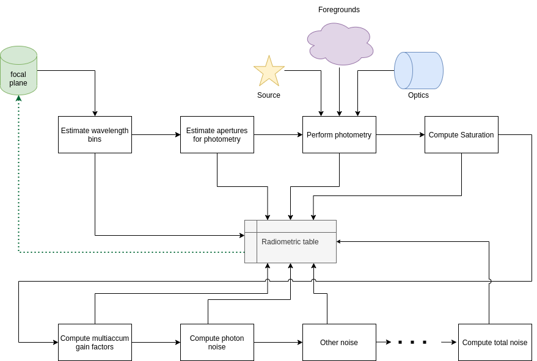
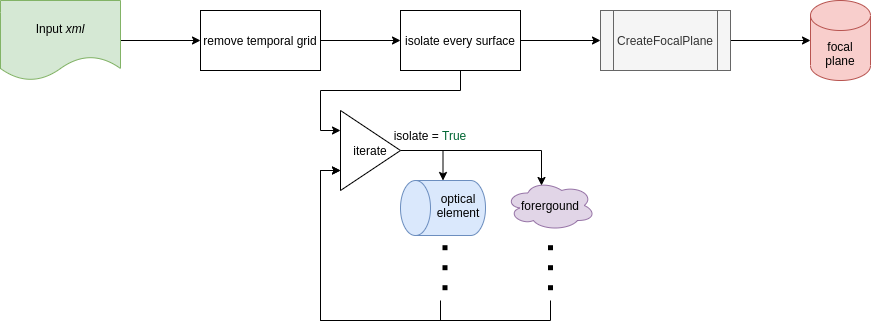

.. _recipe:
.. _modes:

===================================
Radiometric Model Operating Modes
===================================

The radiometric model in ExoSim has three operating modes that are automatically selected based on the configuration and input files.
This is handled by the :class:`~exosim.recipes.radiometric_model.RadiometricModel` class.

Usage
-----

.. code-block:: python

    from exosim import recipes
    recipes.RadiometricModel(options_file='your_config_file.xml',
                             output_file='output_file.h5')

The :class:`~exosim.recipes.radiometric_model.RadiometricModel` can also be run from console as

.. code-block:: console

    exosim-radiometric -c your_config_file.xml -o output_file.h5

or

.. code-block:: console

    exosim-radiometric -c your_config_file.xml -o output_file.h5 -P

to also run ExoSim :class:`~exosim.plots.radiometric_plotter.RadiometricPlotter`, which is documented in :ref:`radiometric plotter`.

The radiometric pipeline stores the products in the output file by default using :func:`exosim.recipes.radiometric_model.RadiometricModel.write`.
If the output format is the default HDF5_, refer to :ref:`loadHDF5` in the :ref:`FAQs` section for how to use the data,
and see :ref:`load signal table` in particular to cast the focal plane into a :class:`~exosim.models.signal.Signal` class.

.. _HDF5: https://www.hdfgroup.org/solutions/hdf5/

Operating Mode Selection
------------------------

The radiometric model automatically selects the appropriate mode based on:

1. **Target List Mode**: When ``targetlist_filepath`` is specified in the sky configuration
2. **Existing Focal Plane Mode**: When the output file exists and contains focal plane data
3. **Single Source Mode**: When creating a new focal plane for a single source configuration

.. _target_list_mode:

Target List Mode
================

When a ``targetlist_filepath`` is specified in the sky configuration, the radiometric model processes multiple targets efficiently. This mode is ideal for survey planning and comparative studies.

**Key Features:**
- Processes multiple targets from a CSV file
- Creates individual focal planes for each target
- Generates comprehensive radiometric tables for each source
- Supports automated plotting and data export

**Overview:**

The target list pipeline processes each target in the following workflow:

1. **Load target list**: Reads the target parameters from a CSV file
2. **Create focal planes**: Generates focal planes for each target individually
3. **Compute radiometric estimates**: Calculates apertures, signals, and noise for each target
4. **Store results**: Saves individual radiometric tables and plots for each target

**Configuration:**

To use the target list mode, your main configuration file should specify a target list in the sky section.
By default, this is loaded by :class:`~exosim.tasks.load.load_source_list.LoadSourceList`.

.. code-block:: xml

    <sky>
        <source> targetlist
            <targetlist_filepath>targets.csv</targetlist_filepath>
            <source_type>planck</source_type>
            <column_mapping>
                <name>star name</name>
                <T>star Teff [K]</T>
                <R>star R [R_sun]</R>
                <D>star D [pc]</D>
                <M>star M [M_sun]</M>
            </column_mapping>
        </source>
    </sky>

**Target List Format:**

The target list should be a CSV file with the following structure:

.. csv-table:: Example target list
   :header: "star name", "star Teff [K]", "star R [R_sun]", "star D [pc]", "star M [M_sun]"
   :widths: 20, 15, 15, 15, 15

   "GJ 1214", "3250", "0.211", "14.55", "0.176"
   "HD 209458", "6086", "1.18", "47.5", "1.175"
   "HD 219134", "4699", "0.778", "6.5", "0.778"

The column names in the CSV file are mapped to the physical parameters using the ``column_mapping`` section in the configuration.

**Output Structure:**

The output file contains the following structure for target list mode:

.. code-block::

    output_file.h5
    ├── targets/
    │   ├── GJ_1214/
    │   │   ├── channels/
    │   │   │   ├── Photometer/
    │   │   │   └── Spectrometer/
    │   │   └── configuration/
    │   ├── HD_209458/
    │   │   ├── channels/
    │   │   └── configuration/
    │   └── HD_219134/
    │       ├── channels/
    │       └── configuration/
    ├── radiometric/
    │   ├── apertures/
    │   ├── GJ_1214/
    │   ├── HD_209458/
    │   └── HD_219134/
    └── ...

Additionally, individual CSV files are created:

- ``GJ_1214_radiometric_table.ecsv``
- ``HD_209458_radiometric_table.ecsv``
- ``HD_219134_radiometric_table.ecsv``

**Usage Example:**

.. code-block:: python

    from exosim.recipes import RadiometricModel

    # Create radiometric model with target list
    rm = RadiometricModel(
        options_file='config_with_targets.xml',
        output_file='target_list_results.h5'
    )

    # Run radiometric analysis for all targets
    rm.run()

.. _existing_fp:

Existing Focal Plane Mode
==========================

When a focal plane file already exists and no target list is specified, the radiometric model loads the existing focal plane and computes radiometric estimates directly.

**Pipeline Steps:**

Starting from the existing focal plane, the following steps are executed:

**Signal Estimation:**

1. Creation of the wavelength table (see :ref:`wavelength bin`);
2. Estimation of aperture sizes and pixel counts (see :ref:`estimate apertures`);
3. Estimation of sub-foreground signals, if any (see :ref:`estimate signals`);
4. Estimation of total foreground signals (see :ref:`estimate signals`);
5. Estimation of source signals in apertures (see :ref:`estimate signals`);
6. Estimation of saturation times (see :ref:`saturation_time`);

**Noise Estimation:**

1. Calculation of multiaccum factors (see :ref:`multiaccum`);
2. Estimation of photon noise (see :ref:`photon noise`);
3. Computation of detector noise sources
4. Calculation of total noise (see :ref:`total noise`)

The radiometric table is then stored in the output file.

**Usage Example:**

.. code-block:: python

    # Assuming 'existing_focal_plane.h5' already contains focal plane data
    rm = recipes.RadiometricModel(
        options_file='config.xml',
        output_file='existing_focal_plane.h5'  # Existing file
    )

Output Files
--------------

The radiometric model produces output files based on the operating mode:

**Target List Mode:**
   Creates a new HDF5 file containing radiometric tables for all specified targets.

**Existing Focal Plane Mode:**
   Updates the input HDF5 file with radiometric information added to existing focal plane data.

**Single Source Mode:**
   Saves radiometric results to the specified output file.

All outputs include comprehensive radiometric tables with wavelength grids, signal estimates, and noise calculations for each channel and detector configuration.

.. _non_existing_fp:

Non existing focal plane
==========================

If a focal plane is not available as input, the :class:`~exosim.recipes.radiometric_model.RadiometricModel` creates it.

Following the figure, the pipeline first loads the input configuration `xml` file.
Then it removes the temporal dimension, as the radiometric model won't need it.
It isolates every optical element, such that it can estimate their contributions, and finally creates the focal plane using :ref:`focal plane recipe`.

Then, from the new focal plane the :ref:`existing_fp` pipeline is run.
