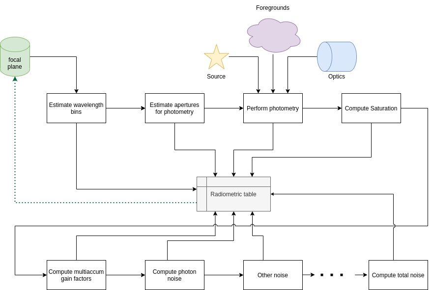
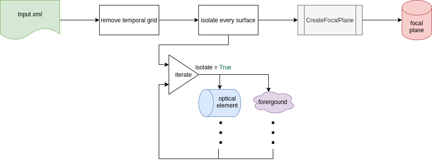

.. _recipe:

===================================
Radiometric model automatic Recipe
===================================

As for the focal plane recipe described in :ref:`focal plane recipe`,
ExoSim include an automatic pipeline also for the radiometric model.
This is under the :py:mod:`~exosim.recipes` of `ExoSim`.

.. code-block:: python

    from exosim import recipes
    recipes.RadiometricModel(options_file='your_config_file.xml',
                             input_file='output_file.h5')

The :class:`~exosim.recipes.radiometricModel.RadiometricModel` can also be run from console as

.. code-block:: console

    exosim-radiometric -c your_config_file.xml -o output_file.h5

or

.. code-block:: console

    exosim-radiometric -c your_config_file.xml -o output_file.h5 -P

to also run ExoSim :class:`~exosim.plots.radiometricPlotter.RadiometricPlotter`, which is documented in :ref:`radiometric plotter`.

The radiometric pipeline stores the product in the output file by default using :func:`exosim.recipes.radiometricModel.RadiometricModel.write`.
If the output format is the default HDF5_, refer to :ref:`loadHDF5` in the :ref:`FAQs` section for how to use the data,
and see :ref:`load signal table` in particular to cast the focal plane into a :class:`~exosim.models.signal.Signal` class.

.. _HDF5: https://www.hdfgroup.org/solutions/hdf5/

.. _existing_fp:

Existing focal plane
=======================

If a focal plane has been computed already and is available as input file,
then the working scheme for the recipe is reported in the following figure:

Starting from the focal plane, all the steps are the ones reported previously in this documentation:
The involved steps are:

1. creation of the wavelength table with :func:`~exosim.recipes.radiometricModel.RadiometricModel.create_table` (see :ref:`wavelength bin`);
2. estimation of the apertures sizes and number of pixels involved with :func:`~exosim.recipes.radiometricModel.RadiometricModel.compute_apertures` (see :ref:`estimate apertures`);
3. estimation of the signals in the apertures for the sub foregrounds, if any: :func:`~exosim.recipes.radiometricModel.RadiometricModel.compute_sub_foregrounds_signals` (see :ref:`estimate signals`);
4. estimation of the total foreground signal in the apertures:  :func:`~exosim.recipes.radiometricModel.RadiometricModel.compute_foreground_signals` (see :ref:`estimate signals`);
5. estimation of the source focal plane signal in the aperture: :func:`~exosim.recipes.radiometricModel.RadiometricModel.compute_source_signals` (see :ref:`estimate signals`);
6. estimation of the saturation time in the channel: :func:`~exosim.recipes.radiometricModel.RadiometricModel.compute_saturation` (see :ref:`saturation time`);

Then the noise estimation is run:

1. estimation of the multiaccum factors :func:`~exosim.recipes.radiometricModel.RadiometricModel.compute_multiaccum` (see :ref:`multiaccum`);
2. estimation shot noise :func:`~exosim.recipes.radiometricModel.RadiometricModel.compute_photon_noise` (see :ref:`photon noise`);
3. update total noise :func:`~exosim.recipes.radiometricModel.RadiometricModel.update_total_noise` (see :ref:`total noise`)

Then the radiometric table is stored into the input file.

.. _non_existing_fp:

Non existing focal plane
==========================

If a focal plane is not available as input, the :class:`~exosim.recipes.radiometricModel.RadiometricModel` creates it.

Following the figure, the pipeline first loads the input configuration `xml` file.
Then it removes the temporal dimension, as the radiometric model won't need it.
It isolate every optical element, such that it can estimate their contributions, and finally creates the focal plane using :ref:`focal plane recipe`.

Then, from the new focal plane the :ref:`existing_fp` pipeline is run.

.. _targetlist:

Radiometric model over a target list
======================================

Not implemented yet
