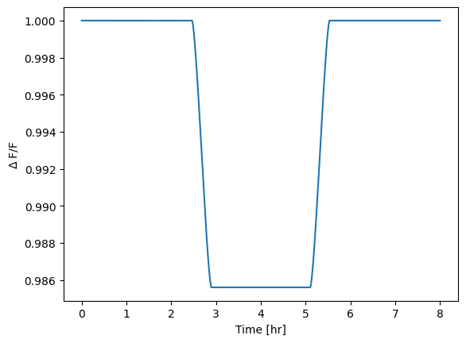
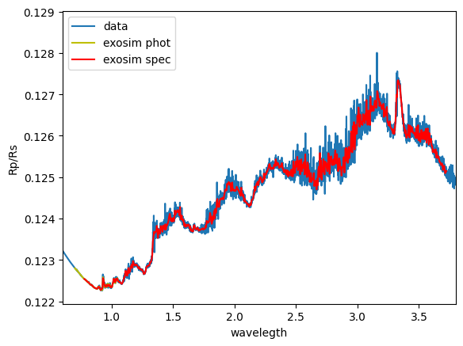
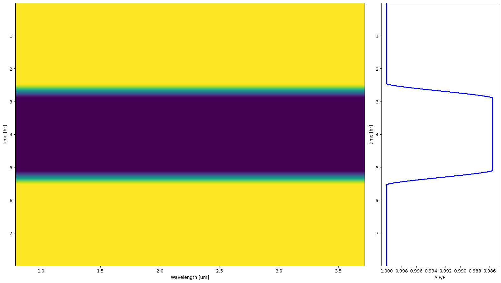
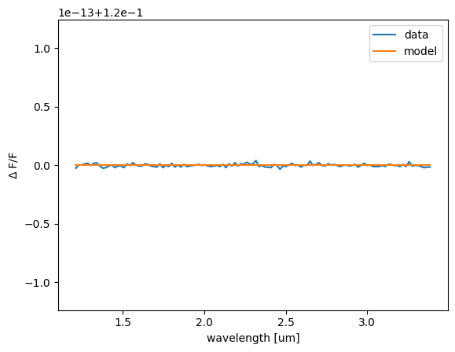
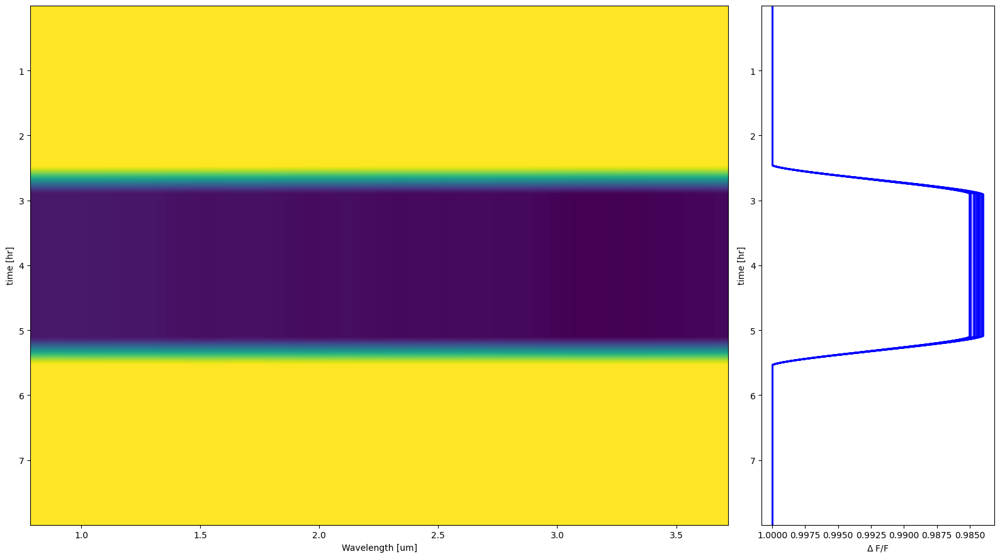
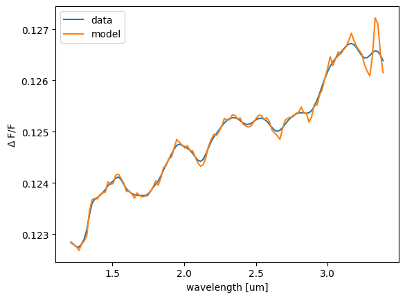

.. role:: xml(code)
   :language: xml

.. _Astronomical signals:

===========================================
Astronomical signals
===========================================

Forewords
=========

Now we can introduce some astronomical signals.
Signals are intended as relative variations on the target source signal.
So, they are defined as a function of the target source signal in time.

A few forewords before we start.
Astronomical signals are not a core part of the ExoSim framework.
ExoSim simulations are aimed at reproducing complex instrumental systematic effects.
In order to train data reduction pipelines to cope with these effects, it is not necessary to introduce astronomical signals.
Therefore, the astronomical signals we are introducing here are not intended as perfect representations of the expected ones,
but only as representative, order-of-magnitude effects.
For the same reason, we introduce them after the jitter, not before.
Jitter is the most important effect to be reproduced, and it is also the most difficult to model.
Introducing the astronomical signal before the jitter would make the jitter model more difficult to implement and the simulations significantly slower.
This simulation order prevents ExoSim from simulating the spectral effect of jitter on the resulting signal, which is, however, a second-order effect
compared to other noise sources.

This order-of-magnitude simulation of the astronomical signal is, however, improved compared to the previous version of ExoSim:
this new version of the code also takes into account the smoothing effect on the astronomical signal caused by the instrument line shape and the intra-pixel response function.
More details are reported in the following section.

Estimate the signal
====================

The astronomical signals are intriduced in the `sky configuration file`, along with the source description.
The :class:`~exosim.tasks.task.Task` describing the astronomical signal is called :class:`~exosim.tasks.astrosignal.estimateAstronomicalSignal.EstimateAstronomicalSignal`.
This is an abstract tasks with no model implemented. 
A complete example is reported in :class:`~exosim.tasks.astrosignal.estimatePlanetarySignal.EstimatePlanetarySignal`.

Here we report as example a signal that is the primary transit light curve of an exoplanet modelled using :class:`~exosim.tasks.astrosignal.estimatePlanetarySignal.EstimatePlanetarySignal`. 

.. code-block:: xml

      <source> HD 209458
         <source_type> planck </source_type>
         <R unit="R_sun"> 1.18 </R>
         <T unit="K"> 6086 </T>
         <D unit="pc"> 47 </D>

         <planet> b
            <signal_task>EstimatePlanetarySignal</signal_task>
            <t0 unit='hour'>4</t0>
            <period unit='day'>3.525</period>
            <sma>8.81</sma>
            <inc unit='deg'>86.71</inc>
            <w unit='deg'>0.0</w>
            <ecc>0.0</ecc>
            <rp> 0.12 </rp>
            <limb_darkening>linear</limb_darkening>
            <limb_darkening_coefficients>[0]</limb_darkening_coefficients>
         </planet>
      </source>

In this example we point to :class:`~exosim.tasks.astrosignal.estimatePlanetarySignal.EstimatePlanetarySignal` 
task to model the primary transit light curve of an exoplanet thanks to the ``signal_task``. 
Everything else under the ``planet`` tree is a parameter needed by the indicated Task. 
Note that ``planet`` is the keyword needed for :class:`~exosim.tasks.astrosignal.estimatePlanetarySignal.EstimatePlanetarySignal`, 
but it can be any other keyword, as long as the corresponding Task is able to parse it.

The user can define multiple astronomical signals for the same star.
All of them are loaded and applied one at a time by ExoSim2.

.. warning::
      The current version of ExoSim applies astronomical signals only to the target star.
      Please make sure to define the astronomical signal for the target star only.
      If astronomical signals are needed for multiple stars, multiple simulations
      can be defined, and the results can be combined later.
      

The astronomical signals are parsed by :class:`~exosim.tasks.astrosignal.findAstronomicalSignals.FindAstronomicalSignals`, 
which looks for the ``signal_task`` keyword and instantiates the corresponding Task.
The signal name is the parent tree keyword, in this case ``planet``.

:class:`~exosim.tasks.astrosignal.estimatePlanetarySignal.EstimatePlanetarySignal` is based on 
the `batman package <http://lkreidberg.github.io/batman/docs/html/index.html>`__  
presented in `Kreidberg 2015 <https://ui.adsabs.harvard.edu/abs/2015PASP..127.1161K/abstract>`__. 
As usual, the User can replace the default Taks withg a custom one. 
The results of an :class:`~exosim.tasks.astrosignal.estimateAstronomicalSignal.EstimateAstronomicalSignal` task
shall be a 2D array with the first dimension being the wavelength and the second the time.

.. warning::
      To run :class:`~exosim.tasks.astrosignal.estimatePlanetarySignal.EstimatePlanetarySignal` you need to have
      the  `batman package <http://lkreidberg.github.io/batman/docs/html/installation.html>`__ installed.
      Because the ``batman`` package is not a core dependency of ExoSim, it is not installed by default.

In this example the planetary radius is constantly 0.12 times the stellar radius, as indicated under the ``rp`` keyword. 
For a single wavelength, the transit light curve is the following:

If we want to simulate a transit with a varying radius, we can use the ``rp`` keyword to indicate a csv file.

.. code-block:: xml

      <source> HD 209458
         <planet> b
            <rp> radius_data.csv </rp>
         </planet>
      </source>

where the ``radius_data.csv`` file is a csv file with two columns, the first being the wavelength and the second the radius in stellar radii, entitled as ``rp/rs``.
In this case, the input data are binned by the Task. 
To give an example, we use a simulated forward model for HD 209458 b produced with TauREx3 and the resulting spectrum is the following:

The used file is available in the ``example/data`` folder of the ExoSim package.

Similarly, the user can define a wavelength dependent limb darkening using a csv file. In this case, the first column is the wavelength and the other columns are the limb darkening coefficients, entitled as ``ldc_c1``, ``ldc_c2``, etc.

Multiple signals can be listed in the ``sky`` configuration file, and they will be parsed and applied one per time.

Apply the signal
====================

Instrument line shape
-----------------------

To apply the signal, the Instrument line shapes are needed.
These are loaded from the focal plane file by the :class:`~exosim.tasks.subexposures.loadILS.LoadILS` task.
The task returns a data cube of 1D PSFs for each wavelength.
The data cube is a 3D array with the first dimension being time, the second wavelength,
and the third the shape response in the spectral direction.
These line shapes are normalised to their maximum value, so that the maximum value of the line shape is 1.

The instrument line shapes produced by this task are not the same as the instrument line shapes as defined in the literature.
To be used as the instrument line shapes as defined in the literature, they need to be convolved with the intra-pixel response.
This convolution is not part of this task, as it affects the way the ILS are sampled.
The convolution with the intra-pixel response is done in the :class:`~exosim.tasks.astrosignal.applyAstronomicalSignal.ApplyAstronomicalSignal` Task,
where the ILS are used to convolve the astronomical signal.

The :class:`~exosim.tasks.subexposures.loadILS.LoadILS` task is a default Task.
If needed, it can be replaced with a custom Task.

.. code-block:: xml

      <channel> channel_name
         <detector>
            <ils_task>LoadILS</ils_task>
         </detector>
      </channel>

Signal application
-----------------------
Once parsed, the astronomical signal is applied to Sub-Exposures by the :class:`~exosim.tasks.astrosignal.applyAstronomicalSignal.ApplyAstronomicalSignal` task.
This task convolves the astronomical signal with the instrument line shape and the intra-pixel response, weights the signal with the source flux on the channel (if provided),
and multiplies it with the Sub-Exposures.

Here we show some example results.
In the following, we are considering a spectrometer read using Correlated Double Sampling (CDS).
We are considering a transit of HD 209458 b with a radius of 0.12 times the stellar radius.
We select the second NDR for each ramp and divide it by the second NDR of the first ramp.
Then we sum the resulting images along the spectral direction.
The following picture shows the results. On the left panel, the transit light curve for each pixel is shown.
So, the y-axis is time, while the x-axis is the pixel number, corresponding to a certain wavelength.
On the right panel, the transit light curve for each wavelength is shown.

Because the transit depth is constant, the transit light curve for each spectral pixel is the same,
and therefore the transit light curves on the right plot are aligned.

The following plot shows the transit depth at the centre of the transit for each wavelength.
We compare the transit depth with the input model,
which is the result of a constant radius ratio of 0.12 between planet and star, and we see that the two are the same up to the numerical precision of 1e-15.

In the following example, we use the same input parameters, but with a varying radius.
The input model is the same as the one shown above for HD 209458 b.
We can see now that in the first plot the transit light curves are no longer aligned.

Also, we compare again the transit depth at the centre of the transit for each wavelength with the expected model.
We can see that the curve extracted from the ExoSim data is smoother than the input model.
This is the effect of the applied ILS to the input model.

