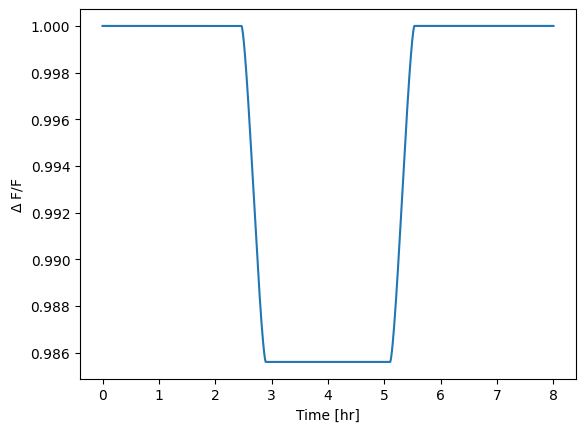
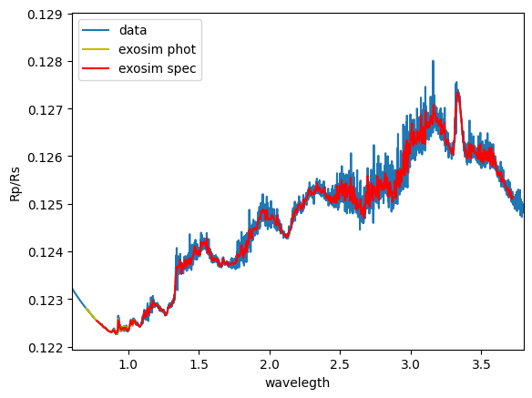
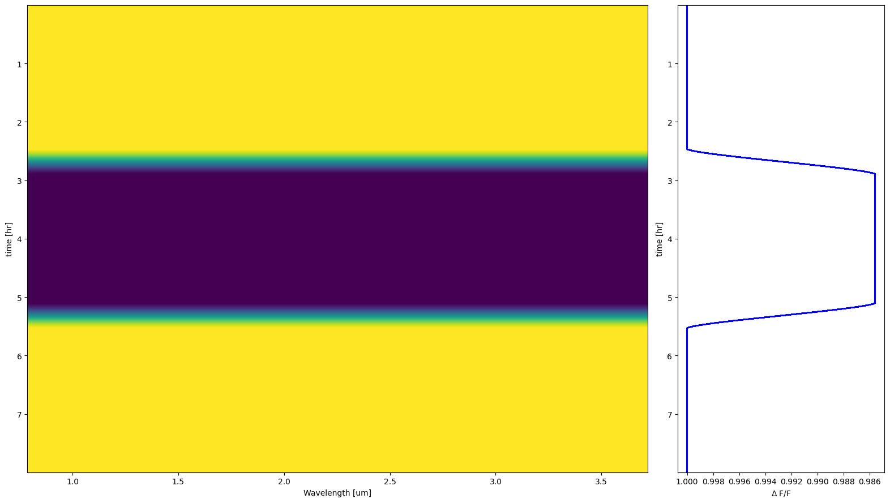
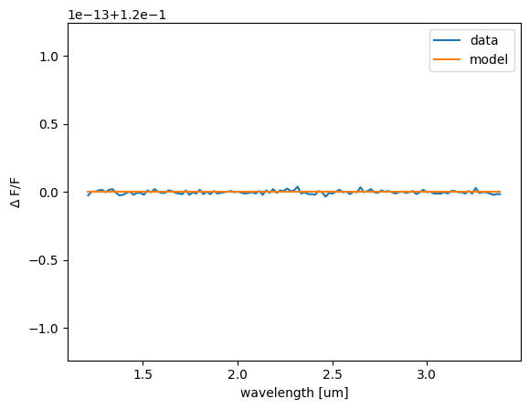
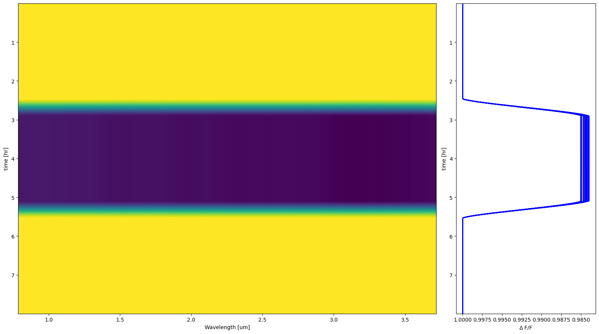
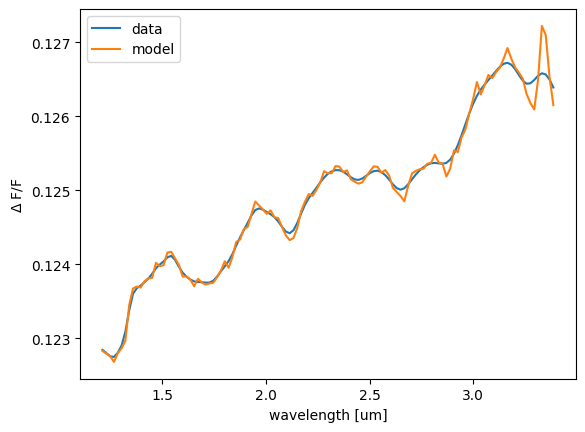

.. role:: xml(code)
   :language: xml

.. _Astronomical signals:

====================
Astronomical signals
====================

A note before we start
======================

We can now introduce astronomical signals. A signal is a relative variation of
the target source signal, defined as a function of the target source signal over
time.

A few points to keep in mind. Astronomical signals are not a core part of the
ExoSim framework: ExoSim simulations aim to reproduce complex instrumental
systematics, and training a data-reduction pipeline against those does not
require an astronomical signal. The signals introduced here are therefore not
meant to be perfect representations of the real ones, only representative,
order-of-magnitude effects.

For the same reason, the signal is applied *after* the jitter, not before.
Jitter is the most important effect to reproduce and the hardest to model;
introducing the astronomical signal first would make the jitter model harder to
implement and the simulations much slower. The cost of this ordering is that
ExoSim does not simulate the spectral effect of jitter on the resulting signal,
which is a second-order effect compared to the other noise sources.

This order-of-magnitude simulation is still an improvement over the previous
version of ExoSim: the new code also accounts for the smoothing of the
astronomical signal by the instrument line shape and the intra-pixel response
function. The next section has the details.

Estimate the signal
====================

Astronomical signals are defined in the `sky` configuration file, next to the
source description. The base
:class:`~exosim.tasks.task.Task` for an astronomical signal is
:class:`~exosim.tasks.astrosignal.estimate_astronomical_signal.EstimateAstronomicalSignal`,
an abstract task with no model implemented; a complete implementation is
:class:`~exosim.tasks.astrosignal.estimate_planetary_signal.EstimatePlanetarySignal`.

As an example, here is the primary transit light curve of an exoplanet, modelled
with
:class:`~exosim.tasks.astrosignal.estimate_planetary_signal.EstimatePlanetarySignal`.

.. code-block:: xml

      <source> HD 209458
         <source_type> planck </source_type>
         <R unit="R_sun"> 1.18 </R>
         <T unit="K"> 6086 </T>
         <D unit="pc"> 47 </D>

         <planet> b
            <signal_task>EstimatePlanetarySignal</signal_task>
            <t0 unit='hour'>4</t0>
            <period unit='day'>3.525</period>
            <sma>8.81</sma>
            <inc unit='deg'>86.71</inc>
            <w unit='deg'>0.0</w>
            <ecc>0.0</ecc>
            <rp> 0.12 </rp>
            <limb_darkening>linear</limb_darkening>
            <limb_darkening_coefficients>[0]</limb_darkening_coefficients>
         </planet>
      </source>

Here ``signal_task`` selects the
:class:`~exosim.tasks.astrosignal.estimate_planetary_signal.EstimatePlanetarySignal`
task to model the transit light curve. Everything else under the ``planet`` tree
is a parameter for that task. ``planet`` is the keyword
:class:`~exosim.tasks.astrosignal.estimate_planetary_signal.EstimatePlanetarySignal`
expects, but it could be any keyword, as long as the corresponding task can
parse it.

You can define several astronomical signals for the same star; ExoSim 2 loads
and applies them one at a time.

.. warning::
      The current version of ExoSim applies astronomical signals only to the target star.
      Please make sure to define the astronomical signal for the target star only.
      If astronomical signals are needed for multiple stars, multiple simulations
      can be defined, and the results can be combined later.

The astronomical signals are parsed by
:class:`~exosim.tasks.astrosignal.find_astronomical_signals.FindAstronomicalSignals`,
which looks for the ``signal_task`` keyword and instantiates the corresponding
task. The signal name is the parent keyword, here ``planet``.

:class:`~exosim.tasks.astrosignal.estimate_planetary_signal.EstimatePlanetarySignal`
is based on the `batman package
<http://lkreidberg.github.io/batman/docs/html/index.html>`__ from `Kreidberg
2015 <https://ui.adsabs.harvard.edu/abs/2015PASP..127.1161K/abstract>`__. As
usual, you can replace the default task with a custom one. An
:class:`~exosim.tasks.astrosignal.estimate_astronomical_signal.EstimateAstronomicalSignal`
task must return a 2D array, with wavelength along the first axis and time along
the second.

.. warning::
      To run :class:`~exosim.tasks.astrosignal.estimate_planetary_signal.EstimatePlanetarySignal` you need to have
      the  `batman package <http://lkreidberg.github.io/batman/docs/html/installation.html>`__ installed.
      Because the ``batman`` package is not a core dependency of ExoSim, it is not installed by default.

In this example the planetary radius is a constant 0.12 stellar radii, set by
the ``rp`` keyword. For a single wavelength, the transit light curve is:

To simulate a transit with a wavelength-dependent radius, point the ``rp``
keyword at a csv file:

.. code-block:: xml

      <source> HD 209458
         <planet> b
            <rp> radius_data.csv </rp>
         </planet>
      </source>

where ``radius_data.csv`` has two columns: the wavelength, and the radius in
stellar radii in a column named ``rp/rs``. The task bins the input data. As an
example, using a simulated forward model for HD 209458 b produced with TauREx3,
the resulting spectrum is:

The file used here is in the ``example/data`` folder of the ExoSim package.

You can define a wavelength-dependent limb darkening the same way: a csv file
whose first column is the wavelength and whose other columns are the limb
darkening coefficients, named ``ldc_c1``, ``ldc_c2``, and so on.

Several signals can be listed in the ``sky`` configuration file; they are parsed
and applied one at a time.

Apply the signal
================

Instrument line shape
---------------------

Applying the signal needs the instrument line shapes. These are loaded from the
focal-plane file by the :class:`~exosim.tasks.subexposures.loadILS.LoadILS` task,
which returns a data cube of 1D PSFs, one per wavelength: a 3D array with time
along the first axis, wavelength along the second, and the shape response in the
spectral direction along the third. Each line shape is normalised so that its
maximum value is 1.

The line shapes produced by this task are not yet the instrument line shapes as
defined in the literature: for that, they must be convolved with the intra-pixel
response. That convolution is not part of this task, because it changes how the
ILS are sampled; it is done in the
:class:`~exosim.tasks.astrosignal.applyAstronomicalSignal.ApplyAstronomicalSignal`
task, where the ILS are used to convolve the astronomical signal.

:class:`~exosim.tasks.subexposures.loadILS.LoadILS` is a default task and can be
replaced with a custom one.

.. code-block:: xml

      <channel> channel_name
         <detector>
            <ils_task>LoadILS</ils_task>
         </detector>
      </channel>

Signal application
------------------

Once parsed, the astronomical signal is applied to the sub-exposures by the
:class:`~exosim.tasks.astrosignal.applyAstronomicalSignal.ApplyAstronomicalSignal`
task. It convolves the signal with the instrument line shape and the intra-pixel
response, weights it by the source flux on the channel (if provided), and
multiplies it into the sub-exposures.

Here are some example results. We consider a spectrometer read with Correlated
Double Sampling (CDS), observing a transit of HD 209458 b with a radius of 0.12
stellar radii. We take the second NDR of each ramp, divide it by the second NDR
of the first ramp, and sum the resulting images along the spectral direction.
The figure below shows the result: the left panel is the transit light curve
per pixel (y-axis time, x-axis pixel number, i.e. wavelength), the right panel
is the transit light curve per wavelength.

Because the transit depth is constant, the light curve is the same for every
spectral pixel, so the curves on the right panel are aligned.

The next plot shows the transit depth at mid-transit for each wavelength,
compared with the input model (a constant planet-to-star radius ratio of 0.12).
The two agree to a numerical precision of 1e-15.

The next example uses the same parameters but a wavelength-dependent radius (the
same input model shown above for HD 209458 b). Now the light curves in the first
plot are no longer aligned.

Comparing the mid-transit depth per wavelength with the expected model again,
the curve extracted from the ExoSim data is smoother than the input model. This
is the effect of the ILS applied to the signal.

