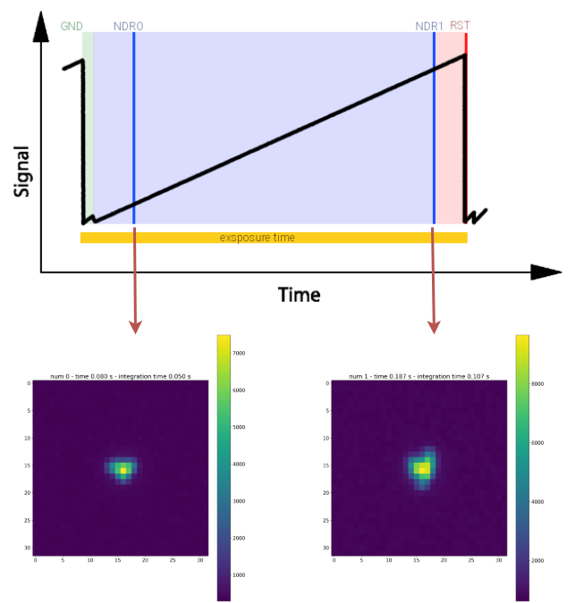
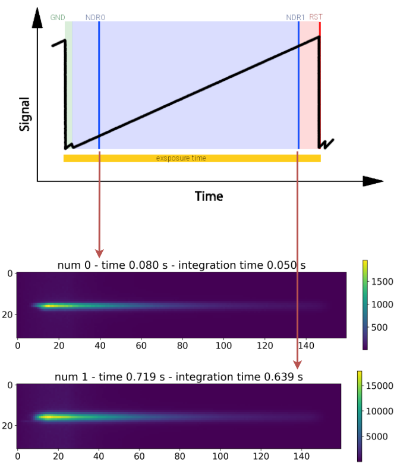

.. role:: xml(code)
   :language: xml

.. _finalising readout:

===========================================
Finalising the Sub-Exposures
===========================================

Add background sub-exposures
===========================================

Because more sources can be in the field of view (see :ref:`multiple_sources`), ExoSim allows to include the background in the sub-exposures.
The background stars are read using the same procedure described in :ref:`Instantaneous readout`,
with the same readout parameters used for the target star.

The resulting sub-exposures are added to the focal plane sub-exposures, and stored back in the output.

To include the background to the produced sub-exposures just enable it on the configuration file, setting the option to `True`.

.. code-block:: xml

    <channel> channel_name
        <detector>
            <add_background_to_se> True </add_background_to_se>
        </detector>
    </channel>

Add foregrounds sub-exposures
===========================================

Similarly to what has been done for the focal planes, once the sub-exposure are completed, we operate on the diffused light foregrounds.

To include the foregrounds to the produced sub-exposures just enable it on the configuration file, setting the option to `True`.

.. code-block:: xml

    <channel> channel_name
        <detector>
            <add_foregrounds_to_se> True </add_foregrounds_to_se>
        </detector>
    </channel>

If the keyword is missing, the foregrounds are included by default.

For each of the sub-exposures in the output we select the foreground focal plane corresponding to the acquisition time, and we multiplied it by the integration time.
The resulting foreground sub-exposure is added to the focal plane sub-exposure and stored back in the output.

This is handled by :class:`~exosim.tasks.subexposures.addForegrounds.AddForegrounds` task.

.. code-block:: python

        import exosim.tasks.subexposures as subexposures

        addForegrounds = subexposures.AddForegrounds()
        se_out = addForegrounds(subexposures=se_out, frg_focal_plane=frg_fp,
                                integration_time=integration_times)

With clear reference to the quantities defined above.

Resulting sub-exposure
===========================================

The resulting sub-exposures will look similar to the followings:

These examples have been produced with the procedure described in :ref:`sub-exposures plotter`.

.. _qe_map:

Quantum efficiency variation
--------------------------------

Each pixel in the focal plane has a slightly different Quantum Efficiency (QE) from the others.
This behaviour can be simulated in `ExoSim` by editing the normalisation of the pixel QEs

This can be set with a custom :class:`~exosim.tasks.task.Task`, as described in :ref:`Custom Tasks`,
or by using the default :class:`~exosim.tasks.subexposures.loadQeMap.LoadQeMap` task.
This task loads the QE variation map pre-computed from and `.h5` file.
If the user has its own map, can write a custom task load this map into a :class:`~exosim.models.signal.Signal` class.
Otherwise, `ExoSim` includes a tool (:ref:`tools`) which allow the creation of a quantum efficiency variation map (see :ref:`quantum_efficiency_map`),
which can be stored and used in successive simulations.

The :class:`~exosim.tasks.task.Task` to use to laod the QE variation map should be indicated under the channel detector configuration using the `qe_map_task` keyword.
In the following we report the example using the default :class:`~exosim.tasks.subexposures.loadQeMap.LoadQeMap` task:

.. code-block:: xml

    <channel> channel_name
        <detector>
            <qe_map_task> LoadQeMap </qe_map_task>
            <qe_map_filename> __ConfigPath__/data/payload/qe_map.h5 </qe_map_filename>
        </detector>
    </channel>

where the `qe_map_filename` keyword indicates the quantum efficiency variation map to use for every channel of the payload.

Alternatively, the map can be provided as a simple numpy array (see `numpy documentation <https://numpy.org/devdocs/reference/generated/numpy.lib.format.html>`_) and parsed by the :class:`~exosim.tasks.subexposures.loadQeMapNumpy.LoadQeMapNumpy` task:

.. code-block:: xml

    <channel> channel_name
        <detector>
            <qe_map_task> LoadQeMapNumpy </qe_map_task>
            <qe_map_filename> qe_map.npy </qe_map_filename>
        </detector>
    </channel>

The resulting map is then applied to all the focal planes in the channel by the :class:`~exosim.tasks.subexposures.applyQeMap.ApplyQeMap` tasks.
Because the quantum efficiency variation map can be time dependent, but sampled at a different cadence than the Sub-Exposure,
in the Sub-Exposure signal is included a new key in the metadata: `qe_variation_map_index`.
This array contains the indexes of the quantum efficiency realisation used for each of the sub-exposure:
the array is as long as the sub-exposure temporal axis, and for each time step is reported
the time index of the quantum efficiency variation map applied to that sub-exposure.

If no quantum efficiency variation map is provide, the code skip this step raising a Warning.
