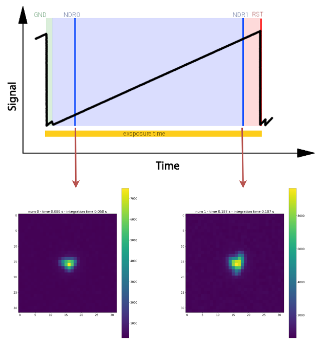
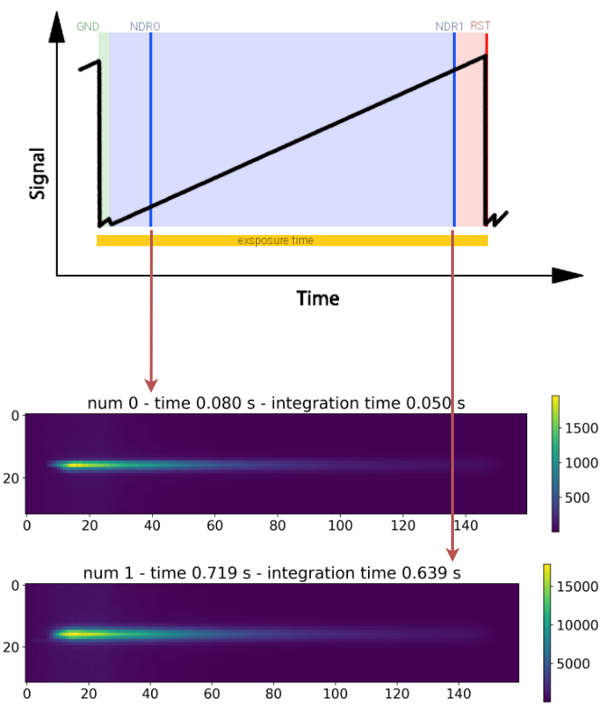

.. role:: xml(code)
   :language: xml

.. _finalising readout:

============================
Finalising the sub-exposures
============================

Add background sub-exposures
============================

Because there can be more than one source in the field of view (see
:ref:`multiple_sources`), ExoSim can add the background to the sub-exposures.
The background stars are read with the same procedure and the same readout
parameters as the target star (see :ref:`Instantaneous readout`).

The resulting sub-exposures are added to the focal-plane sub-exposures and
stored back in the output.

To include the background, enable it in the configuration file:

.. code-block:: xml

    <channel> channel_name
        <detector>
            <add_background_to_se> True </add_background_to_se>
        </detector>
    </channel>

Add foreground sub-exposures
============================

As with the focal planes, once the sub-exposures are complete we handle the
diffuse-light foregrounds.

To include the foregrounds, enable it in the configuration file:

.. code-block:: xml

    <channel> channel_name
        <detector>
            <add_foregrounds_to_se> True </add_foregrounds_to_se>
        </detector>
    </channel>

If the keyword is missing, the foregrounds are included by default.

For each sub-exposure in the output, ExoSim selects the foreground focal plane
matching its acquisition time and multiplies it by the integration time. The
resulting foreground sub-exposure is added to the focal-plane sub-exposure and
stored back in the output.

This is handled by the
:class:`~exosim.tasks.subexposures.addForegrounds.AddForegrounds` task:

.. code-block:: python

        import exosim.tasks.subexposures as subexposures

        addForegrounds = subexposures.AddForegrounds()
        se_out = addForegrounds(subexposures=se_out, frg_focal_plane=frg_fp,
                                integration_time=integration_times)

using the quantities defined above.

Resulting sub-exposure
======================

The resulting sub-exposures look similar to this:

These examples were produced with the procedure in :ref:`sub-exposures plotter`.

.. _qe_map:

Quantum-efficiency variation
============================

Each pixel of the focal plane has a slightly different quantum efficiency (QE).
`ExoSim` can simulate this by varying the normalisation of the pixel QEs.

You can do this with a custom :class:`~exosim.tasks.task.Task` (see
:ref:`Custom Tasks`) or with the default
:class:`~exosim.tasks.subexposures.loadQeMap.LoadQeMap` task, which loads a
pre-computed QE variation map from an `.h5` file. If you have your own map, a
custom task can load it into a :class:`~exosim.models.signal.Signal`.
Otherwise, `ExoSim` includes a tool (:ref:`tools`) that creates a QE variation
map (see :ref:`quantum_efficiency_map`), which can be stored and reused in later
simulations.

Name the task that loads the QE variation map under the channel detector
configuration, with the `qe_map_task` keyword. Here is the example with the
default :class:`~exosim.tasks.subexposures.loadQeMap.LoadQeMap` task:

.. code-block:: xml

    <channel> channel_name
        <detector>
            <qe_map_task> LoadQeMap </qe_map_task>
            <qe_map_filename> __ConfigPath__/data/payload/qe_map.h5 </qe_map_filename>
        </detector>
    </channel>

The `qe_map_filename` keyword gives the QE variation map to use for every
channel of the payload.

The map can also be a plain NumPy array (see the `NumPy documentation
<https://numpy.org/devdocs/reference/generated/numpy.lib.format.html>`_), parsed
by the :class:`~exosim.tasks.subexposures.loadQeMapNumpy.LoadQeMapNumpy` task:

.. code-block:: xml

    <channel> channel_name
        <detector>
            <qe_map_task> LoadQeMapNumpy </qe_map_task>
            <qe_map_filename> qe_map.npy </qe_map_filename>
        </detector>
    </channel>

The map is applied to every focal plane in the channel by the
:class:`~exosim.tasks.subexposures.applyQeMap.ApplyQeMap` task. Because the QE
variation map can be time-dependent but sampled at a different cadence from the
sub-exposures, the sub-exposure signal carries a new metadata key,
`qe_variation_map_index`. This array is as long as the sub-exposure time axis
and gives, for each time step, the index of the QE variation map realisation
applied to that sub-exposure.

If no QE variation map is provided, the code skips this step and raises a
warning.
