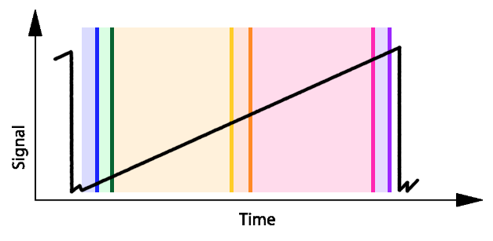
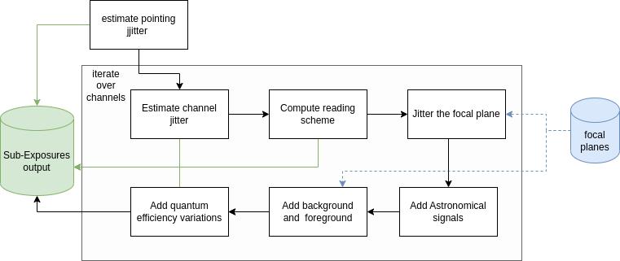

.. _sub-exposures creation:

=============
Sub-exposures
=============

The second step of an `ExoSim` simulation builds the `sub-exposures` from the
instrument focal planes. A `sub-exposure` is a focal plane sampled at the same
cadence as the NDRs.

To understand sub-exposures, we first need a word on detector ramp sampling. As
photons reach the focal plane, each pixel converts them into electrons and
collects the charge, like an accumulator that fills up over time. When it is
full, a reset empties it and collection starts again. The focal plane is read
during the accumulation, producing a number of NDRs set by the multiaccum
reading scheme. This assumes an instantaneous readout of the detector, and the
focal planes read this way are what we call `sub-exposures`.

Sub-exposures differ from NDRs in two ways: the sub-exposures of one ramp are
**not** summed together (the NDRs are), and the detector effects that go into
the NDRs are not applied yet; they are added later, as the last step in
`ExoSim 2.0`. Each sub-exposure is therefore an integrated image of what
happened between the previous detector action and the sub-exposure time.

.. note::
    This model considers only *instantaneous readout* of the detector.

Producing the sub-exposures needs a simulation cadence at a higher frequency
than the one used to sample the focal plane. Set it in the channel
configuration file as `readout_frequency`:

.. code-block:: xml

    <channel> channel name
        <readout>
            <readout_frequency unit ='s'> 0.1 </readout_frequency>
        </readout>
    </channel>

You can also give `readout_frequency` in :math:`Hz` instead of :math:`s`.

Here is an example. The figure below shows a reading scheme with a
mid-frequency resolution of 0.01 s, called the `simulation clock`; the other
quantities in the figure are given as a number of simulation-clock units. The
detector saturates in :math:`60 \, s`, which is the exposure time. The ramp is
sampled with 3 groups of 2 NDRs each. For the first :math:`0.2 \, s` the
detector is held in the ground state (GND), which is :math:`2` simulation-clock
units; for the last :math:`0.2 \, s` (:math:`2` units) it is in reset mode
(RST). The time available to sample the ramp is therefore
:math:`60 - 0.2 - 0.2 = 59.6 \, s`, or :math:`596` units. With a readout cadence
of :math:`0.1 \, s`, the first sub-exposure of the first group is read after
:math:`0.1 \, s` (:math:`1` unit), and the second after another :math:`0.1 \, s`;
within each group the two sub-exposures are :math:`1` unit apart. The groups are
:math:`29.6 \, s` (:math:`296` units) apart. This example is adapted from
Rauscher and Fox et al. 2007
(http://iopscience.iop.org/article/10.1086/520887/pdf).

.. image:: ../tools/_static/reading_ramp.png
    :width: 600
    :align: center

The figure shows the duration of the states along the top and the start of each
group along the bottom. :ref:`reading_scheme` explains how to design such a
scheme; these numbers were computed with one of the :ref:`tools`,
:ref:`readout_scheme_calculator`.

Each simulation-clock unit corresponds to a different realisation of the focal
plane, because of pointing jitter, and all of these realisations are used in the
simulation.

The next figure illustrates the concept of `sub-exposures`: each colour is the
area collected in a different sub-exposure.

The sub-exposure creation is automated by a recipe,
:class:`~exosim.recipes.createSubExposures.CreateSubExposures`. This section
explains the steps it goes through.

.. toctree::
   :maxdepth: 1

   Pointing jitter <pointing_jitter>
   Reading scheme <reading_scheme>
   Instantaneous readout <instantaneous_readout>
   Astronomical signal <astronomical_signal>
   Finalising the sub-exposures <finalising_sub_exposures>
   Automatic recipe <pipeline>

The overall flow is summarised here:

`ExoSim` also has a dedicated plotter,
:class:`~exosim.plots.subExposuresPlotter.SubExposuresPlotter`, described in
:ref:`sub-exposures plotter`.
