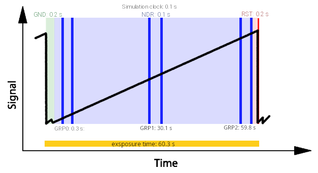

.. _sub-exposures creation:

===================================
Sub-Exposures
===================================

The second step af an `ExoSim` simulation is the creation of the `sub-exposures` starting from  instrument focal planes.
With `sub-exposures` here we are referring to the production of focal planes sampled at the same cadence of NDRs.

To better understand the idea of sub-exposures, we first need to discuss a little the detector ramp sampling.
While the photons arrive to the focal plane, the detector pixels start converting them into electrons anc collecting them.
We can think of each pixel as an accumulator of charge. So, during time, the collected charges increases.
When the accumulator is full, a reset process empties it to collect charges again.
The focal plane is read during the charge accumulation, producing a certain number of NDRs,
according to the multiaccum reading scheme enabled. This procedure assume an instantaneous readout of the detector.
Such read focal planes, are called here `sub-exposures`.
The difference between `sub-exposures` and NDRs are the fact that the sub-exposures of the same ramp are not summed together, as will be for the NDRs production,
and the detector effects, which are involved in the production of NDRs. These are added later, as a last step in `ExoSim  2.0`.
So, each sub-exposures represent an integrated image of what happened between the previous detector action and the sub-exposure time.

.. note:: In this model we are only considering *instantaneous read out* of the detector.

To produce these `sub-exposure` a simulation cadence is needed which refer to an higher frequency than the one used to sample the focal plane.
This cadence can be set in the channel configuration file as `readout_frequency`:

.. code-block:: xml

    <channel> channel name
        <readout>
            <readout_frequency unit ='s'> 0.1 </readout_frequency>
        </readout>
    </channel>

The user can also set the `readout_frequency` in units of :math:`Hz` instead of :math:`s`.

Let's seen an example. In the following figure is reported a reading scheme where we consider a mid frequencies resolution of 0.01 second,
which here is called `simulation clock`. The other quantities in the figure are written as number of simulation clock units.
The detector saturates in :math:`60 \, s`, which is the exposure time. This ramp is sampled using 3 groups of 2 NDRs each.
For the first :math:`0.2 \, s` the detector is kept in ground state (GND), these corresponds to :math:`2` simulation clock units.
We also know that for the last :math:`0.2 \,s` (:math:`2` simulation clock units), the detector is in reset mode (RST).
So, the available time to sample the ramp is :math:`60-0.2-0.2 = 59.6 \, s`, corresponding to :math:`596` simulation clock units.
Because the detector reading cadence is :math:`0.1 s`, after :math:`0.1 \, s` (:math:`1` simulation clock unit), the first sub-exposure of the first group is read.
After other :math:`0.1 \, s` the second sub-exposure is read too. In every groups the two sub-exposures are separated by :math:`1` simulation clock units.
The groups are then separated by :math:`29.6 \, s` (:math:`296` simulation clock units).
This example is described in this picture, adapted from Rauscher and Fox et al. 2007 (http://iopscience.iop.org/article/10.1086/520887/pdf)

Where are reported the duration of states on the top, and the start of each group on the bottom.
We'll describe later (:ref:`reading_scheme`) how to design such reading scheme,
but this numbers have been estimated using one of the :ref:`tools`: :ref:`readout_scheme_calculator`.

Each of the simulation clock units corresponds to a different realisation of the focal plane, because of the pointing Jitter.
All of these realisations are considered in the simulation.
Schemes like this will be further investigated later, when we'll discuss how `ExoSim` handles reading schemes.

With reference to the previous figure, we can investigate the concept of `sub-exposures`,
using the following image, where each color represents the area collected in a different sub-exposure.

.. image:: _static/reding_ramp_se_explained.png
    :width: 600
    :align: center

The sub-exposures creation is automatised by a recipe: :class:`~exosim.recipes.createSubExposures.CreateSubExposures`.
In this section we explain each of the steps that lead to the sub-exposures creation.

.. toctree::
   :maxdepth: 1

    Pointing jitter <pointing_jitter>
    Reading scheme  <reading_scheme>
    Instantaneous readout  <instantaneous_readout>
    Astronomical signal  <astronomical_signal>
    Finalising the Sub-Exposures <finalising_sub_exposures>
    Automatic Recipe <pipeline>

The steps flow is summarised in the following figure:

`ExoSim` also include a dedicated Plotter, called :class:`~exosim.plots.subExposuresPlotter.SubExposuresPlotter`,
which is described in :ref:`sub-exposures plotter`
