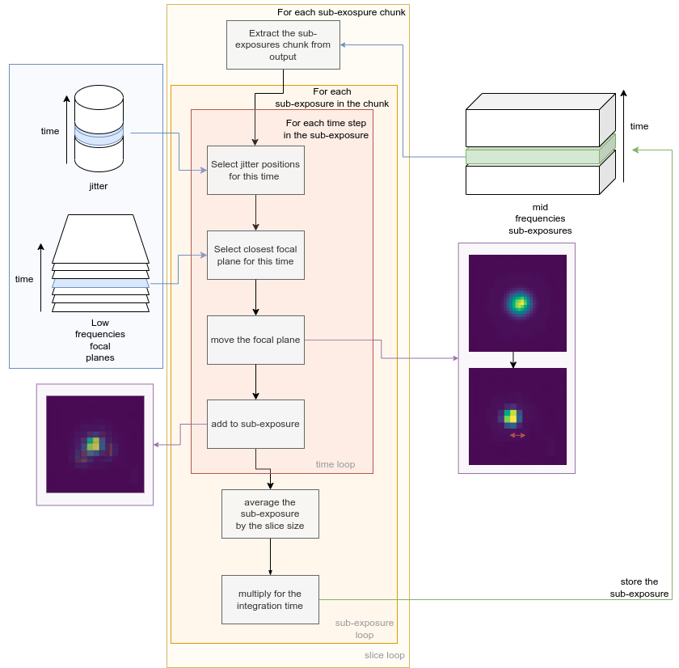

.. role:: xml(code)
   :language: xml

.. _Instantaneous readout:

===========================================
Instantaneous readout
===========================================

We now have all the elements to simulate the instantaneous readout.

Focal plane Sub-Exposures
============================
This is handled by :class:`~exosim.tasks.subexposures.instantaneousReadOut.InstantaneousReadOut` task.

This :class:`~exosim.tasks.task.Task`, first calls :class:`~exosim.tasks.subexposures.computeReadingScheme.ComputeReadingScheme`,
described in :ref:`reading_scheme`, then it scales the jitter to the indicated channel focal plane, using :class:`~exosim.tasks.subexposures.estimateChJitter.EstimateChJitter`,
described in  :ref:`ch_jitter`.

Preparing the output datacube
--------------------------------

Then, :class:`~exosim.tasks.subexposures.instantaneousReadOut.InstantaneousReadOut` builds the output, which will have :math:`counts` units,
and so it is a :class:`~exosim.models.signal.Counts` class. Because the resulting datacube size can grow fast,
:class:`~exosim.tasks.subexposures.instantaneousReadOut.InstantaneousReadOut` initialises it as a cached :class:`~exosim.models.signal.Signal` class,
which is described in :ref:`cached`.
The time dimension of this :class:`~exosim.models.signal.Signal` class contains the acquisition times of each sub-exposures.
So, this datacube has for each time step the shape of the focal plane without considering the oversampling factor (see :ref:`detector geometry`),
and a time step for each sub-exposure expected, which corresponds to the total number of NDRs listed in the reading scheme.
This means that if each ramp is sampled using 3 groups of 2 NDRs, we have 6 NDRs for each ramp, and therefore 6 sub-exposures.
Saying that each ramp last 60 s, to sample 8 hr of observation requires 480 ramps, and this results in 2880 sub-exposures.
As mentioned, this number can grow quite fast: for a bright target the saturation time can go down for example to 1 second.
Assuming this is the size of the ramp, we have 172800 sub-exposure.
Given that the sub-exposures are stored using ``float64`` data format (64 bits = 8 Bytes memory size),
the size of this datacube, for a focal plane of :math:`64 \times 64` pixels
is :math:`172800 \cdot 64 \cdot 64 / 8 = 88.473.600` Bytes. The resulting datacube is around 84 MB.
This justifies the use of cached data, which are stored stored and used in chunks.
The chunk size is set to 2 MB by default, but the user can set its own value as.

.. code-block:: Python

    RunConfig.chunk_size = N

where `N` is the desired size expressed in Mbs.

.. note::
    The use of ``float64`` data format, instead of ``float32`` is justified by the numerical precision required to handle the convoluted focal plane.
    Reducing the data format to ``float32`` would result in a loss of precision, which would be propagated to the final results as a non-conservation of the total incoming power.

Fill the output datacube
--------------------------

The main steps of the instantaneous readout process are summarised in the following figure.

Once the output is ready, `ExoSim` iterates over the chunks, thanks to the :class:`h5py.Dataset` methods (see also :ref:`cached`), extracting a slice of sub-exposure.
For each of the sub-exposures this slice there are a set of simulation time steps of `high_frequencies_resolution` unit associated.
For each of this time step we recover the associated jitter offsets in the spectral and spatial directions.
We select the low frequencies sampled focal plane corresponding to the time step considered.
We remove the focal plane oversampling factor by shifting the focal plane by the offset quantity.
Because the focal plane is sampled at a different cadence than the Sub-Exposures,
in the Sub-Exposure signal is included a new key in the metadata: `focal_plane_time_indexes`.
This array is as long as the sub-exposure temporal axis, and for each time step is reported
the time index of the focal plane used for that sub-exposure.

.. note::
        Here is where the oversampling factor comes into play.
        If the oversampling factor is smaller than jitter amplitude in pixel size, the jitter does not effect the final product of the simulation.
        It is important to calibrate the oversampling factor to the expected jitter amplitude in the channel.

Then, all the jittered focal planes associated to the same sub-exposure are averaged.
The resulted sub-exposure is then multiplied by its integration time, moving from the :math:`ct/s` of the focal planet to the :math:`ct` of the sub-exposure,
and it is stored back to the output datacube.

This is performed with

.. code-block:: python

        import exosim.tasks.subexposures as subexposures

        instantaneousReadOut = subexposures.InstantaneousReadOut()
        se_out, integration_times = instantaneousReadOut(
                                main_parameters=main_parameters,
                                parameters=payload_parameters['channel'][ch],
                                focal_plane=focal_plane,
                                frg_focal_plane=frg_focal_plane,
                                pointing_jitter=(jitter_spa, jitter_spe),
                                output_file=output_file)

Where ``main_parameters`` is the the main configurations dictionary, ``payload_parameters`` is the payload configuration dictionary and ``ch`` is the channel name.
``focal_plane`` and ``frg_focal_plane`` are the focal plane and the foreground focal plane respectively.
``jitter_spa`` and  ``jitter_spe`` are the jitter positions in :math:`deg` in the spatial and spectral direction respectively.
Finally, ``output_file`` is an output file, as described in :ref:`cached`.

.. note::
    Because of the phisycs of the problem, the total power collected on the focal plane is not always conserved.
    However, for debugging reasons, the user can force the conservation of the total power by setting the following parameter in the channel configuration file: 
    :xml:`<force_power_conservation> True </force_power_conservation>`

Focal plane oversampling factor for small jitter effects
~~~~~~~~~~~~~~~~~~~~~~~~~~~~~~~~~~~~~~~~~~~~~~~~~~~~~~~~~
It may happens that the jitter effect is too small to be captured by the defined oversampling factor.
In this case, the focal plane is resampled in order to capture the jitter rms in at least 3 sub-pixels.
The user can specify the number of sub-pixels to caputure the jitter rms by setting 

.. code-block:: xml

    <channel> channel_name
        <detector>
        <jitter_rms_min_resolution> 10 </jitter_rms_min_resolution>
        </detector>
    </channel>

In this case 10 subpixels are used. By default this quantity is set to 3. 
Small numbers of sub-pixels are suggested to sample random jitter effects (to sample a Normal distributed noise effect, 3 sub-pixel are more than enough), while larger numbers might be needed to sampled pointing drift.
The use of an incorrect number of sub-pixel may results in a digitalisation effect on the photometry.  

The magnification is computed by :class:`~exosim.tasks.subexposures.prepareInstantaneousReadOut.PrepareInstantaneousReadOut`, 
but the resampling operation is performed by the :func:`~exosim.tasks.subexposures.instantaneousReadOut.InstantaneousReadOut.oversample`,
method of :class:`~exosim.tasks.subexposures.instantaneousReadOut.InstantaneousReadOut`, which is using the :class:`scipy.interpolate.RectBivariateSpline` class.
If the focal plane is Nyquist sampled in the original oversampled focal plane, the signal information is conserved.

The ovsersampling can be imposed by the user by setting

.. code-block:: xml

    <channel> channel_name
        <detector>
        <jitter_resampler_mag> 2 </jitter_resampler_mag>
        </detector>
    </channel>

In the example we are suggesting the code to use a magnification factor for the resampler of `2`.
If the base oversampling factor is `4`, we are now resampling each pixel with an oversampling factor of :math:`4 \times 2 = 8`.
However, if the suggested magnification factor is not enough to sample the jitter rms with 3 sub-pixels,
the code computes and apply the right factor.

.. note::

    The magnificattion and the rms minimum resolution are two face of the same coin. 
