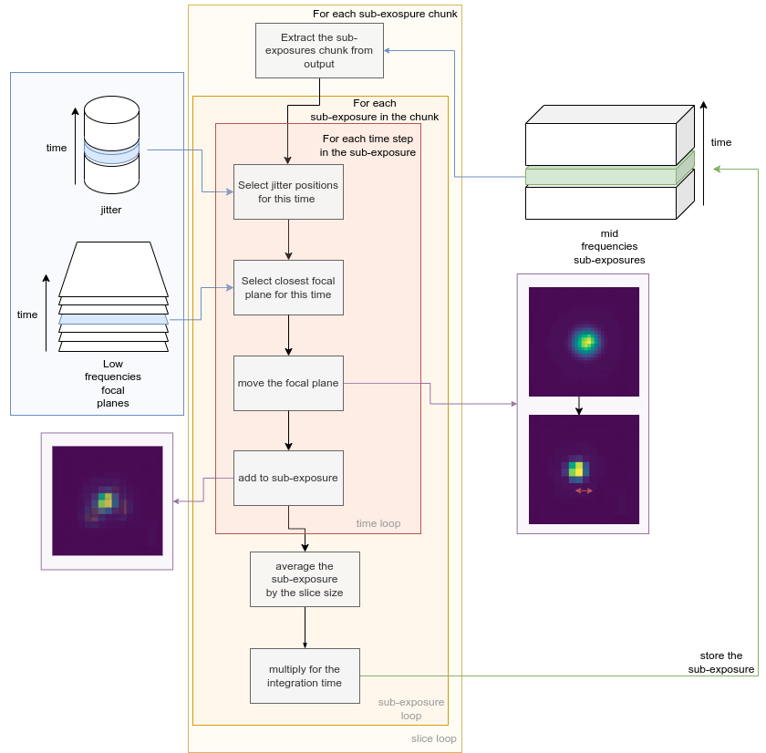

.. role:: xml(code)
   :language: xml

.. _Instantaneous readout:

=====================
Instantaneous readout
=====================

We now have everything needed to simulate the instantaneous readout.

Focal-plane sub-exposures
=========================

This is handled by the
:class:`~exosim.tasks.subexposures.instantaneousReadOut.InstantaneousReadOut`
task. It first calls
:class:`~exosim.tasks.subexposures.compute_reading_scheme.ComputeReadingScheme`
(see :ref:`reading_scheme`), then scales the jitter to the channel focal plane
with
:class:`~exosim.tasks.subexposures.estimate_ch_jitter.EstimateChJitter` (see
:ref:`ch_jitter`).

Preparing the output datacube
-----------------------------

:class:`~exosim.tasks.subexposures.instantaneousReadOut.InstantaneousReadOut`
then builds the output. It has :math:`counts` units, so it is a
:class:`~exosim.models.signal.Counts` object. Because the datacube can grow
quickly, it is initialised as a cached
:class:`~exosim.models.signal.Signal` (see :ref:`cached`). Its time axis holds
the acquisition time of each sub-exposure.

For every time step, the datacube has the shape of the focal plane without the
oversampling factor (see :ref:`detector geometry`), and it has one time step per
expected sub-exposure, that is the total number of NDRs in the reading
scheme. So if each ramp is sampled with 3 groups of 2 NDRs, there are 6 NDRs per
ramp and therefore 6 sub-exposures. If each ramp lasts 60 s, sampling 8 hours of
observation needs 480 ramps, or 2880 sub-exposures. For a
:math:`64 \times 64` focal plane stored as ``float64`` (8 bytes per value),
that is :math:`2880 \cdot 64 \cdot 64 \cdot 8 \approx 90` MB.

This number grows fast: for a bright target the saturation time can drop to,
say, 1 s. With a 1 s ramp, 8 hours of observation is 172800 sub-exposures, or
about 5.3 GB. This is why the datacube is cached and processed in chunks. The
chunk size is 2 MB by default; you can change it with:

.. code-block:: python

    RunConfig.chunk_size = N

where `N` is the size in MB.

.. note::
    ``float64`` is used instead of ``float32`` because of the numerical
    precision required for the convolved focal plane. ``float32`` would lose
    precision, which would show up in the final results as a non-conservation
    of the total incoming power.

Filling the output datacube
---------------------------

The main steps of the instantaneous readout are summarised in this figure:

Once the output is ready, `ExoSim` iterates over the chunks, using the
:class:`h5py.Dataset` methods (see also :ref:`cached`), taking a slice of
sub-exposures at a time. Each sub-exposure in the slice has a set of simulation
time steps, one per `high_frequencies_resolution` unit, associated with it. For
each of these time steps, `ExoSim`:

- recovers the jitter offsets in the spectral and spatial directions;
- selects the low-frequency-sampled focal plane for that time step;
- removes the focal-plane oversampling factor by shifting the focal plane by the
  offset.

Because the focal plane is sampled at a different cadence from the
sub-exposures, the sub-exposure signal carries a new metadata key,
`focal_plane_time_indexes`. This array is as long as the sub-exposure time axis
and gives, for each time step, the index of the focal plane used for that
sub-exposure.

.. note::
    This is where the oversampling factor matters. If the oversampling factor is
    smaller than the jitter amplitude in pixels, the jitter has no effect on the
    final product. Calibrate the oversampling factor to the expected jitter
    amplitude in the channel.

All the jittered focal planes for the same sub-exposure are then averaged. The
resulting sub-exposure is multiplied by its integration time, moving from the
:math:`ct/s` of the focal plane to the :math:`ct` of the sub-exposure, and
written back to the output datacube.

This is done with:

.. code-block:: python

        import exosim.tasks.subexposures as subexposures

        instantaneousReadOut = subexposures.InstantaneousReadOut()
        se_out, integration_times = instantaneousReadOut(
                                main_parameters=main_parameters,
                                parameters=payload_parameters['channel'][ch],
                                focal_plane=focal_plane,
                                frg_focal_plane=frg_focal_plane,
                                pointing_jitter=(jitter_spa, jitter_spe),
                                output_file=output_file)

Here ``main_parameters`` is the main configuration dictionary,
``payload_parameters`` is the payload configuration dictionary and ``ch`` is the
channel name. ``focal_plane`` and ``frg_focal_plane`` are the focal plane and
the foreground focal plane. ``jitter_spa`` and ``jitter_spe`` are the jitter
positions in :math:`deg` in the spatial and spectral directions. ``output_file``
is an output file, as described in :ref:`cached`.

.. note::
    Because of the physics of the problem, the total power collected on the
    focal plane is not always conserved. For debugging, you can force
    conservation by setting, in the channel configuration file,
    :xml:`<force_power_conservation> True </force_power_conservation>`.

Focal-plane oversampling for small jitter effects
~~~~~~~~~~~~~~~~~~~~~~~~~~~~~~~~~~~~~~~~~~~~~~~~~~~

The jitter effect can be too small to be captured by the chosen oversampling
factor. In that case the focal plane is resampled so that the jitter RMS spans
at least 3 sub-pixels. You can set the number of sub-pixels used:

.. code-block:: xml

    <channel> channel_name
        <detector>
        <jitter_rms_min_resolution> 10 </jitter_rms_min_resolution>
        </detector>
    </channel>

Here 10 sub-pixels are used; the default is 3. Small numbers are enough for
random jitter (3 sub-pixels more than cover a normally distributed noise
effect), while larger numbers may be needed to sample a pointing drift. An
incorrect number of sub-pixels can produce a digitisation effect on the
photometry.

The magnification is computed by
:class:`~exosim.tasks.subexposures.prepareInstantaneousReadOut.PrepareInstantaneousReadOut`,
but the resampling itself is done by the
:func:`~exosim.tasks.subexposures.instantaneousReadOut.InstantaneousReadOut.oversample`
method of
:class:`~exosim.tasks.subexposures.instantaneousReadOut.InstantaneousReadOut`,
which uses :class:`scipy.interpolate.RectBivariateSpline`. If the original
oversampled focal plane is Nyquist sampled, the signal information is conserved.

You can also impose the magnification:

.. code-block:: xml

    <channel> channel_name
        <detector>
        <jitter_resampler_mag> 2 </jitter_resampler_mag>
        </detector>
    </channel>

Here we tell the code to use a resampler magnification of `2`. With a base
oversampling factor of `4`, each pixel is now resampled at
:math:`4 \times 2 = 8`. If this magnification is still not enough to sample the
jitter RMS with 3 sub-pixels, the code computes and applies the right factor.

.. note::
    The magnification and the minimum RMS resolution are two sides of the same
    coin.
