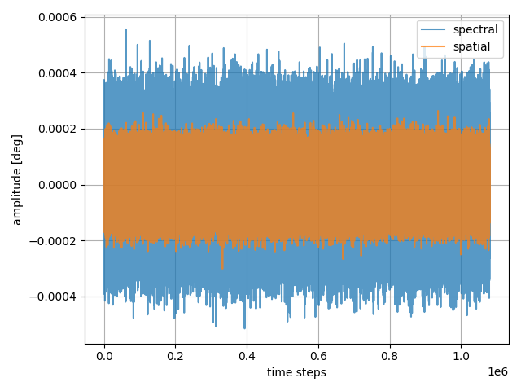
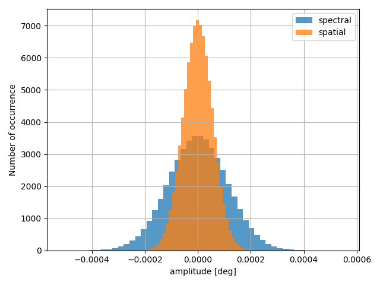

===========================================
Preparing the Pointing Jitter
===========================================

Instrument Pointing Jitter
=============================

First, we need to simulate the instrument pointing jitter.
As mentioned in :ref:`sub-exposures creation`, the jitter is sampled to the mid frequencies time scale,
so the first step is to define this quantity:

.. code-block:: xml

    <root>
        <time_grid>
            <start_time unit="hour">0.0</start_time>
            <end_time unit="hour">10.0</end_time>
            <low_frequencies_resolution unit="second">60.0</low_frequencies_resolution>
        </time_grid>
    </root>

With this configuration we are simulating 10 hours of observation, with low frequencies variation sampled at 1 minute cadence,
and mid frequencies effects sampled at 0.01 seconds cadence.

Then, still in the main configuration file, we need to describe the jitter under the `jitter` keyword:

.. code-block:: xml

    <root>
        <jitter>
            ...
        </jitter>
    </root>

Here the first key to define is the `jitter_task`, which specify which jitter :class:`~exosim.tasks.task.Task` we want to use.
To learn about how to customised :class:`~exosim.tasks.task.Task`, please refer to :ref:`Custom Tasks`.
By default, we use :class:`~exosim.tasks.subexposures.estimatePointingJitter.EstimatePointingJitter`.
This class randomly build the jitter in the spectral and spatial directions expressed as :math:`deg`, starting from the input standard deviations:

.. code-block:: xml

    <jitter>
        <jitter_task> EstimatePointingJitter </jitter_task>
        <spatial unit="arcsec"> 0.2 </spatial>
        <spectral unit="arcsec"> 0.4 </spectral>
        <frequency_resolution unit="Hz"> 100 </frequency_resolution>
    </jitter>

Using this configuration the resulting jittered positions will result as:

.. code-block:: python

    import exosim.tasks.subexposures as subexposures
    estimatePointingJitter = subexposures.EstimatePointingJitter()
    jitter_spa, jitter_spe, jitter_time = estimatePointingJitter(parameters=main_parameters)

where `main_parameters` is the parameter dictionary from the main configuration file.

Which are distributed as

This is the same as run the class with the configuration

.. _ch_jitter:

Channel Pointing Jitter
=============================

Once the instrument pointing jitter is computed, it is shared between all the channels.
Because each channel has a different plate scale (see also :ref:`pointing`),
we now need to rescale the pointing jitter to the channel pixel.
This is handled by :class:`~exosim.tasks.subexposures.estimateChJitter.EstimateChJitter`,
which computes the angle of view of each sub-pixel of the focal plane and convert the instrument pointing jitter,
expressed as :math:`deg`, to units of sub-pixels.

Assuming the instrument jitter has been already computed, and the channels plate scales are in the parameter dictionary

.. code-block:: xml

    <channel> Photometer
        <type> photometer </type>
        <detector>
            <plate_scale unit="arcsec/micron"> 0.01 </plate_scale>
        <detector>
        <readout>
            <readout_frequency unit="Hz">100</readout_frequency>
        </readout>
    </channel>

    <channel> Spectrometer
        <type> spectrometer </type>
        <detector>
            <plate_scale>
                <spatial unit="arcsec/micron"> 0.01 </spatial>
                <spectral unit="arcsec/micron"> 0.05 </spectral>
            </plate_scale>
        <detector>
        <readout>
            <readout_frequency unit="Hz">100</readout_frequency>
        </readout>
    </channel>

Than :class:`~exosim.tasks.subexposures.estimateChJitter.EstimateChJitter` can be run as

.. code-block:: python

    import exosim.tasks.subexposures as subexposures
    estimateChJitter = subexposures.EstimateChJitter()
    jit_y, jit_x, jit_time = estimateChJitter(parameters = parameters,
                                              pointing_jitter=(jitter_spa,
                                                               jitter_spe,
                                                               jitter_time))

This will results in a list of jitter offsets in pixel units sampled at a multiple of the channel
`readout_frequency` cadence, for the ful length of the observation.

The new jitter time line, `jit_time` might be different from the previous `jitter_time`,
and different from channel to channel. The new time line is estimated using the lowest multiple shared between the channel `readout_frequency`
and the frequency used to sample the input jitter.
This will result in `ExoSim` oversampling in frequency the detector readout to ensure that the input jitter is well represented and aligned to the detector readout scheme.
