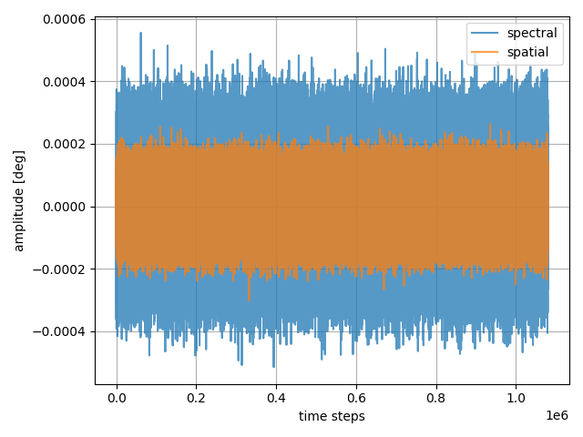
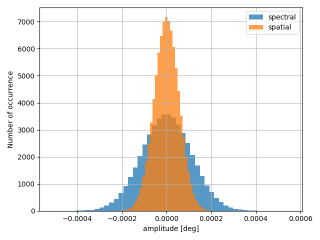

=============================
Preparing the pointing jitter
=============================

Instrument pointing jitter
==========================

First, simulate the instrument pointing jitter. As explained in
:ref:`sub-exposures creation`, the jitter is sampled on the mid-frequency time
scale, so the first step is to define that time grid:

.. code-block:: xml

    <root>
        <time_grid>
            <start_time unit="hour">0.0</start_time>
            <end_time unit="hour">10.0</end_time>
            <low_frequencies_resolution unit="second">60.0</low_frequencies_resolution>
        </time_grid>
    </root>

This simulates 10 hours of observation, with low-frequency variations sampled
every minute and mid-frequency effects sampled every 0.01 seconds.

Then, still in the main configuration file, describe the jitter under the
`jitter` keyword:

.. code-block:: xml

    <root>
        <jitter>
            ...
        </jitter>
    </root>

The first key to set is `jitter_task`, which selects the jitter
:class:`~exosim.tasks.task.Task` (see :ref:`Custom Tasks` on customising tasks).
The default is
:class:`~exosim.tasks.subexposures.estimatePointingJitter.EstimatePointingJitter`,
which builds a random jitter in the spectral and spatial directions, in
:math:`deg`, from the input standard deviations:

.. code-block:: xml

    <jitter>
        <jitter_task> EstimatePointingJitter </jitter_task>
        <spatial unit="arcsec"> 0.2 </spatial>
        <spectral unit="arcsec"> 0.4 </spectral>
        <frequency_resolution unit="Hz"> 100 </frequency_resolution>
    </jitter>

With this configuration, the jittered positions are computed as:

.. code-block:: python

    import exosim.tasks.subexposures as subexposures
    estimatePointingJitter = subexposures.EstimatePointingJitter()
    jitter_spa, jitter_spe, jitter_time = estimatePointingJitter(parameters=main_parameters)

where `main_parameters` is the parameter dictionary from the main configuration
file.

.. note::
    For a long observation with a small low-frequency variation and a high
    oversampling factor, the RAM needed to compute the jitter variation can be
    very large. You can trade memory for computation time by switching on the
    `slicing` parameter in the `jitter` section:

    .. code-block:: xml

        <jitter>
            <slicing> True </slicing>
        </jitter>

The positions are distributed as:

This is equivalent to running the class with the configuration shown above.

.. _ch_jitter:

Channel pointing jitter
=======================

The instrument pointing jitter is shared by all the channels. Because each
channel has a different plate scale (see also :ref:`pointing`), the jitter must
be rescaled to the channel pixel. This is handled by
:class:`~exosim.tasks.subexposures.estimate_ch_jitter.EstimateChJitter`, which
computes the angular size of each sub-pixel of the focal plane and converts the
instrument pointing jitter from :math:`deg` into sub-pixels.

Assuming the instrument jitter has already been computed, and the channel plate
scales are in the parameter dictionary:

.. code-block:: xml

    <channel> Photometer
        <type> photometer </type>
        <detector>
            <plate_scale unit="arcsec/micron"> 0.01 </plate_scale>
        </detector>
        <readout>
            <readout_frequency unit="Hz">100</readout_frequency>
        </readout>
    </channel>

    <channel> Spectrometer
        <type> spectrometer </type>
        <detector>
            <plate_scale>
                <spatial unit="arcsec/micron"> 0.01 </spatial>
                <spectral unit="arcsec/micron"> 0.05 </spectral>
            </plate_scale>
        </detector>
        <readout>
            <readout_frequency unit="Hz">100</readout_frequency>
        </readout>
    </channel>

:class:`~exosim.tasks.subexposures.estimate_ch_jitter.EstimateChJitter` is then
run as:

.. code-block:: python

    import exosim.tasks.subexposures as subexposures
    estimateChJitter = subexposures.EstimateChJitter()
    jit_y, jit_x, jit_time = estimateChJitter(parameters = parameters,
                                              pointing_jitter=(jitter_spa,
                                                               jitter_spe,
                                                               jitter_time))

The result is a list of jitter offsets, in pixel units, sampled at a multiple of
the channel `readout_frequency` cadence, for the full length of the observation.

The new jitter timeline, `jit_time`, may differ from `jitter_time` and from
channel to channel. It is built from the lowest common multiple of the channel
`readout_frequency` and the frequency used to sample the input jitter. In
effect, `ExoSim` oversamples the detector readout in frequency so that the input
jitter is well represented and aligned with the detector readout scheme.
