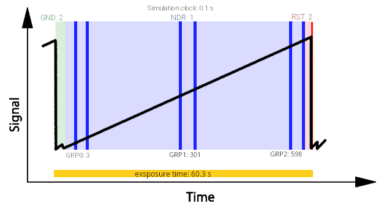

.. _reading_scheme:

===========================================
Reading Scheme
===========================================

Once the jitter time lines are ready, we need to define the reading scheme for the detector.

.. note:: In this model we are only considering *instantaneous read out* of the detector.

Assuming we want to reproduce the following reading scheme, which is the same of :ref:`sub-exposures creation`,
where a :math:`60.3 \,s` exposure time is sampled by 6 NDRs divided in 3 groups.

The ramp is sampled at the readout_frequency cadence, defined in :ref:sub-exposures creation.
In this example, we assume:

+ Ground (GND) state lasts :math:`0.2\,s`, i.e. 2 simulation clocks at :math:`10\,Hz`;
+ The first NDR is read after 1 clock (:math:`0.1\,s`);
+ NDRs within a group are spaced by 1 clock;
+ Groups are spaced by 296 simulation clocks;
+ Reset (RST) state lasts 2 clocks (:math:`0.2\,s`).

Given these parameters, the NDRs occur at the following clock indices:

+ First NDR: starts at clock 2 (after GND), ends at 3
+ Second NDR: starts at 4, ends at 5
+ Third NDR: starts at 300 (= 4 + 296), ends at 301
+ Fourth NDR: starts at 302, ends at 303
+ Fifth NDR: starts at 598 (= 302 + 296), ends at 599
+ Sixth NDR: starts at 600, ends at 601

Then the RST state completes the ramp at clocks 602–603

This amounts to a total of 603 simulation clocks at :math:`0.1\,s` resolution, i.e. exactly :math:`60.3\,s.`

.. code-block:: xml

    <channel> channel name
        <readout>
            <readout_frequency unit="Hz">10</readout_frequency>
            <n_NRDs_per_group> 2 </n_NRDs_per_group>
            <n_groups> 3 </n_groups>
            <n_sim_clocks_Ground> 2 </n_sim_clocks_Ground>
            <n_sim_clocks_first_NDR> 1 </n_sim_clocks_first_NDR>
            <n_sim_clocks_Reset> 2 </n_sim_clocks_Reset>
            <n_sim_clocks_groups> 296 </n_sim_clocks_groups>
        </readout>
    </channel>

The user can also set the `readout_frequency` in units of :math:`Hz` instead of :math:`s`.

The reading scheme is computed by :class:`~exosim.tasks.subexposures.computeReadingScheme.ComputeReadingScheme`

.. code-block:: python

        import exosim.tasks.subexposures as subexposures
        computeReadingScheme = subexposures.ComputeReadingScheme()
        clock, base_mask, base_group_end, base_group_start, number_of_exposures = computeReadingScheme(
            parameters=parameters,
            main_parameters=main_parameters,
            focal_plane=focal_plane,
            frg_focal_plane=frg_focal_plane)

The outputs of this :class:`~exosim.tasks.taks.Task` can be confusing, because is written to optimise the next step in the sub-exposures procedure.
In the following we discuss each of them.

+ ``clock``: this is the simulation frequency, which is the inverse of `high_frequencies_resolution` defined in :ref:`sub-exposures creation`;
+ ``base_mask``: this is state machine for the reading operation on the ramp.
  In fact, a ramp is made of different states: ground state (GNS), reset state (RTS) and read states (NDR).
  This mask is a list of of 0 and 1, where 1 is for the steps indicating a read operation:
  Referring to the previous image, the base will look like [0, 1, 1, 1, 1, 1, 1, 0].
+ ``frame_sequence``: this is the full list of simulation stapes for each steps on the ramp repeated by the number of ramps. E.g. [2, 1, 1, 296, 1, 296, 1, 2].
+ ``number_of_exposures``: this is the number of exposures needed to sample the full observation using ramps of the exposure time size.
  To estimate this quantity, the :class:`~exosim.tasks.task.Task` compute the integration time using :class:`~exosim.tasks.instrument.computeSaturation.ComputeSaturation`,
  which is why it need the focal planes.

The exposure time is computed from the configuration using a logic equivalent to hardware implementations (e.g. FPGA), counting clocks for each operation:

.. code-block:: python

    # define exposure time in seconds
    exposure_time = (
        n_clk_GND                          # Ground state
        + n_clk_NDR0                       # First NDR
        + n_clk_NDR * (n_NRDs_per_group - 1)                    # Remaining NDRs in first group
        + (n_clk_GRP + n_clk_NDR * (n_NRDs_per_group - 1)) * (n_GRPs - 1)  # Other groups
        + n_clk_RST                        # Reset state
    ) * clock                              # Convert to seconds

This structure mirrors how readout operations would be sequenced in a detector control system or programmable logic, giving full transparency on timing and event spacing.

For testing reasons, because sampling the full observation can be long and produce a lot of sub-exposure, the user can force the number of exposure to use by

.. code-block:: xml

    <channel> channel name
        <type> channel type </type>
        <readout>
            <n_exposures> 2 </n_exposures>
        </readout>
    </channel>

.. note::
    To help the user in defining the detector reading scheme, `ExoSim` include a dedicated tool: :ref:`readout_scheme_calculator`.

The readout scheme along with all the information needed for the instantaneous readout 
is computed by :class:`~exosim.tasks.subexposures.PrepareInstantaneousReadOut.PrepareInstantaneousReadOut`.
