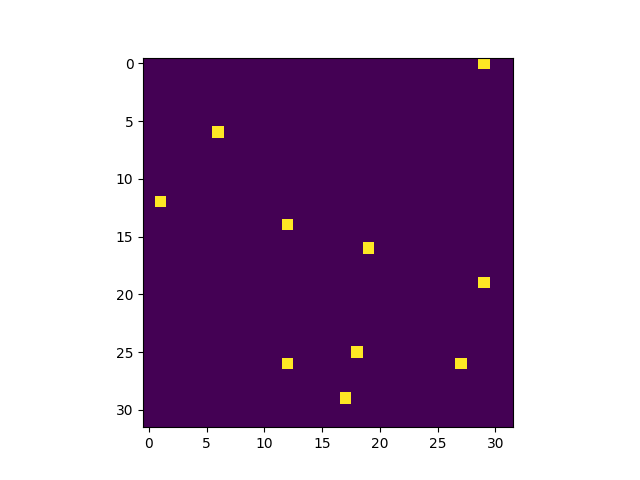

.. _dead_pixel_map:

===================================
Dead pixels map
===================================

The :class:`~exosim.tools.deadPixelsMap.DeadPixelsMap` tool
allows the creation of dead pixels maps that can be used in `ExoSim`.

The tool requires the number of dead pixels in the channel to distribute them randomly over the focal plane.

The following configuration are to be set into the tool input parameters

.. code-block:: xml

    <channel> channel_name
        <detector>
            <dp_mean > 10 </dp_mean>
        </detector>
    </channel>

Then the tool can be run as

.. code-block:: python

    import exosim.tools as tools

    tools.DeadPixelsMap(options_file='tools_input_example.xml',
                               output='data/payload')

And it produces a `.csv` file for each channel with the coordinates of the dead pixels.

The result will be like

The tool can also be used in the case the exact number of the dead pixel is not known.
In this case the inputs should include the uncertainty on this number.

.. code-block:: xml

    <channel> channel_name
        <detector>
            <dp_mean > 10 </dp_mean>
            <dp_sigma > 1 </dp_sigma>
        </detector>
    </channel>

The code will then select a random number of dead pixels centered in the `dp_meam`
value and normally distributed with `dp_sigma` standard deviation.

The produced `.csv` files can be used as input for :class:`~exosim.tasks.detector.applyDeadPixelMap.ApplyDeadPixelsMap`,
described in :ref:`dead_pixels`.
