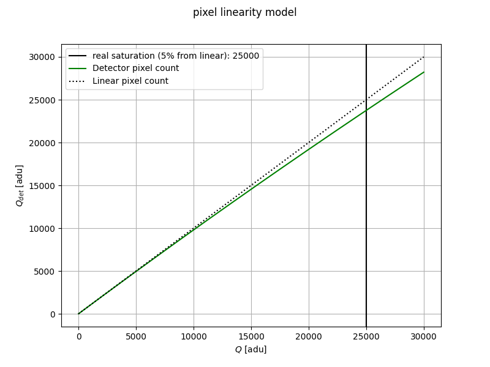
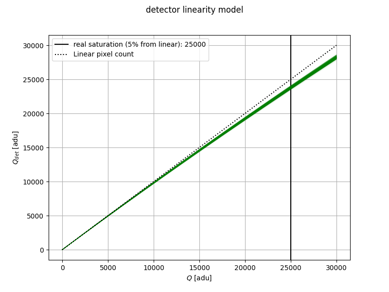
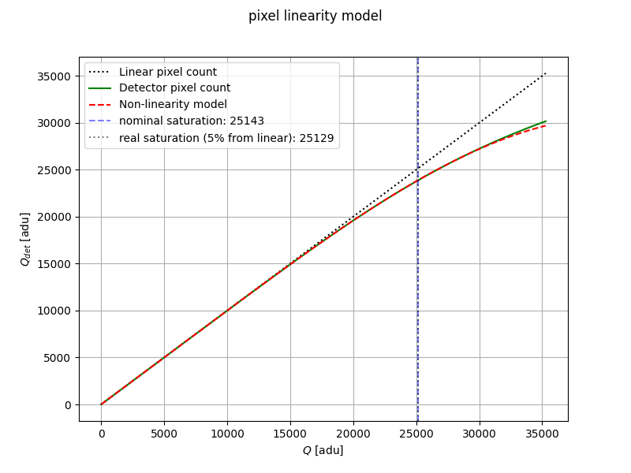
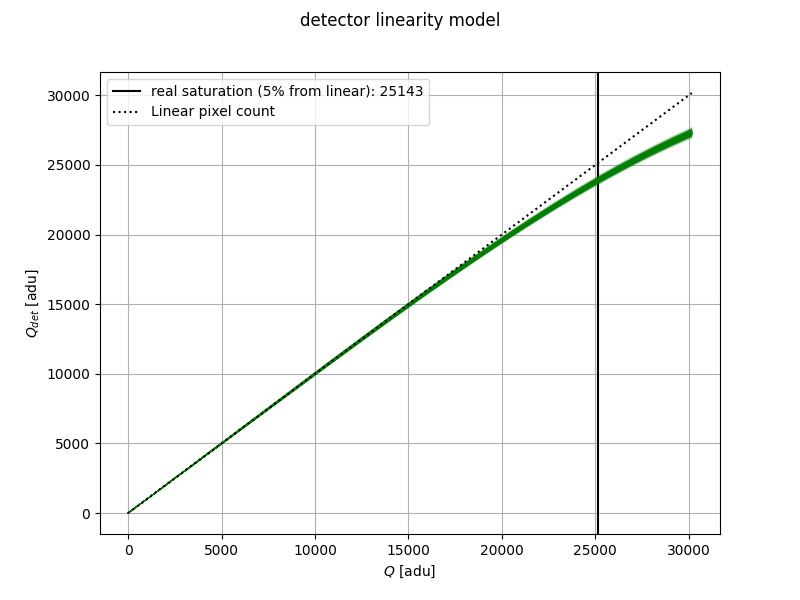

.. _pixel_non_linearity:

===================================
Pixels Non-Linearity
===================================

This tools helps the user to find the pixel non-linearity coefficients to as inputs for ExoSim,
starting from the measurable pixel non-linearity correction.

In fact, the detector non linearity model, is usually written as polynomial such as

.. math::
    Q_{det} = Q \cdot (1 + \sum_i a_i \cdot Q^i)

where :math:`Q_{det}` is the charge read by the detector, and :math:`Q` is the ideal count,
as :math:`Q = \phi_t`, with :math:`\phi` being the number of electrons generated and :math:`t` being the elapsed time.

Pixels Non-Linearity from scratch
----------------------------------

The :class:`~exosim.tools.pixelsNonLinearity.PixelsNonLinearity` tool retrieves the :math:`a_i` coefficients, starting from physical assumptions.

The detector non linearity model, is written as polynomial such as

.. math::
    Q_{det} = Q \cdot (1 + \sum_i a_i \cdot Q^i)

where :math:`Q_{det}` is the charge read by the detector, and :math:`Q` is the ideal count,
as :math:`Q = \phi_t`, with :math:`\phi` being the number of electrons generated and :math:`t` being the elapsed time.

Considering the detector as a capacitor, the charge :math:`Q_{det}` is given by

.. math::
    Q_{det} = \phi \tau \cdot \left(1 - e^{-Q/\phi \tau}\right)

where :math:`\phi` is the charge generated in the detector pixel, and :math:`\tau` is the capacitor time constant.
In fact the product :math:`\phi \tau` is constant   
:math:`Q` is the response of a linear detectror is given by :math:`Q = \phi t`

The detector is considered saturated when the charge :math:`Q_{det}` at the well depth :math:`Q_{det, \, wd}` 
differs from the ideal well depth :math:`Q_{wd}` by 5%.

.. math::
    Q_{det} = (1-5\%)Q_{wd}

Then 

.. math::
    \phi \tau \cdot \left(1 - e^{-Q_{wd}/\phi \tau}\right) = (1-5\%)Q_{wd}
    
This equation can be solved numerically and gives 

.. math::
    \frac{Q_{wd}}{\phi \tau} \sim 0.103479
    
Therefore the detector collected charge is given by

.. math::
        Q_{det} = \frac{Q_{wd}}{0.103479} \cdot \left(1 - e^\frac{- 0.103479 \, Q}{Q_{wd}}\right)
        
Which can be approximated by a polynomial of order 4 as

.. math::

        Q_{det} = Q\left[ 1- \frac{1}{2!}\frac{0.103479}{Q_{wd}} Q
        
        + \frac{1}{3!}\left(\frac{0.103479}{Q_{wd}}\right)^2 Q^2 
        
        - \frac{1}{4!}\left(\frac{0.103479}{Q_{wd}}\right)^3 Q^3 
        
        + \frac{1}{5!}\left(\frac{0.103479}{Q_{wd}}\right)^4 Q^4 \right]

The results are the coefficients for a 4-th order polynomial:

.. math::
    Q_{det} = Q \cdot (a_1 + a_2 \cdot Q + a_3 \cdot Q^2 + a_4 \cdot Q^3 + a_5 \cdot Q^4)

The user should indicate the expected non-linearity shape, by setting the saturation parameter, called `well_depth`:

.. code-block:: xml

    <channel> channel_name
        <detector>
            <well_depth> 25000 </well_depth>
        </detector>
    </channel>

Then the tool can be run as

.. code-block:: python

    import exosim.tools as tools

    tools.PixelsNonLinearity(options_file='tools_input_example.xml',
                                output='pnl_map.h5')

With the given example, we obtain the following expected non-linearity shape:

However, each pixel is different, and therefore, this class also produces a map of the coefficient for each pixel. 
Each coefficient is normally distributed around the mean value, with a standard deviation indicated in the configuration.
If no standard deviation is indicated, the coefficients are assumed to be constant.

.. code-block:: xml

    <channel> channel_name
        <detector>
            <spatial_pix> 200 </spatial_pix>
            <spectral_pix> 200 </spectral_pix>
            <pnl_coeff_std> 0.005 </pnl_coeff_std>
        </detector>
    </channel>

To obtain the map we added to the configuration the detector sizes and the standard deviation of the coefficients. 

The code output is a map of :math:`a_i` coefficients for each pixel, which can be injected into  :class:`~exosim.tasks.detector.applyPixelsNonLinearity.ApplyPixelsNonLinearity`.

Pixels Non-Linearity from correcting coefficients
------------------------------------------------------

Let's write again the detector non linearity model as

.. math::
    Q_{det} = Q \bigtriangleup (1 + \sum_i a_i \cdot Q^i)

where :math:`Q_{det}` is the charge read by the detector, and :math:`Q` is the ideal count,
as :math:`Q = \phi_t`, with :math:`\phi` being the number of electrons generated and :math:`t` being the elapsed time.
In the equation above, :math:`\bigtriangleup` is the operator used to defined the relation between :math:`Q_{det}` and :math:`Q`,
which depends on the definition of the coefficients :math:`a_i` (see also equation below).

However, it is usually the inverse operation that is known, as it's coefficients are measurable empirically:

.. math::
    Q ={Q_{det}}\bigtriangledown ( b_1 + \sum_{i=2} b_i \cdot Q_{det}^i)

Where :math:`\bigtriangledown` is the inverse operator of :math:`\bigtriangleup`.
Depending on the way the non linearity is estimated, the operator can either be a division (:math:`\div`)
or a multiplication (:math:`\times`). If not specified, a division is assumed.

The :class:`~exosim.tools.pixelsNonLinearityFromCorrection.PixelsNonLinearityFromCorrection` can determine the coefficients :math:`b_i` from the measured non linearity correction.

The :math:`b_i` correction coefficients should be listed in the configuration file using the `pnl_coeff` keyword
in increasing alphabetical order: `pnl_coeff_a` for :math:`b_1`,
`pnl_coeff_b` for :math:`b_2`, `pnl_coeff_c` for :math:`b_3`,
`pnl_coeff_d` for :math:`b_4`, `pnl_coeff_e` for :math:`b_5` and so on.
The user can list any number of correction coefficients, and they will be automatically parsed.
Please, note that using this notation, :math:`b_1` is not forced to be the unity.

.. code-block:: xml

    <channel> channel_name
        <detector>
            <well_depth> 25000 </well_depth>
            <pnl_coeff_a>  1.00117667e+00 </pnl_coeff_a>
            <pnl_coeff_b> -5.41836850e-07 </pnl_coeff_b>
            <pnl_coeff_c> 4.57790820e-11 </pnl_coeff_c>
            <pnl_coeff_d> 7.66734616e-16 </pnl_coeff_d>
            <pnl_coeff_e> -2.32026578e-19 </pnl_coeff_e>
            <pnl_correction_operator> / </pnl_correction_operator>

            <pnl_coeff_std> 0.005 </pnl_coeff_std>
        </detector>
    </channel>

as example of non linearity, we used the parameters from Hilbert 2009: "WFC3 TV3 Testing: IR Channel Nonlinearity Correction" (link_).

This class will restrieve the :math:`a_i` coefficients, starting from the the indicated :math:`b_i`.
The results are the coefficients for a 4-th order polynomial:

.. math::
    Q_{det} = Q \cdot (a_1 + a_2 \cdot Q + a_3 \cdot Q^2 + a_4 \cdot Q^3 + a_5 \cdot Q^4)

With the given example, we obtain the following expected non-linearity shape:

However, each pixel is different, and therefore, this class also produces a map of the coefficient for each pixel as before. 

.. _link: https://www.stsci.edu/files/live/sites/www/files/home/hst/instrumentation/wfc3/documentation/instrument-science-reports-isrs/_documents/2008/WFC3-2008-39.pdf
