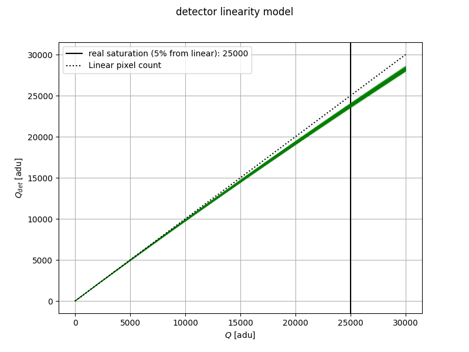
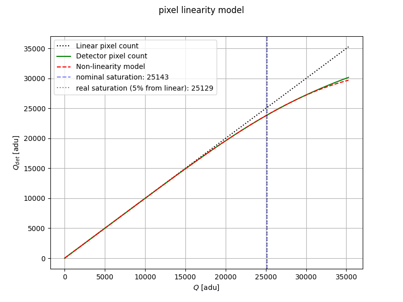
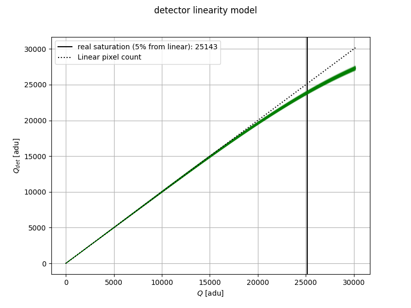

.. _pixel_non_linearity:

===================
Pixel non-linearity
===================

This tool produces the pixel non-linearity coefficients that `ExoSim` needs as
input, starting either from physical assumptions or from the non-linearity
correction that is measured in the lab.

The detector non-linearity is usually written as a polynomial,

.. math::
    Q_{det} = Q \cdot (1 + \sum_i a_i \cdot Q^i)

where :math:`Q_{det}` is the charge read by the detector and :math:`Q` is the
ideal count, :math:`Q = \phi t`, with :math:`\phi` the number of electrons
generated per unit time and :math:`t` the elapsed time. The tool retrieves the
:math:`a_i` coefficients.

From physical assumptions
-------------------------

The :class:`~exosim.tools.pixels_non_linearity.PixelsNonLinearity` tool derives
the :math:`a_i` coefficients from a simple physical model of the pixel.

Treating the pixel as a capacitor, the collected charge is

.. math::
    Q_{det} = \phi \tau \cdot \left(1 - e^{-Q/\phi \tau}\right)

where :math:`\tau` is the capacitor time constant, so the product
:math:`\phi \tau` is constant, and :math:`Q = \phi t` is the response of an ideal
linear detector.

The pixel is taken to be saturated when the charge at the well depth,
:math:`Q_{det, \, wd}`, falls 5% short of the ideal well depth :math:`Q_{wd}`:

.. math::
    Q_{det} = (1-5\%)Q_{wd}

so that

.. math::
    \phi \tau \cdot \left(1 - e^{-Q_{wd}/\phi \tau}\right) = (1-5\%)Q_{wd}

Solving this numerically gives

.. math::
    \frac{Q_{wd}}{\phi \tau} \sim 0.103479

and therefore

.. math::
        Q_{det} = \frac{Q_{wd}}{0.103479} \cdot \left(1 - e^\frac{- 0.103479 \, Q}{Q_{wd}}\right)

which a 4th-order Taylor expansion approximates as

.. math::

        Q_{det} = Q\left[ 1- \frac{1}{2!}\frac{0.103479}{Q_{wd}} Q

        + \frac{1}{3!}\left(\frac{0.103479}{Q_{wd}}\right)^2 Q^2

        - \frac{1}{4!}\left(\frac{0.103479}{Q_{wd}}\right)^3 Q^3

        + \frac{1}{5!}\left(\frac{0.103479}{Q_{wd}}\right)^4 Q^4 \right]

The result is the set of coefficients for a 4th-order polynomial:

.. math::
    Q_{det} = Q \cdot (a_1 + a_2 \cdot Q + a_3 \cdot Q^2 + a_4 \cdot Q^3 + a_5 \cdot Q^4)

The only input needed is the saturation level, ``well_depth``:

.. code-block:: xml

    <channel> channel_name
        <detector>
            <well_depth> 25000 </well_depth>
        </detector>
    </channel>

Then run the tool:

.. code-block:: python

    import exosim.tools as tools

    tools.PixelsNonLinearity(options_file='tools_input_example.xml',
                             output='pnl_map.h5')

With this example, the expected non-linearity shape is:

.. image:: _static/detector_linearity.png
    :align: center
    :width: 80%

No two pixels are identical, so the tool also produces a map with a set of
coefficients per pixel. Each coefficient is drawn from a normal distribution
around its mean value, with the standard deviation given in the configuration; if
no standard deviation is given, the coefficients are held constant.

.. code-block:: xml

    <channel> channel_name
        <detector>
            <spatial_pix> 200 </spatial_pix>
            <spectral_pix> 200 </spectral_pix>
            <pnl_coeff_std> 0.005 </pnl_coeff_std>
        </detector>
    </channel>

Here the detector sizes and the coefficient spread have been added to the
configuration, giving:

The output is a map of :math:`a_i` coefficients per pixel, which feeds
:class:`~exosim.tasks.detector.applyPixelsNonLinearity.ApplyPixelsNonLinearity`.

From measured correction coefficients
-------------------------------------

Write the non-linearity model as

.. math::
    Q_{det} = Q \bigtriangleup (1 + \sum_i a_i \cdot Q^i)

where :math:`\bigtriangleup` is the operator that relates :math:`Q_{det}` to
:math:`Q`, and its meaning depends on how the coefficients :math:`a_i` are
defined.

In practice it is the inverse relation that is measured, since its coefficients
can be found empirically:

.. math::
    Q ={Q_{det}}\bigtriangledown ( b_1 + \sum_{i=2} b_i \cdot Q_{det}^i)

where :math:`\bigtriangledown` is the inverse of :math:`\bigtriangleup`.
Depending on how the non-linearity was estimated, this operator is either a
division (:math:`\div`) or a multiplication (:math:`\times`); if it is not
specified, a division is assumed.

The
:class:`~exosim.tools.pixels_non_linearityFromCorrection.PixelsNonLinearityFromCorrection`
tool converts the measured correction coefficients :math:`b_i` into the
:math:`a_i` coefficients that `ExoSim` uses.

List the :math:`b_i` coefficients in the configuration with the ``pnl_coeff``
keyword, in alphabetical order: ``pnl_coeff_a`` for :math:`b_1`, ``pnl_coeff_b``
for :math:`b_2`, ``pnl_coeff_c`` for :math:`b_3`, and so on. Any number of
coefficients can be listed and they are parsed automatically. Note that with this
notation :math:`b_1` is not forced to be unity.

.. code-block:: xml

    <channel> channel_name
        <detector>
            <well_depth> 25000 </well_depth>
            <pnl_coeff_a>  1.00117667e+00 </pnl_coeff_a>
            <pnl_coeff_b> -5.41836850e-07 </pnl_coeff_b>
            <pnl_coeff_c> 4.57790820e-11 </pnl_coeff_c>
            <pnl_coeff_d> 7.66734616e-16 </pnl_coeff_d>
            <pnl_coeff_e> -2.32026578e-19 </pnl_coeff_e>
            <pnl_correction_operator> / </pnl_correction_operator>

            <pnl_coeff_std> 0.005 </pnl_coeff_std>
        </detector>
    </channel>

The example coefficients above are taken from Hilbert 2009, "WFC3 TV3 Testing: IR
Channel Nonlinearity Correction" (link_).

The tool retrieves the :math:`a_i` coefficients for a 4th-order polynomial,

.. math::
    Q_{det} = Q \cdot (a_1 + a_2 \cdot Q + a_3 \cdot Q^2 + a_4 \cdot Q^3 + a_5 \cdot Q^4)

giving the expected non-linearity shape:

As before, it also produces a per-pixel map of the coefficients:

.. _link: https://www.stsci.edu/files/live/sites/www/files/home/hst/instrumentation/wfc3/documentation/instrument-science-reports-isrs/_documents/2008/WFC3-2008-39.pdf
